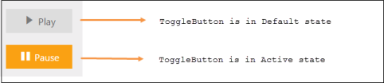
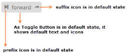
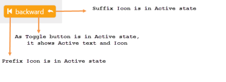
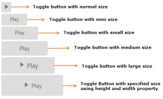
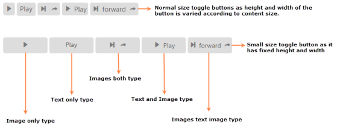
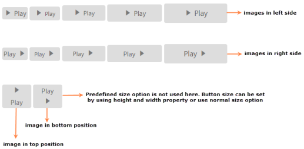
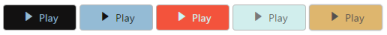

# Easy Customization

Toggle Button is used in all applications. ToggleButton size, content and content location is varied according to each application. The following section contains some customizable option for Toggle Button that can perform easily. 

## Toggle State

Toggle button has two states like off / on state in a switch. By default you can set any state at initial and then you can move from one state to another state by clicking on the Toggle Button. These two states are Default and Active.ToggleState property is used toset the state of Toggle Button as default state or active state. Default value of ToggleState is false.

The following steps explains you the details about rendering the Toggle Button with different ToggleState.


//Add the code in CSHTML page to configure the widget and initialize the control

        @*set the state for toggle button*@

        @Html.EJ().ToggleButton("toggleButton_default").Size(ButtonSize.Small).ContentType(ContentType.TextAndImage).DefaultText("Play").ActiveText("Pause").DefaultPrefixIcon("e-mediaplay").ActivePrefixIcon("e-mediapause").ToggleState(false)

             

        @Html.EJ().ToggleButton("toggleButton_active").Size(ButtonSize.Small).ContentType(ContentType.TextAndImage).DefaultText("Play").ActiveText("Pause").DefaultPrefixIcon("e-mediaplay").ActivePrefixIcon("e-mediapause").ToggleState(true)

		

Execute the above code to render the following output.

_Figure 4: Toggle button with two different toggle states_

## ToggleState with icons

### Prefix and Suffix Icons

You can add icons in prefix and suffix position of Toggle Button. Location of Icon is customized easily using the following mentioned option. This is applicable for the content type’s ImageOnly, TextAndImage, ImageTextImage and ImageBoth.

Toggle Button control also supports the build-in icon libraries. The ej.widgets.core.min.css contains the definition for important icons that are used in toggle buttons. You can use these build-in icons by mentioning the icon class name as value in DefaultPrefixIcon, DefaultSuffixIcon, ActivePrefixIcon,and ActiveSuffixIcon property. You can use any font icons that is defined in ej.widgets.core.min.css it avoids the complexity in specifying icon using sprite image and CSS.

For example the following mentioned build-in CSS class are used to show the font icons that are used by media player.

* e-mediaback
* e-mediaforward
* e-medianext
* e-mediaprev
* e-mediaeject
* e-mediaclose
* e-mediapause
* e-mediaplay

#### Prefix Icon

It inserts the icon at the starting position of Toggle Button. After this prefix icon, you can use text or suffix icon.

#### Suffix Icon

It inserts the icon at the ending position of Toggle Button. Before this suffix icon, you can use text or prefix icon.

You can also set icon in different location (prefix, suffix) and in different state (default, active) by using the option provided. The following properties are defined for merging the option to add text, icon with different position and in toggle states.

_Table 1: Property Table_

<table>
<tr>
<th>
ActiveText</th><th>
Specifies the text of toggle button in active state</th></tr>
<tr>
<td>
ActivePrefixIcon</td><td>
Specifies the prefix icon of toggle button in active state</td></tr>
<tr>
<td>
ActiveSuffixIcon</td><td>
Specifies the suffix icon of toggle button in active state</td></tr>
<tr>
<td>
DefaultText</td><td>
Specifies the text of toggle button in default state.</td></tr>
<tr>
<td>
DefaultPrefixIcon</td><td>
Specifies the prefix icon of toggle button in default state</td></tr>
<tr>
<td>
DefaultSuffixIcon</td><td>
Specifies the suffix icon of toggle button in default state</td></tr>
</table>

The following script explains you the details about rendering the Toggle Button with above mentioned customization properties.



//Add the code in CSHTML page to configure the widget and initialize the control

    @*set the prefix, suffix build in icons in default and active state*@

    @Html.EJ().ToggleButton("toggleButton_iconsAndStates").ContentType(ContentType.ImageTextImage).ShowRoundedCorner(true).DefaultText("forward").ActiveText("backward").DefaultPrefixIcon("e-mediaforward ").ActivePrefixIcon("e-mediaback ").DefaultSuffixIcon("e-redo ").ActiveSuffixIcon("e-undo ")



Execute the above code to render the following output.

_Figure 5: Before clicking the toggle button_

_Figure 6: After clicking the toggle button_

## Toggle button size

You can render the Toggle Button in different sizes by using Size property. You can use some predefined size option for rendering a Toggle Button in easiest way. Each size option has different height and width. It mainly avoids the complexity in rendering Toggle Button with complex CSS class. You can mention the size of the Toggle Button using the following five predefined size options. 

_Table 2: Predefined Toggle Button size_

<table>
<tr>
<th>
Normal</th><th>
Creates toggle button with content size.</th></tr>
<tr>
<td>
Mini</td><td>
Creates toggle button with inbuilt mini size height, width specified.</td></tr>
<tr>
<td>
Small</td><td>
Creates toggle button with inbuilt small size height, width specified.</td></tr>
<tr>
<td>
Medium</td><td>
Creates toggle button with inbuilt medium size height, width specified.</td></tr>
<tr>
<td>
Large</td><td>
Creates toggle button with inbuilt large size height, width specified.</td></tr>
</table>

You can also set your own width and height for toggle button using Height and Width property.

The following steps explains you the details about rendering the Toggle Button with above mentioned size options.

1. In the View page, add the following button elements to configure Toggle Button widget.



//Add the code in CSHTML page to configure the widget and initialize the control

    

        @*Set the different size types for toggle button control as follows. *@

        <table>

            <tr>

                <td class="btnsht">

                    @Html.EJ().ToggleButton("toggleButton_normal").Size(ButtonSize.Normal).ShowRoundedCorner(true).ContentType(ContentType.ImageOnly).DefaultPrefixIcon("e-mediaplay").ActivePrefixIcon("e-medianext")

                </td> </tr><tr>

                 <td class="btnsht">

                    @Html.EJ().ToggleButton("toggleButton_mini").Size(ButtonSize.Mini).ShowRoundedCorner(true).DefaultText("Play").ActiveText("Next")

                </td></tr><tr>

                <td class="btnsht">

                    @Html.EJ().ToggleButton("toggleButton_small").Size(ButtonSize.Small).ShowRoundedCorner(true).DefaultText("Play").ActiveText("Next")

                </td></tr><tr>

                <td class="btnsht">

                    @Html.EJ().ToggleButton("toggleButton_medium").Size(ButtonSize.Medium).ShowRoundedCorner(true).DefaultText("Play").ActiveText("Next")

                </td></tr><tr>

                <td class="btnsht">

                    @Html.EJ().ToggleButton("toggleButton_large").Size(ButtonSize.Large).ShowRoundedCorner(true).ContentType(ContentType.TextAndImage).DefaultText("Play").ActiveText("Next").DefaultPrefixIcon("e-mediaplay").ActivePrefixIcon("e-medianext")

                </td></tr><tr> 

                <td class="btnsht">

                    @Html.EJ().ToggleButton("toggleButton_customSize").ShowRoundedCorner(true).ContentType(ContentType.TextAndImage).DefaultText("Play").ActiveText("Next").DefaultPrefixIcon("e-mediaplay").ActivePrefixIcon("e-medianext").Height("50").Width("150")

                </td>

            </tr>

        </table>

    



Execute the above code to render the following output.

_Figure 13: Toggle button in different sizes_

## Content type

The content of the Toggle Button is mainly text and images. Instead of using complex CSS classes to render Toggle Button with different content types, you can use some predefined content type options as listed in the following table. Using this ContentType property you can easily add different types of content for Toggle Button. The Toggle Button supports the following content types.

_Table 3: List of Content types_

<table>
<tr>
<th>
TextOnly</th><th>
Supports only for text content only.</th></tr>
<tr>
<td>
ImageOnly</td><td>
Supports only for image content only</td></tr>
<tr>
<td>
ImageBoth</td><td>
Supports image for both ends of the toggle button.</td></tr>
<tr>
<td>
TextAndImage</td><td>
Supports image with the text content.</td></tr>
<tr>
<td>
ImageTextImage</td><td>
Supports image with both ends and middle in text.</td></tr>
</table>

The following steps explains you the details about rendering the Toggle Button with above mentioned content type options.

1. In the View page, add the following button elements to configure Toggle Button widget.



//Add the code in CSHTML page to configure the widget and initialize the control

    

    @*set different content types for toggle button*@

        <table>

            <tr>

                <td class="btnsht">

                    @Html.EJ().ToggleButton("toggleButton_imageOnly").ShowRoundedCorner(true).ContentType(ContentType.ImageOnly).DefaultPrefixIcon("e-mediaplay").ActivePrefixIcon("e-medianext")

                </td>

                <td class="btnsht">

                    @Html.EJ().ToggleButton("toggleButton_textOnly").ShowRoundedCorner(true).DefaultText("Play").ActiveText("Next")

                </td>

                <td class="btnsht">

                    @Html.EJ().ToggleButton("toggleButton_imageBoth").ShowRoundedCorner(true).ContentType(ContentType.ImageBoth).DefaultPrefixIcon("e-mediaforward ").ActivePrefixIcon("e-mediaback ").DefaultSuffixIcon("e-undo").ActiveSuffixIcon("e-redo")

                </td>

                <td class="btnsht">

                    @Html.EJ().ToggleButton("toggleButton_textAndImage").ShowRoundedCorner(true).ShowRoundedCorner(true).ContentType(ContentType.TextAndImage).DefaultText("Play").ActiveText("Next").DefaultPrefixIcon("e-mediaplay").ActivePrefixIcon("e-medianext")

                </td>

                <td class="btnsht">

                    @Html.EJ().ToggleButton("toggleButton_imageTextImage").ShowRoundedCorner(true).ContentType(ContentType.ImageTextImage).DefaultText("forward").ActiveText("backward").DefaultPrefixIcon("e-mediaforward ").ActivePrefixIcon("e-mediaback ").DefaultSuffixIcon("e-undo").ActiveSuffixIcon("e-redo")

                </td>

            </tr>

        </table>

    

    

        <table>

            <tr>

                <td class="btnsht">

                    @Html.EJ().ToggleButton("toggleButton_small_imageonly").Size(ButtonSize.Small).ShowRoundedCorner(true).ContentType(ContentType.ImageOnly).DefaultPrefixIcon("e-mediaplay").ActivePrefixIcon("e-medianext")

                </td>

                <td class="btnsht">

                    @Html.EJ().ToggleButton("toggleButton_small_textOnly").Size(ButtonSize.Small).ShowRoundedCorner(true).DefaultText("Play").ActiveText("Next")

                </td>

                <td class="btnsht">

                    @Html.EJ().ToggleButton("toggleButton_small_imageBoth").Size(ButtonSize.Small).ShowRoundedCorner(true).ContentType(ContentType.ImageBoth).DefaultPrefixIcon("e-mediaforward ").ActivePrefixIcon("e-mediaback ").DefaultSuffixIcon("e-undo").ActiveSuffixIcon("e-redo")

                </td>

                <td class="btnsht">

                    @Html.EJ().ToggleButton("toggleButton_small_textAndImage").Size(ButtonSize.Small).ShowRoundedCorner(true).ContentType(ContentType.TextAndImage).DefaultText("Play").ActiveText("Next").DefaultPrefixIcon("e-mediaplay").ActivePrefixIcon("e-medianext")

                </td>

                <td class="btnsht">

                    @Html.EJ().ToggleButton("toggleButton_small_imageTextImage").Size(ButtonSize.Small).ShowRoundedCorner(true).ContentType(ContentType.ImageTextImage).DefaultText("forward").ActiveText("backward").DefaultPrefixIcon("e-mediaforward ").ActivePrefixIcon("e-mediaback ").DefaultSuffixIcon("e-undo").ActiveSuffixIcon("e-redo")

                </td>

            </tr>

        </table>

    



Execute the above code to render the following output.

_Figure 14: Toggle button with different content types_

ImagePosition

To provide the best look and feel for Toggle Button, position of images in toggle button is important. You can easily customize the position of images inside toggle button using ImagePosition property without using any complex CSS. ImagePosition property is applicable only with the TextAndImage content type property. This property represent the position of images with respect to text.

_Table 4: Property Table_

<table>
<tr>
<th>
ImageLeft</th><th>
Support for aligning text in right and image in left.</th></tr>
<tr>
<td>
ImageRight</td><td>
Support for aligning text in left and image in right.</td></tr>
<tr>
<td>
ImageTop</td><td>
Support for aligning text in bottom and image in top.</td></tr>
<tr>
<td>
ImageBottom</td><td>
Support for aligning text in top and image in bottom.</td></tr>
</table>

The following steps explains you the details about rendering the Toggle Button with above mentioned image Position options.

1. In the View page, add the following button elements to configure Toggle Button widget.



@*Add the code in CSHTML page to configure the widget and initialize the control*@

    @*set images of toggle button in different location*@

    

        @*align the images in left side*@

        <table>

            <tr>

                <td class="btnsht">

                    @Html.EJ().ToggleButton("toggleButton_normal_imageLeft").Size(ButtonSize.Normal).ShowRoundedCorner(true).ContentType(ContentType.TextAndImage).DefaultText("Play").ActiveText("Next").DefaultPrefixIcon("e-mediaplay").ActivePrefixIcon("e-medianext").ImagePosition(ImagePosition.ImageLeft)

                </td>

                <td class="btnsht">

                    @Html.EJ().ToggleButton("toggleButton_mini_imageLeft").Size(ButtonSize.Mini).ShowRoundedCorner(true).ContentType(ContentType.TextAndImage).DefaultText("Play").ActiveText("Next").DefaultPrefixIcon("e-mediaplay").ActivePrefixIcon("e-medianext").ImagePosition(ImagePosition.ImageLeft)

                </td>

                <td class="btnsht">

                    @Html.EJ().ToggleButton("toggleButton_small_imageLeft").Size(ButtonSize.Small).ShowRoundedCorner(true).ContentType(ContentType.TextAndImage).DefaultText("Play").ActiveText("Next").DefaultPrefixIcon("e-mediaplay").ActivePrefixIcon("e-medianext").ImagePosition(ImagePosition.ImageLeft)

                </td>

                <td class="btnsht">

                    @Html.EJ().ToggleButton("toggleButton_medium_imageLeft").Size(ButtonSize.Medium).ShowRoundedCorner(true).ContentType(ContentType.TextAndImage).DefaultText("Play").ActiveText("Next").DefaultPrefixIcon("e-mediaplay").ActivePrefixIcon("e-medianext").ImagePosition(ImagePosition.ImageLeft)

                </td>

                <td class="btnsht">

                    @Html.EJ().ToggleButton("toggleButton_large_imageLeft").Size(ButtonSize.Large).ShowRoundedCorner(true).ContentType(ContentType.TextAndImage).DefaultText("Play").ActiveText("Next").DefaultPrefixIcon("e-mediaplay").ActivePrefixIcon("e-medianext").ImagePosition(ImagePosition.ImageLeft)

                </td>

            </tr>

        </table>

    

    

        @*align the images in right side*@

        <table>

            <tr>

                 <td class="btnsht">

                    @Html.EJ().ToggleButton("toggleButton_normal_imageRight").Size(ButtonSize.Normal).ShowRoundedCorner(true).ContentType(ContentType.TextAndImage).DefaultText("Play").ActiveText("Next").DefaultPrefixIcon("e-mediaplay").ActivePrefixIcon("e-medianext").ImagePosition(ImagePosition.ImageRight)

                </td>

                <td class="btnsht">

                    @Html.EJ().ToggleButton("toggleButton_mini_imageRight").Size(ButtonSize.Mini).ShowRoundedCorner(true).ContentType(ContentType.TextAndImage).DefaultText("Play").ActiveText("Next").DefaultPrefixIcon("e-mediaplay").ActivePrefixIcon("e-medianext").ImagePosition(ImagePosition.ImageRight)

                </td>

                <td class="btnsht">

                    @Html.EJ().ToggleButton("toggleButton_small_imageRight").Size(ButtonSize.Small).ShowRoundedCorner(true).ContentType(ContentType.TextAndImage).DefaultText("Play").ActiveText("Next").DefaultPrefixIcon("e-mediaplay").ActivePrefixIcon("e-medianext").ImagePosition(ImagePosition.ImageRight)

                </td>

                <td class="btnsht">

                    @Html.EJ().ToggleButton("toggleButton_medium_imageRight").Size(ButtonSize.Medium).ShowRoundedCorner(true).ContentType(ContentType.TextAndImage).DefaultText("Play").ActiveText("Next").DefaultPrefixIcon("e-mediaplay").ActivePrefixIcon("e-medianext").ImagePosition(ImagePosition.ImageRight)

                </td>

                <td class="btnsht">

                    @Html.EJ().ToggleButton("toggleButton_large_imageRight").Size(ButtonSize.Large).ShowRoundedCorner(true).ContentType(ContentType.TextAndImage).DefaultText("Play").ActiveText("Next").DefaultPrefixIcon("e-mediaplay").ActivePrefixIcon("e-medianext").ImagePosition(ImagePosition.ImageRight)

                </td>

            </tr>

        </table>

    

     

         @*align the images in Top and Bottom*@

        <table>

            <tr>

                 <td class="btnsht">

                    @Html.EJ().ToggleButton("toggleButton_imageTop").ShowRoundedCorner(true).ContentType(ContentType.TextAndImage).DefaultText("Play").ActiveText("Next").DefaultPrefixIcon("e-mediaplay").ActivePrefixIcon("e-medianext").ImagePosition(ImagePosition.ImageTop).Height("60").Width("50")

                </td>

                <td class="btnsht">

                    @Html.EJ().ToggleButton("toggleButton_imageBottom").ShowRoundedCorner(true).ContentType(ContentType.TextAndImage).DefaultText("Play").ActiveText("Next").DefaultPrefixIcon("e-mediaplay").ActivePrefixIcon("e-medianext").ImagePosition(ImagePosition.ImageBottom).Height("60").Width("50")

                </td>

            </tr>

        </table>

    



Execute the above code to render the following output.

_Figure 15: Toggle button with different type of image position_

## Theme support

You can control the style and appearance of Toggle Button based on CSS classes. To apply styles to the Toggle Button control, you can refer two files, ej.widgets.core.min.css and ej.theme.min.css. When you refer ej.widgets.all.min.css file, then it is not necessary to include the files ej.widgets.core.min.css and ej.theme.min.css in your project, as ej.widgets.all.min.css is the combination of these two. 

By default, there are 12 themes support available for Toggle Button control namely,

* default-theme
* flat-azure-dark
* fat-lime
* flat-lime-dark
* flat-saffron
* flat-saffron-dark
* gradient-azure
* gradient-azure-dark
* gradient-lime
* gradient-lime-dark
* gradient-saffron
* gradient-saffron-dark

## Custom CSS

You can use the CSS to customize the Toggle Button control appearance. Define a CSS class as per requirement and assign the class name to CssClass property.

The following steps explains you the details about rendering the Toggle Button with custom CSS.

1. In the View page, add the following button elements to configure Toggle Button widget.

   ~~~ html	

		@*Add the code in CSHTML page to configure the widget and initialize the control*@

		    @*set different custom CSS class for toggle button*@

		    

			@*apply custom CSS class for toggle buttons*@

			<table>

			    <tr>

				<td class="btnsht">

				    @Html.EJ().ToggleButton("toggleButton_customCSS1").Size(ButtonSize.Small).ShowRoundedCorner(true).ContentType(ContentType.TextAndImage).DefaultText("Play").ActiveText("Next").DefaultPrefixIcon("e-mediaplay").ActivePrefixIcon("e-medianext").CssClass("customCss1")

				</td>

				<td class="btnsht">

				    @Html.EJ().ToggleButton("toggleButton_customCSS2").Size(ButtonSize.Small).ShowRoundedCorner(true).ContentType(ContentType.TextAndImage).DefaultText("Play").ActiveText("Next").DefaultPrefixIcon("e-mediaplay").ActivePrefixIcon("e-medianext").CssClass("customCss2")

				</td>

				<td class="btnsht">

				    @Html.EJ().ToggleButton("toggleButton_customCSS3").Size(ButtonSize.Small).ShowRoundedCorner(true).ContentType(ContentType.TextAndImage).DefaultText("Play").ActiveText("Next").DefaultPrefixIcon("e-mediaplay").ActivePrefixIcon("e-medianext").CssClass("customCss3")

				</td>

				<td class="btnsht">

				    @Html.EJ().ToggleButton("toggleButton_customCSS4").Size(ButtonSize.Small).ShowRoundedCorner(true).ContentType(ContentType.TextAndImage).DefaultText("Play").ActiveText("Next").DefaultPrefixIcon("e-mediaplay").ActivePrefixIcon("e-medianext").CssClass("customCss4")

				</td>

				<td class="btnsht">

				    @Html.EJ().ToggleButton("toggleButton_customCSS5").Size(ButtonSize.Small).ShowRoundedCorner(true).ContentType(ContentType.TextAndImage).DefaultText("Play").ActiveText("Next").DefaultPrefixIcon("e-mediaplay").ActivePrefixIcon("e-medianext").CssClass("customCss5")

				</td>

			    </tr>

			</table>

		  

   ~~~
   {:.prettyprint }

2. Configure the CSS styles to apply on buttons.

   ~~~ css

		

   ~~~
   {:.prettyprint }

Execute the above code to render the following output.

_Figure 16: Toggle button with Custom CSS_

