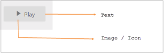
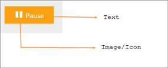
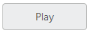

# Getting Started

This section explains briefly about how to create a ToggleButton in your ASP.NET MVC application.

## Create your first Toggle Button in MVC

The Toggle Button control displays both text and images. The text displayed on the Toggle Button is contained in the Text property. The Toggle Button control display images using the SpriteCssClass and ImagePosition properties. The Toggle Buttons has theme support also.

The following screenshot illustrates a Toggle Button control. 

Toggle Button in OFF state_ 
{:.caption}

Toggle Button in ON state
{:.caption}

### Create a Toggle Button

Essential Studio ASP.NET MVC Toggle Button control has a built-in feature to customize the size, text and images of button.

1. Create an MVC Project and add required assemblies, scripts, and styles to it.  Refer [MVC-Getting Started](http://help.syncfusion.com/aspnetmvc/togglebutton/getting-started) Documentation.
2. Add the following code example to the corresponding view page to render the Toggle Button. 

   ~~~ cshtml

	@Html.EJ().ToggleButton("tbutton").Size(ButtonSize.Mini).ShowRoundedCorner(true).DefaultText("Play")

   ~~~
   

3. Output of the above steps.

