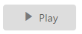
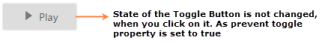

## Miscellaneous

ShowRoundedCorner 

It sets the corner of Toggle Button in rounded shape. The Toggle Button, by default doesn’t have rounded corner. To set rounded corner, you can enable ShowRoundedCorner property.

The following steps explains you the details about rendering the Toggle Button with Rounded corner support. 

1. In the View page, add the following button elements to configure Toggle Button widget.

[CSHTML]

@*Add the code in CSHTML page to configure the widget and initialize the control*@

    &lt;div class="one"&gt;

        @*set rounded corner for toggle button*@       

                 @Html.EJ().ToggleButton("toggleButton_roundedCorner").Size(ButtonSize.Small).ShowRoundedCorner(true).ContentType(ContentType.TextAndImage).DefaultText("Play").ActiveText("Next").DefaultPrefixIcon("e-mediaplay").ActivePrefixIcon("e-medianext")       

    &lt;/div&gt;

Execute the above code to render the following output.

{  | markdownify }
{:.image }

_Figure_ _19__: Toggle button with Rounder corner_

PreventToggle

This property is used to prevent the state change of Toggle Button when it is clicked. When you set PreventToggle propertyas true, then the state of the Toggle Button is not changed even though it is clicked. Default value of PreventToggle is false.

The following steps explains you the details about rendering the Toggle Button with PreventToggle property enabled.

1. In the View page, add the following button elements to configure Toggle Button widget.

[CSHTML]

@*Add the code in CSHTML page to configure the widget and initialize the control*@

    &lt;div class="one"&gt;

        @* set prevent toggle property for preventing states*@       

                 @Html.EJ().ToggleButton("toggleButton_preventToggle").Size(ButtonSize.Small).ContentType(ContentType.TextAndImage).DefaultText("Play").ActiveText("Next").DefaultPrefixIcon("e-mediaplay").ActivePrefixIcon("e-medianext").PreventToggle(true)       

    &lt;/div&gt;

Execute the above code to render the following output.

{  | markdownify }
{:.image }

_Figure_ _20__: Toggle button with prevent Toggle_

