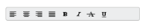
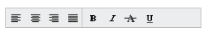

## Appearance and Styling 

Adjusting Toolbar size

Height

The Height property is used to set height of the Toolbar. Set the value to this property as number or string type.

[CSHTML] 

/ / Add this code in your CSHTML page and refer local data section for data source

    @Html.EJ().Toolbar("toolbarcontent").Width("250").Height("300").Datasource((IEnumerable<ToolbarLocalBinding>)ViewBag.datasource).ToolbarFields(f => f.ID("IconId").SpriteCssClass("SpriteCss").TooltipText("Tooltip"))

Width

The Width property is used to set width of the Toolbar. Set the value to this property as number or string type.

[CSHTML] 

/ / Add this code in your CSHTML page and refer local data section for data source

    @Html.EJ().Toolbar("toolbarcontent").Width("250").Datasource((IEnumerable<ToolbarLocalBinding>)ViewBag.datasource).ToolbarFields(f => f.ID("IconId").SpriteCssClass("SpriteCss").TooltipText("Tooltip"))

Enabling Rounded Corner 

The ShowRoundedCorner property is Boolean type, which allows us to enable rounded corner for Toolbar control. Default value of this property is false. You can specify the property ShowRoundedCorner in the script as below,

[CSHTML] 

/ / Add this code in your CSHTML page and refer local data section for data source

    @Html.EJ().Toolbar("toolbarcontent").Width("250").Datasource((IEnumerable<ToolbarLocalBinding>)ViewBag.datasource).ToolbarFields(f => f.ID("IconId").SpriteCssClass("SpriteCss").TooltipText("Tooltip")).ShowRoundedCorner(true)

{{ '' | markdownify }}
{:.image }

_Figure 11: ToolBar control with rounded corner_

Enabling Separator 

The EnableSeparator property is Boolean type, which allow us to set separator between Toolbar items in Toolbar control. It separates one or more list items. When you want to separate two set of items, then define them in two separate ‘ul’ elements. Default value of EnableSeparator is false.

[CSHTML] 

/ / Add this code in your CSHTML page and refer local data section for data source

    @Html.EJ().Toolbar("toolbarcontent").Width("250").Datasource((IEnumerable<ToolbarLocalBinding>)ViewBag.datasource).ToolbarFields(f => f.ID("IconId").SpriteCssClass("SpriteCss").TooltipText("Tooltip")).EnableSeparator(true)

{{ '' | markdownify }}
{:.image }

_Figure 12: ToolBar control with item separator_

Themes

You can control thestyle and appearance of the Toolbar based on CSS classes. In order to apply styles to the Toolbar control, you can refer two files - ej.widgets.core.min.css and ej.theme.min.css. When you refer ej.widgets.all.min.css file, it is not necessary to include the files ej.widgets.core.min.css and ej.theme.min.css in your project, as ej.widgets.all.min.css is the combination of these two. 

By default, there are 12 themes support available for Toolbar control namely

* default-theme
* flat-azure-dark
* fat-lime
* flat-lime-dark
* flat-saffron
* flat-saffron-dark
* gradient-azure
* gradient-azure-dark
* gradient-lime
* gradient-lime-dark
* gradient-saffron
* gradient-saffron-dark

CssClass 

The CssClass property is used to set root class for Toolbar control theme. Set the value to this property as string type.

[CSHTML] 

/ / Add this code in your CSHTML page and refer local data section for data source

    @Html.EJ().Toolbar("toolbarcontent").Width("250").Datasource((IEnumerable<ToolbarLocalBinding>)ViewBag.datasource).ToolbarFields(f => f.ID("IconId").SpriteCssClass("SpriteCss").TooltipText("Tooltip")).CssClass("gradient-lime")

[CSS]

{{ '' | markdownify }}
{:.image }

_Figure 13: ToolBar control with CssClass_

