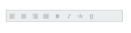

# Behavior settings

The following are some miscellaneous properties that enables you to change the behavior of Toolbar control.

## Enabling Toolbar

Enabled property is Boolean type, which allow us to enable or disable the Toolbar control. By default Enabled value is true. You can specify the property Enabled in the script as follows.



// Add this code in your CSHTML page and refer local data section for data source

 
   @Html.EJ().Toolbar("toolbar").Width("250").Datasource((IEnumerable<ToolbarLocalBinding>)ViewBag.datasource)
   .ToolbarFields(f => f.ID("IconId").SpriteCssClass("SpriteCss").TooltipText("Tooltip")).Enabled(false)



The following screenshot illustrates a Toolbar with Disable mode.

ToolBar control in Enabled (false)
{:.caption}

## Hiding Toolbar 

The Hide property is Boolean type, which allow us to show or hide the Toolbar. Default value of Hide is false. You can specify the property Hide in the script as follows. 

 

// Add this code in your CSHTML page and refer local data section for data source

 
   @Html.EJ().Toolbar("toolbar").Width("250").Datasource((IEnumerable<ToolbarLocalBinding>)ViewBag.datasource)
   .ToolbarFields(f => f.ID("IconId").SpriteCssClass("SpriteCss").TooltipText("Tooltip")).Hide(true)



## Disable Or Enable Separate Toolbar Item

### Disable Item

The **Toolbar** property **disableItem** and **disableItemByID** can be used to disable separate toolbar item. 



    @Html.EJ().Toolbar("editingToolbar").Items(s =>
       {
           s.Add().SpriteCssClass("e-icon e-cut_01").TooltipText("Cut");
           s.Add().SpriteCssClass("e-icon e-copy_02").TooltipText("Copy");
           s.Add().SpriteCssClass("e-icon e-paste_01").TooltipText("Paste");
          
       }).Items(s1 =>
       {
           s1.Add().SpriteCssClass("e-icon e-bold_01").TooltipText("Bold");
           s1.Add().SpriteCssClass("e-icon e-underline_01").TooltipText("Underline");
           s1.Add().SpriteCssClass("e-icon e-strikethrough_01").TooltipText("StrikeThrough");

       }).Items(s2 =>
       {
           s2.Add().SpriteCssClass("e-icon e-align-left_01").TooltipText("Left");
           s2.Add().SpriteCssClass("e-icon e-align-center_01").TooltipText("Center");
           s2.Add().SpriteCssClass("e-icon e-align-right_01").TooltipText("Right");
           s2.Add().SpriteCssClass("e-icon e-align-justify_01").TooltipText("Justify");

       }).ClientSideEvents(e=>e.Create("create"))
    



           function create() {
            var obj = $("#editingToolbar").data("ejToolbar");
            obj.disableItem($(".e-toolbar li")[2]);
        }


OR


       function create() {
            var obj = $("#editingToolbar").data("ejToolbar");
             obj.disableItemByID("paste");
        }
        


### Enable Item

The **Toolbar** property **enableItem** and **enableItemByID** can be used to enable separate toolbar item. 



	@Html.EJ().Toolbar("editingToolbar").Items(s =>
       {
           s.Add().SpriteCssClass("e-icon e-cut_01").TooltipText("Cut");
           s.Add().SpriteCssClass("e-icon e-copy_02").TooltipText("Copy");
           s.Add().SpriteCssClass("e-icon e-paste_01").TooltipText("Paste");
          
       }).Items(s1 =>
       {
           s1.Add().SpriteCssClass("e-icon e-bold_01").TooltipText("Bold");
           s1.Add().SpriteCssClass("e-icon e-underline_01").TooltipText("Underline");
           s1.Add().SpriteCssClass("e-icon e-strikethrough_01").TooltipText("StrikeThrough");

       }).Items(s2 =>
       {
           s2.Add().SpriteCssClass("e-icon e-align-left_01").TooltipText("Left");
           s2.Add().SpriteCssClass("e-icon e-align-center_01").TooltipText("Center");
           s2.Add().SpriteCssClass("e-icon e-align-right_01").TooltipText("Right");
           s2.Add().SpriteCssClass("e-icon e-align-justify_01").TooltipText("Justify");

       }).ClientSideEvents(e=>e.Create("create"))
    



           function create() {
            var obj = $("#editingToolbar").data("ejToolbar");
            obj.enableItem($(".e-toolbar li")[2]);
        }


OR


       function create() {
            var obj = $("#editingToolbar").data("ejToolbar");
             obj.enableItemByID("paste");
        }
        


