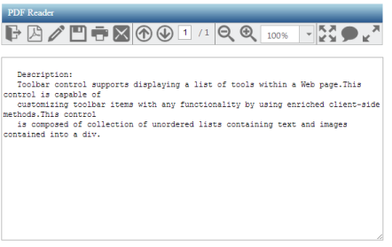
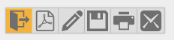
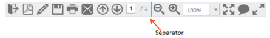
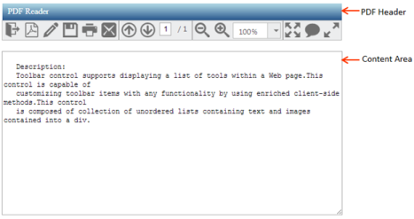

# Getting Started

This section explains briefly about how to create a Toolbar in your ASP.NET MVC application. 

## Create your first Toolbar in MVC

### Create Toolbar for PDF Reader

Toolbar control displays a list of tools in a webpage. It is used to customize Toolbar items of any functionality, by using enriched client-side methods. This control consists of a collection of unordered lists, containing text and images into a 
. From the following section, you can learn how to customize Toolbar control for a PDF Reader scenario. The following screen shot shows the appearance of Toolbar in PDF Reader simulator application.

Here, the Toolbar consists of a Toolbar with title and text area as PDF Reader.

### Create a Toolbar

Using the following steps, you can create a Toolbar control. The basic rendering of ASP.NET MVC Toolbar is achieved with default functionality.

1. You can create an MVC Project and add necessary Dll and script with the help of the given [MVC-Getting Started](http://help.syncfusion.com/ug/js/Documents/gettingstartedwithmv.htm) Documentation.

2. Add the mentioned code to the corresponding view page for Toolbar rendering.

   

@Html.EJ().Toolbar("ToolbarItem")



The following output is displayed.

_Figure 2: Toolbar without Toolbar items_

### Initialize Toolbar Items

Toolbar consists of a list of items. From the following guidelines, you can learn how to initialize the Toolbaritems with <UL> <LI> template. 								

Initialize the Toolbaritems with <UL> <LI> template as follows. 



    <!--list of toolbar items-->

    <ul>

        <li id="OtherFormat" title="Convert PDF files to Word or Excel Online…">

            

        </li>

        <li id="PDFOnline" title="Convert files to PDF Online">

            

        </li>

        <li id="Signature" title="Sign, add text or send a document for signature">

            

        </li>

        <li id="Save" title="Save file ( Ctrl+S )">

            

        </li>

        <li id="Print" title="Print file ( Ctrl+P ) ">

            

        </li>

        <li id="Message" title="Message">

            

        </li>

    </ul>

    @Html.EJ().Toolbar("ToolbarItem").Width("auto").EnableSeparator(true).Height("33px")



Apply the given styles in the code table to show the Toolbar items as follows. You can refer images from any location. For the following code example, the images have been referred from the given location.

[http://js.syncfusion.com/UG/Web/Content/](http://js.syncfusion.com/UG/Web/Content/)pdf-icon.png





Execute the code to render a Toolbar with a list of Toolbar items.

_Figure 3: Toolbar with list of toolbar items_

### Render remaining Toolbar Items

To achieve the requirements, you need to render all the Toolbar items. You can separate or group the Toolbar items. The separation or grouping of Toolbar items is achieved when you give Toolbar items as a list of <UL> <LI> values inside the toolbar 
 or span element. From the following sections, you can learn how to initialize the remaining Toolbar items with <UL> <LI> template and how to group the toolbar items. 

Initialize the Toolbar items with <UL> <LI> template as follows.



    <!--Initialize toolbar items from above code snippet -->

    <!-- Separator will be added at the end of each ul inside the toolbar element-->

    <!-- list of Remaining toolbar items with item separator -->

    <ul>

        <li id="Previous" title="Show previous page ( Left Arrow )">

            

        </li>

        <li id="Next" title="Show next page ( Right Arrow )">

            

        </li>

        <li id="page">

            

                <input type="text" value="1" />

            

        </li>

        <li id="count">

            / 1</li>

    </ul>

    <ul>

        <li id="ZoomOut" title="Zoom Out">

            

        </li>

        <li id="ZoomIn" title="Zoom In">

            

        </li>

        <li id="ZoomValue">

            

                <ul>

                    <li>10%</li>

                    <li>25%</li>

                    <li>50%</li>

                    <li>100%</li>

                    <li>400%</li>

                    <li>800%</li>

                    <li>1600%</li>

                    <li>3200%</li>

                    <li>6400%</li>

                </ul>

            

            @Html.EJ().DropDownList("car").Width("90").Value("100%").TargetID("carlist")

        </li>

    </ul>

    <ul>

        <li id="FitFull" title="Fit one full page to window">

            

        </li>

        <li id="StickyNote" title="Add stick note ( Ctrl+6 ) ">

            

        </li>

        <li id="ReadMode" title="View File in Read Mode">

            

        </li>

    </ul>



Add the following styles in the code table to display the Toolbar items as follows. 



    /*Additional style for Remaining toolbar items*/



### Set Zoom value is one of the items in the Toolbar. You need to render the DropDownList control for select zoom value. DropDownList control is rendered with <UL> <LI> elements. The ASP.NET MVCDropdown control with a list of zoom values is used to render Set Zoom value in the above sample code. Refer to the provided link for Dropdown creation.

[Dropdown – GettingStarted](http://help.syncfusion.com/aspnetmvc/)

Execute the code to render Toolbar items with separator.

### Add Actions to Toolbar Items

Now that the Toolbar is rendered, you need to render the header and content area to create a PDF Reader. In the following section, you can learn how to render the header (Toolbar), contentsection (PDF viewer area) and how to set the action to Toolbar items.

_Note: PDF reading or rendering is not shown here. Simulation of the PDF Reader app to demonstrate the usage of Toolbar control is provided. PDF rendering area is ignored._

Initialize the contentarea and header as specified in the code table.



<!—“control” class used for aligns the pdf reader in center of a page. -->

    

    

    <!--Add toolbar items from above code snippet -->

    

    <!-- Here Initialize the Toolbar items as like above code sample -->

    

        <textarea id="content" rows="10" cols="30"> 

   Description:

   Toolbar control supports displaying a list of tools within a Web page. This control is capable of 

   customizing toolbar items with any functionality by using enriched client-side methods.This control 

   Is composed of collection of unordered lists containing text and images contained into a div.

</textarea>

    

 



You can apply the following styles with the above styles to design the PDF header and content area. 





_Figure 5: PDF Reader Appearance_

So far, you have added the required toolbar items and configured its appearance. When you click on 

Toolbar items, the operation is performed through client-slide click event. The following code example explains how to perform operations, when you click on the Toolbar items.



    <!--Add toolbar items from above code snippet -->

<!-- Here Initialize the Toolbar items as shown in above code sample and add Client side Event as follows -->

@Html.EJ().Toolbar("ToolbarItem").ClientSideEvents(e => e.Click("onItemclick")).Width("auto").EnableSeparator(true)







