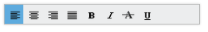

# Keyboard Navigation

The entire Toolbar commands can be accessed through the keyboard by specifying the Keyboard Shortcut listed in the following table.

_Table_ _4__: List of keyboard shortcuts_

<table>
<tr>
<th>
Keyboard Shortcut</th><th>
Function</th></tr>
<tr>
<td>
Alt + j</td><td>
Focuses the control</td></tr>
<tr>
<td>
UP</td><td>
Navigates up and left.</td></tr>
<tr>
<td>
Down</td><td>
Navigates down and right.</td></tr>
<tr>
<td>
Left</td><td>
Navigates up and left.</td></tr>
<tr>
<td>
Right</td><td>
Navigates down and right.</td></tr>
<tr>
<td>
Home</td><td>
Navigates to the starting item.</td></tr>
<tr>
<td>
End</td><td>
Navigates to the ending item.</td></tr>
<tr>
<td>
Enter</td><td>
Selects the focused item</td></tr>
</table>

The following code example illustrates shortcuts associated with the Toolbar items.



/ / Add this code in your CSHTML page and refer local data section for data source

    @Html.EJ().Toolbar("toolbarcontent").Width("250").Datasource((IEnumerable<ToolbarLocalBinding>)ViewBag.datasource).ToolbarFields(f => f.ID("IconId").SpriteCssClass("SpriteCss").TooltipText("Tooltip")) 



_Figure_ _32__: ToolBar control with Keyboard shortcuts_

