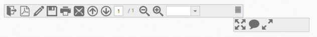

# Responsive Layout

Responsive Layout is aimed at crafting sites to provide an optimal viewing experience—easy reading and navigation with a minimum of resizing, panning, and scrolling—across a wide range of devices (from mobile phones to desktop computer monitors). You can achieve Responsive Layout by using default functionality of Toolbar with IsResponsive as true and also you need to give Toolbar Width as in percentage value and add ej.responsive.css file in this sample. CDN link for the responsive css file is as follows.

[http://cdn.syncfusion.com/13.1.0.21/js/web/responsive-css/ej.responsive.css](http://cdn.syncfusion.com/13.1.0.21/js/web/responsive-css/ej.responsive.css)

Add the above css link in the code sample.        

1. Add the following code example in your HTML page.





    @Html.EJ().Toolbar("ToolbarItem").Width("65%").Height("33px").IsResponsive(true).Items(s =>

    {

        s.Add().Id("OtherFormat").SpriteCssClass("PdfDocument e-icon convertToOthers ").TooltipText("Convert PDF files to Word or Excel Online…");

        s.Add().Id("PDFOnline").SpriteCssClass("PdfDocument e-icon convertToPdf ").TooltipText("Convert files to PDF Online");

        s.Add().Id("Signature").SpriteCssClass("PdfDocument e-icon signature ").TooltipText("Sign, add text or send a document for signature");

        s.Add().Id("Save").SpriteCssClass("PdfDocument e-icon save ").TooltipText("Save file ( Ctrl+S )");

        s.Add().Id("Print").SpriteCssClass("PdfDocument e-icon print ").TooltipText("Print file ( Ctrl+P )");

        s.Add().Id("Message").SpriteCssClass("PdfDocument e-icon msg ").TooltipText("Message");

    }).Items(s1 =>

    {

        s1.Add().Id("Previous").SpriteCssClass("PdfDocument e-icon previous ").TooltipText("Show previous page ( Left Arrow )");

        s1.Add().Id("Next").SpriteCssClass("PdfDocument e-icon next ").TooltipText("Show next page ( Right Arrow )");

        s1.Add().Id("page").SpriteCssClass("PdfDocument ").ContentTemplate(@<input type="text" value="1" />);

        s1.Add().Id("count").ContentTemplate(@/1);

    }).Items(s2 =>

    {

        s2.Add().Id("ZoomOut").SpriteCssClass("PdfDocument e-icon zoomOut ").TooltipText("Zoom Out");

        s2.Add().Id("ZoomIn").SpriteCssClass("PdfDocument e-icon zoomIn ").TooltipText("Zoom In");

        s2.Add().Id("ZoomValue").SpriteCssClass("PdfDocument ").ContentTemplate(@

            @dropdown()

        
);

    }).Items(s3 =>

{

    s3.Add().Id("FitFull").SpriteCssClass("PdfDocument e-icon fitOne ").TooltipText("Fit one full page to window");

    s3.Add().Id("StickyNote").SpriteCssClass("PdfDocument e-icon sticky ").TooltipText("Add stick note ( Ctrl+6 ) ");

    s3.Add().Id("ReadMode").SpriteCssClass("PdfDocument e-icon readMode ").TooltipText("View File in Read Mode");

})

    @helper dropdown()

{

    

        <ul>

            <li>10%</li>

            <li>25%</li>

            <li>50%</li>

            <li>100%</li>

            <li>400%</li>

            <li>800%</li>

            <li>1600%</li>

            <li>3200%</li>

            <li>6400%</li>

        </ul>

    
        

    @Html.EJ().DropDownList("selectPercent").Width("90").Value("100%").TargetID("percentlist")

}







  

Execute the above code to render the following output.

