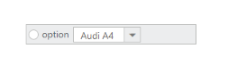

## Template Support

Template allows you to insert custom or ASP.NET MVC controls inside the toolbar items. Also you can design simple drop down buttons listing the items and radio button inside the Toolbar.

Set the list for DropDown control inside a list element and define this element as a Toolbar item. You can use all simple controls as a ToolBar item. For example to add RadioButton and DropDownList to Toolbar, use the following code example.

[CSHTML] 

/ / Add this code in your CSHTML page and refer local data section for data source

@Html.EJ().Toolbar("toolbarcontent").Items(s =>

{

    s.Add().ContentTemplate(@&lt;div&gt;

        @Html.EJ().RadioButton("radio1").Checked(false)

    &lt;/div&gt;);

    s.Add().ContentTemplate(@&lt;div&gt;

        @Html.EJ().DropDownList("selectcar").Height("23").Width("100").TargetID("cars").SelectedItemIndex(0)

        &lt;div id="cars"&gt;

            &lt;ul&gt;

                <li>Audi A4</li>

                <li>Audi A5</li>

                <li>Audi A6</li>

                <li>Audi A7</li>

            &lt;/ul&gt;

        &lt;/div&gt;

    &lt;/div&gt;);

})

The following screenshot displays a Toolbar with embedded controls.

{  | markdownify }
{:.image }

_Figure_ _30__: Toolbar with Template_

