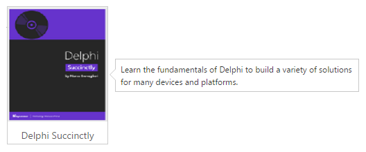

# Position

The position object defines various attributes of the Tooltip position, including the element it is positioned in relation to, and how the position is adjusted within the defined container.

Lets position the Tooltips (stems) left center corner at the right center of the target element.


 
    

        
        
Delphi Succinctly

    

    @Html.EJ().Tooltip("sample").Content("Learn the fundamentals of Delphi to build a variety of solutions for many devices and platforms.").Position(pos => pos.Target(target => target.Horizontal("right").Vertical("center")).Stem(stem => stem.Horizontal("left").Vertical("center")))



Apply the following styles to show the Tooltip.



    
    


N> By default, the Tooltips "center bottom" corner is placed at the center top of the target element.

## Containment 

Determines the HTML element in which the Tooltip is appended to e.g. its containing element and The tooltip will be restricted to move only within the specified container element.

Let's append our Tooltip to a custom 'frame' container:


 
    

        

            TypeScript lets you write <a id="tooltip1"><u> JavaScript</u> </a>the way you really want to.
        

    

    
    @Html.EJ().Tooltip("tooltip1").Content("JavaScript is the programming language of HTML and the Web.").Containment(".frame")
    


N> By default all Tooltips are appended to the document.body element.

## Associates 

 The Tooltip will be positioned in relation to target element. Can also be set to 'mouse' or the window, or an absolute x/y position on the page.
 
 Let's position the Tooltip in relation to the 'a' element inside the div element:
 
 
 
    

        

            TypeScript lets you write <a id="tooltip2"><u> JavaScript</u> </a>the way you really want to.
        

    

    @Html.EJ().Tooltip("tooltip2").Content("JavaScript is the programming language of HTML and the Web.")
    

 
We can also position the Tooltip in relation to the mouse.
 

 
    

        

            TypeScript lets you write <a id="tooltip3"><u> JavaScript</u> </a>the way you really want to.
        

    

    @Html.EJ().Tooltip("tooltip3").Content("JavaScript is the programming language of HTML and the Web.").Associate(Associate.Mousefollow)
    


Position the tooltip at the current mouse position, once enter to the target element as follows


 
    

        

            TypeScript lets you write <a id="tooltip4"><u> JavaScript</u> </a>the way you really want to.
        

    

    @Html.EJ().Tooltip("tooltip4").Content("JavaScript is the programming language of HTML and the Web.").Associate(Associate.Mouseenter)
    


It also possible to place the tooltip relation to the window as follows


 
    

        

            TypeScript lets you write <a id="tooltip5"><u> JavaScript</u> </a>the way you really want to.
        

    

    @Html.EJ().Tooltip("tooltip5").Content("JavaScript is the programming language of HTML and the Web.").Position(pos => pos.Target(target => target.Horizontal("right").Vertical("bottom"))).Associate(Associate.Window)


    
And last but not least, absolute positioning via X,Y co-ordinates e.g. a Tooltip at 10px from left and top of the page:


 
    

        

            TypeScript lets you write <a id="tooltip6"><u> JavaScript</u> </a>the way you really want to.
        

    

    @Html.EJ().Tooltip("tooltip6").Content("JavaScript is the programming language of HTML and the Web.").Position(pos => pos.Target(target => target.Horizontal(10).Vertical(10))).Associate(Associate.Axis)



## Collision 

When the positioned element overflows the window in some direction, move it to an alternative position. 

The following values determines the kind of positioning that takes place.

<table>
<tr>
<td>
Value </td><td>
Description </td></tr>
<tr>
<td>
Flip </td><td>
Flips the element to the opposite side of the target if the collision detected. </td></tr>
<tr>
<td>
Fit </td><td>
Shift the element away from the edge of the window. </td></tr>
<tr>
<td>
FlipFit(Default) </td><td>
Ensure as much of the element is visible as possible to showcase. </td></tr>
<tr>
<td>
None </td><td>
Does not apply any collision detection. </td></tr>
</table>


 
    

        

            TypeScript lets you write <a id="tooltip7"><u> JavaScript</u> </a>the way you really want to.
        

    

    @Html.EJ().Tooltip("tooltip7").Content("JavaScript is the programming language of HTML and the Web.").Collision(Collision.Fit)

