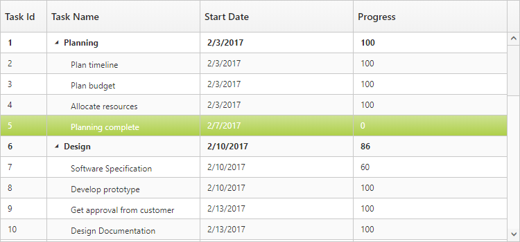

# Appearance and Styling

The look and feel of the TreeGrid control can be customized by applying themes.

The following are the available themes in TreeGrid control.

1. Flat Azure                      
2. Flat Azure Dark                 
3. Flat Lime                             
4. Flat Lime Dark                
5. Flat Saffron                       
6. Flat Saffron Dark
7. Gradient Azure
8. Gradient Azure Dark
9. Gradient Lime
10. Gradient Lime Dark
11. Gradient Saffron
12. Gradient Saffron Dark
13. Bootstrap

You can apply the theme (Gradient lime) to the TreeGrid control by using the style sheet from the online link as follows.



<!DOCTYPE html>
<html xmlns="http://www.w3.org/1999/xhtml">
<head>
<title>Getting Started with TreeGrid Control for JavaScript</title>
<!-- style sheet for default theme(gradient lime) -->
<link href=" http://cdn.syncfusion.com/{{ site.releaseversion }}/js/web/flat-azure/ej.web.all.min.css" rel="stylesheet">
</html>



The following screenshot shows the TreeGrid control with Gradient-lime theme.

## Configuring CSS class

In TreeGrid `CssClass` property is used to apply different custom styles to multiple TreeGrid controls available in the webpage.

The following code example shows how to apply different background color for each TreeGrid control's toolbar element.



@(Html.EJ().TreeGrid("TreeGridContainer")
        .CssClass("c-class1")
)
@(Html.EJ().TreeGrid("TreeGridContainer1")
        .CssClass("c-class2")
)
@(Html.EJ().ScriptManager())



The below screenshot shows the output of above code example.

## Customize rows and cells

In TreeGrid, while rendering rows  `RowDataBound` event will be triggered for rows. Similarly `QueryCellInfo` event will be triggered for every cells. Using these events we can customize the tree grid rows and cells at initial load.

The below code example shows how to customize the rows and cells in tree grid.



@(Html.EJ().TreeGrid("TreeGridContainer")    
    .ClientSideEvents(eve=>
    {
        eve.QueryCellInfo("queryCellInfo");
        eve.RowDataBound("rowDataBound");
    })
)
@(Html.EJ().ScriptManager())



The below screenshot shows the output of above code example.

