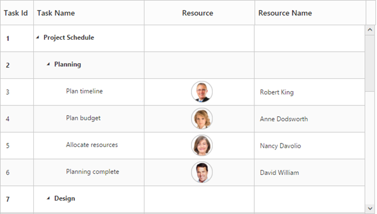
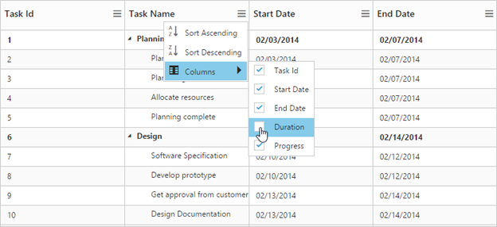
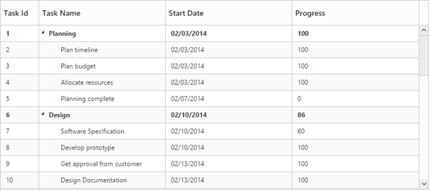

# Columns

Column definitions specified in the `Columns` option defines how the data in the **dataSource** have to be displayed, formatted and edited in TreeGrid. The values in the **dataSource** can be mapped to the appropriate column using the `Field` property of the corresponding column object.

## Editing type

The edit type of a column can be defined using the `EditType` property of the column object.

The following example shows how to define the edit type in a column,


@(Html.EJ().TreeGrid("TreeGridContainer")
	.Columns(col=>
		{
			col.EditType(TreeGridEditingType.Boolean).Add();
			col.EditType(TreeGridEditingType.Numeric).Add();
		})
@(Html.EJ().ScriptManager())       



The column editors can be further customized using the `EditOptions` property of the column object. 

The following example shows how to define additional properties to customize the date edit type,


@(Html.EJ().TreeGrid("TreeGridContainer")
	.Columns(col =>
		{
			col.Field("StartDate").EditType(TreeGridEditingType.Datepicker).DateEditOptions(new Syncfusion.JavaScript.Models.DatePickerProperties
		{
			HighlightWeekend = true
		}).Add();
		})
	)
@(Html.EJ().ScriptManager())       



## Formatting

The values in each column can be formatted using the `Format` property of the column object.

The following example shows how to specify the numeric format string to display currency, percentage symbols and date values in a column.


@(Html.EJ().TreeGrid("TreeGridContainer")
	.Columns(col =>
	{
		col.Field("Percentage").HeaderText("Percentage").Format("{0:P0}").Add();
		col.Field("Currency").HeaderText("Currency").Format("{0:C2}").Add();
		col.Field("startDate").HeaderText("Start Date").Format("{0:MM/dd/yyyy}").Add();
		col.Field("endDate").HeaderText("End Date").Format("{0:MM/dd/yyyy hh:mm:ss}").Add();
	})
	)
@(Html.EJ().ScriptManager())       



N>
For more numeric format strings, please refer this [link](https://msdn.microsoft.com/library/dwhawy9k(v=vs.100).aspx).

For more date format strings, please refer this [link](https://msdn.microsoft.com/library/az4se3k1(v=vs.100).aspx).

## Defining column width

In TreeGrid, it is possible to define width for a specific column by setting `Width` property of column.

The below code snippet shows how to set width for specific column.


@(Html.EJ().TreeGrid("TreeGridContainer")
	.Columns(col =>
	{
		col.Field("taskID").HeaderText("Task Id").Width(50).Add();
		col.Field("taskName").HeaderText("Task Name").Width(150).Add();
		col.Field("startDate").HeaderText("Start Date").Width(100).Add();
		col.Field("endDate").HeaderText("End Date").Width(100).Add();
		col.Field("duration").HeaderText("Duration").Width(100).Add();
	})
	)
@(Html.EJ().ScriptManager())       



The below screenshot shows TreeGrid render with specific column width.

### Defining common width for the columns

The TreeGrid control provide the support to set same width for all the columns in tree grid using `CommonWidth` property.

The below code snippet shows how to set common width for tree grid columns.


@(Html.EJ().TreeGrid("TreeGridContainer")
	.CommonWidth(140)
	)
@(Html.EJ().ScriptManager())       



The below screenshot shows TreeGrid render with common width. 

## Headers

### Header text

Using the `HeaderText` property, you can provide the title for a specific column. The below code snippet shows how to set header text for the columns.


@(Html.EJ().TreeGrid("TreeGridContainer")
	.Columns(col =>
	{
		col.Field("taskID").HeaderText("Task Id").Add();
		col.Field("taskName").HeaderText("Task Name").Add();
		col.Field("startDate").HeaderText("Start Date").Add();
		col.Field("endDate").HeaderText("End Date").Add();		
	})
	)
@(Html.EJ().ScriptManager())  



### Text wrapping

It is possible to wrap the header text or the title for the column, when the content exceeds the column width using the `HeaderTextOverflow` property. By default this property is set to **None**. To enable wrapping of header text, you have to set the `HeaderTextOverflow` property to **‘Wrap’**. The below code snippet demonstrates this.


@(Html.EJ().TreeGrid("TreeGridContainer")
	.HeaderTextOverflow(TreeGridHeaderTextOverflow.Wrap)
	)
@(Html.EJ().ScriptManager())  



### Header Template

Using the `HeaderTemplateID` property, you can specify the Id of the script element, which contains the JsRender template, to the specific column.

Following code snippet shows how to set the header template,   



@(Html.EJ().TreeGrid("TreeGridContainer")
	.Columns(col =>
		{
			col.Field("taskName").EditType(TreeGridEditingType.String).HeaderTemplateID("#projectName").Add();
			col.Field("startDate").EditType(TreeGridEditingType.Datepicker).Add();
			col.Field("resourceId").EditType(TreeGridEditingType.Dropdown).DropDownData((IEnumerable<object>)ViewBag.projectResources).HeaderTemplateID("#resource").Add();
			col.Field("progress").EditType(TreeGridEditingType.Numeric).Add();
		})
	)
@(Html.EJ().ScriptManager())  

    
    
	
	

The below screenshot depicts column headers with custom templates.

## Frozen Columns

Specific columns can be frozen by enabling the `IsFrozen` property of the respective column object. The columns which are frozen remain static while scrolling the content horizontally. You can also freeze or unfreeze a column during runtime, by selecting Freeze or Unfreeze menu item in the column menu. These set of menu options will be displayed in all the columns when the `IsFrozen` property is enabled in any of the columns. However you can control the visibility of these menu options in a particular column by enabling/disabling the `AllowFreezing` property of that specific column.



@(Html.EJ().TreeGrid("TreeGridContainer")
    .ShowColumnChooser(true)
	.Columns(co =>	
		{
			co.Field("TaskId").HeaderText("ID").Width(100).IsFrozen(true).AllowFreezing(false).Add();
            co.Field("TaskName").HeaderText("Task Name").Width(200).IsFrozen(true).Add();
            co.Field("StartDate").HeaderText("Start Date").Add();
            co.Field("EndDate").HeaderText("End Date").Add();
            co.Field("Duration").HeaderText("Duration").Add();
		})
	)
@(Html.EJ().ScriptManager())  



The below screenshot depicts TreeGrid with frozen columns,

It is also possible to freeze all the preceding columns at run-time by choosing *Freeze Preceding Columns* option in the column menu or by using the [`freezePrecedingColumns`](https://help.syncfusion.com/api/js/ejtreegrid#methods:freezeprecedingcolumns "freezePrecedingColumns") method, the column field name, for which the columns preceding it to be frozen should be passed as the method parameter.

### Freezing columns using method

Columns can also be frozen or unfrozen with custom actions using the [`freezeColumn`](/api/js/ejtreegrid#methods:freezecolumn "freezeColumn") method.
The column's field name which is to be frozen/unfrozen should be passed as the method parameter, along with the freeze state.


@(Html.EJ().TreeGrid("TreeGridContainer")
	//.
	)
@(Html.EJ().ScriptManager())  



## Resizing

You can resize the column width to view the hidden text of the cell. This feature can be enabled by setting the `AllowColumnResize` property to true.



@(Html.EJ().TreeGrid("TreeGridContainer")
	.AllowColumnResize(true)
	)
@(Html.EJ().ScriptManager())



### Column resize mode

In Treegrid, it is possible to provide different column resizing mode using `ResizeMode` property of `ColumnResizeSettings`.

The below are the types of column resize modes available in TreeGrid,

* Normal - Columns are stretched with control width at load time. When resizing the column, the current column width is updated based on next column.
* Next column - Columns are stretched with control width at load time. When resize the column the current column width is updated based on stretching columns in control width.
* Fixed Columns - Column are rendered with given width value at load time. Only the current column width is changed while resizing the column.

The following code snippet explains how to set column resize mode in tree grid.



@(Html.EJ().TreeGrid("TreeGridContainer")
  .ColumnResizeSettings(cr=>
        {
            cr.ResizeMode(TreeGridColumnResizeMode.FixedColumns);
        })
	)
@(Html.EJ().ScriptManager())



The above screenshot shows the tree grid render with `FixedColumns` resize mode.
{:.caption}

## Checkbox column 

It is possible to display a column as checkbox column in TreeGrid by enabling the `DisplayAsCheckbox` property and by setting the `EditType` property as `Boolean` for the column .  If the `DisplayAsCheckbox` property is set as false, then the column will be displayed as string column with the value mapped from the data source.
The following code snippet explains how to display a checkbox column in TreeGrid.



@(Html.EJ().TreeGrid("TreeGridContainer")
   .Columns(col =>
		{
			col.Field("approved").HeaderText("Approved").EditType(TreeGridEditingType.Boolean).DisplayAsCheckbox(true).Add();			
		})
	)
@(Html.EJ().ScriptManager())



The below screen shot depicts the `Approved` column in TreeGrid displayed as a checkbox column.

The index of the checkbox column can be changed at run-time using the [`updateCheckboxColumn`](https://help.syncfusion.com/api/js/ejtreegrid#methods:updatecheckboxcolumn "updateCheckboxColumn") method. The index of the column in which the checkbox should be displayed is passed as the method parameter.

## Column Template

Column Template is used to customize the column’s look and feel based on requirement.

The following code example shows you how to display the icon in the TreeGrid column.

* `TemplateID` - Using the `TemplateID` property, you can specify the Id of the script element, which contains the template for the column.
* `Template` - HTML templates can be specified in the `Template` property of the particular column as a string (HTML element).

However, you need to enable the `IsTemplateColumn` property for the specific column to display the custom template instead of default template.

Following code example show how to define template for the column.



// JsRender template definition.
    

@(Html.EJ().TreeGrid("TreeGridContainer")
	.RowHeight(50)
	.Columns(col =>
		{
			col.Field("taskID").HeaderText("Task Id").Width(45).Add();
			col.Field("taskName").HeaderText("Task Name").Add();
			col.HeaderText("Resource").IsTemplateColumn(true).TemplateID("columnTemplate").TextAlign(TextAlign.Center).Add();
			col.Field("resourceNames").HeaderText("Resource Name").Add();
		})
	)
@(Html.EJ().ScriptManager())



## Column Menu

Column menu can be displayed in column header by enabling the `ShowColumnChooser`.

Following are the items displayed in the column menu,

* **Column Chooser** – Displays all the column names, you can enable or disable a column by check or uncheck the respective column name in the column chooser menu.
* **Sort Ascending & Sort Descending** – Used to sort the items in the column. These menu options will be displayed only when you set the `AllowSorting` property as true. To perform multilevel sorting, the `AllowMultiSorting` property should be enabled.
* **Freeze, Unfreeze & Freeze Preceding Columns** – Used to freeze or unfreeze the columns. These set of menu options will be displayed in all the columns when the `IsFrozen` property is enabled in any of the columns. However, you can control the visibility of these menu options in a particular column by enabling/disabling the `AllowFreezing` property of that specific column.



@(Html.EJ().TreeGrid("TreeGridContainer")
	.ShowColumnChooser(true)
    .AllowSorting(true)
    .AllowMultiSorting(true)
	.Columns(col =>
		{
			col.Field("duration").HeaderText("Duration").Visible(false).Add();			
		})
	)
@(Html.EJ().ScriptManager())



The column menu also provides support for some of the additional column options such as,

* Insert column left
* Insert column right 
* Delete column
* Rename column

The column options can be enabled or disabled with the `ShowColumnOptions` property, default value of this property is `false`.

Following code example shows how to enable the column option in tree grid.



   @(Html.EJ().TreeGrid("TreeGridContainer")
		.ShowColumnOptions(true)
	)
@(Html.EJ().ScriptManager())



The above screenshot shows insert column dialog in TreeGrid  
{:.caption}

The TreeGrid columns can also be renamed or deleted at run-time with custom actions using the [`renameColumn`](https://help.syncfusion.com/api/js/ejtreegrid#methods:renamecolumn "renameColumn") and [`deleteColumn`](https://help.syncfusion.com/api/js/ejtreegrid#methods:deletecolumn "deleteColumn") methods.

### Customizing the insert column dialog.

It is possible to add or remove the `Columns` properties in insert column dialog using `ColumnDialogFields` property. In insert column option `Field`, `HeaderText` and `EditType` properties are necessary to create a new column, so this fields are unable to remove from insert column option.

Following code example shows how to customize the insert column option in tree grid.



@(Html.EJ().TreeGrid("TreeGridContainer")	
	.AllowSorting(true)	
	.ShowColumnOptions(true)
	.ColumnDialogFields(new List<TreeGridColumnDialogFields>()
    {
        TreeGridColumnDialogFields.Field,
        TreeGridColumnDialogFields.HeaderText,
        TreeGridColumnDialogFields.EditType,
        TreeGridColumnDialogFields.Width,
        TreeGridColumnDialogFields.Visible,
        TreeGridColumnDialogFields.AllowSorting,
        TreeGridColumnDialogFields.TextAlign,
        TreeGridColumnDialogFields.HeaderTextAlign                
    })
	)
@(Html.EJ().ScriptManager())



The above screenshot shows customized insert column dialog in tree grid.  
{:.caption}

### Hide specific column in column chooser list
It is possible to hide the specific column in column chooser list by settings `ShowInColumnChooser` as `false` in the column definition.

Following code example shows how to hide specific column in column chooser list



@(Html.EJ().TreeGrid("TreeGridContainer")	
	.ShowColumnChooser(true)
	.Columns(col =>
		{
			col.Field("taskID").HeaderText("Task Id").ShowInColumnChooser(false).Add();			
		})
	)
@(Html.EJ().ScriptManager())



The above screenshot shows TreeGrid column chooser rendered without `Task Id` column. 
{:.caption}

## Show/Hide columns using method

It is possible to toggle the visibility of the columns using the [`hideColumn`](/api/js/ejtreegrid#methods:hidecolumn "hideColumn") and [`showColumn`](/api/js/ejtreegrid#methods:showcolumn "showColumn") methods. The column's header text should be passed as the method parameter which is to be hidden.



@(Html.EJ().TreeGrid("TreeGridContainer")	
	 //.
	)
@(Html.EJ().ScriptManager())



## Command Column

### Default action buttons

Using command columns in TreeGrid, we can display a separate column to perform CRUD operations. It is also possible to perform any custom actions by using custom command buttons. Command column can be defined in TreeGrid by using the `Commands` property.
A command column can be customized by using the `Type` and `ButtonOptions` properties.

* **Type**: Using this property we can add required action buttons in TreeGrid command column such as edit,delete,save and cancel.
* **ButtonOptions**: Using this property we can customize the button in the command column with the properties available in [Button](https://help.syncfusion.com/api/js/ejbutton#members "Button").


@(Html.EJ().TreeGrid("TreeGridContainer")              
              .Columns(co =>
              {                                
                  co.HeaderText("Manage Records").Commands(command =>
                      {
                          command.Type(TreeGridUnboundType.Edit)
                              .ButtonOptions(new ButtonProperties()
                              {
                                  Text = "Edit", 
                                  Width="58"
                              }).Add();
                          command.Type(TreeGridUnboundType.Delete)
                              .ButtonOptions(new ButtonProperties()
                              {
                                  Text = "Delete",
                                  Width = "58"
                              }).Add();
                          command.Type(TreeGridUnboundType.Save)
                              .ButtonOptions(new ButtonProperties()
                              {
                                  Text = "Save",
                                  Width = "58"
                              }).Add();
                          command.Type(TreeGridUnboundType.Cancel)
                              .ButtonOptions(new ButtonProperties()
                              {
                                  Text = "Cancel",
                                  Width = "58"
                              }).Add();
                      }).Add();
              })      
    )
@(Html.EJ().ScriptManager())


### Custom buttons

We can also add custom buttons to the command column by specifying text value other than default buttons to the type property. We can also bind actions to the custom button using the [Click](https://help.syncfusion.com/api/js/ejbutton#events:click "click") client-side event of Button.


  @(Html.EJ().TreeGrid("TreeGridContainer")
              .Columns(co =>
              {
                   co.HeaderText("Manage Records").Commands(command =>
                      {
                          command.Type("Details")
                              .ButtonOptions(new ButtonProperties()
                              {
                                  Text = "Details",
                                  Width = "58",
                                  Click = "onClick"
                              }).Add();
                      }).Add();                         
              })    
    )
@(Html.EJ().ScriptManager())



## Tree column/ Expander column 

The position of the expander column which acts as tree column, can be changed using the `TreeColumnIndex` property.

Following code example shows how to change the position of the expander column.


 @(Html.EJ().TreeGrid("TreeGridContainer")
	.TreeColumnIndex(2)    
	)
@(Html.EJ().ScriptManager())



The tree column index can be also be changed at run-time by using the [`columnIndex`](https://help.syncfusion.com/api/js/ejtreegrid#methods:columnindex "columnIndex")

## Visibility

Columns can be hidden on loading by setting the `Visible` property as false.

Following code example explains how to hide the fourth column.


 @(Html.EJ().TreeGrid("TreeGridContainer")
	.Columns(col =>
		{
			col.Field("taskID").HeaderText("Task Id").Width(45).Add();
			col.Field("taskName").HeaderText("Task Name").Add();			
			col.Field("startDate").HeaderText("Start Date").Add();
			col.Field("endDate").HeaderText("End Date").Visible(false).Add();
			col.Field("progress").HeaderText("Progress").Add();
		}) 
	)
@(Html.EJ().ScriptManager())
        


## Read-only

A column can be made read-only by setting the `AllowEditing` property as false.

N>
By setting Columns.AllowEditing as false that specific column alone is made as read only, and by setting the EditSettings.AllowEditing as false the entire TreeGrid is made read-only.

The below code snippet demonstrates this.


 @(Html.EJ().TreeGrid("TreeGridContainer")
	.Columns(col =>
		{
			col.Field("taskID").HeaderText("Task Id").Width(45).Add();
			col.Field("taskName").HeaderText("Task Name").AllowEditing(false).Add();			
			col.Field("startDate").HeaderText("Start Date").Add();
			col.Field("endDate").HeaderText("End Date").Add();		
		}) 
	)
@(Html.EJ().ScriptManager())



## Validation Rules

At some occasions, we will need to validate the data before updating it to the database. In TreeGrid it is possible to validate the data while performing adding and editing actions. The validation rules must be provided in the column definition using `ValidationRules` property. TreeGrid has built-in support for the below validation rules.

* **maxlength** – Makes the value require a given maximum text length.
* **minlength** – Makes the value require a given minimum text length.
* **required** – Makes the value required. 
* **number** – Makes the value require a decimal number.
* **range** – Makes the value require a given value range.

The below code example explains defining the validation rules for the column.


 @(Html.EJ().TreeGrid("TreeGridContainer")
	 .Columns(col =>
		{
			col.Field("taskID").HeaderText("Task Id").Width(45).ValidationRules(v=> v.AddRule("required",true)).Add();
			col.Field("taskName").HeaderText("Task Name").ValidationRules(v => v.AddRule("maxlength",5).AddRule("minlength",2)).Add();
			col.Field("progress").HeaderText("Progress").ValidationRules(v => v.AddRule("range", new List<object>() { -1, 101 })).Add();			
		}) 
	)
@(Html.EJ().ScriptManager())



Custom validation error messages can also be defined in the column object. The below code example explains defining the custom error message. 


 @(Html.EJ().TreeGrid("TreeGridContainer")
	 .Columns(col =>
		{
			col.Field("taskID").HeaderText("Task Id").Width(45).ValidationRules(v=> v.AddRule("required",true).AddRule("number",true).AddRule("messages", new Dictionary<string, object>() { { "required", "This field was must" } })).Add();
		}) 
	)
@(Html.EJ().ScriptManager())



### Custom Validation rules
Apart by the in-built validation rules, any custom validation rules can also be defined for the column. The below code example explains defining custom validation rule for a column.


 

@(Html.EJ().TreeGrid("TreeGridContainer")
	 .Columns(col =>
		{
			col.Field("Progress").HeaderText("Progress").EditType(TreeGridEditingType.Numeric).ValidationRules(v => v.AddRule("customCompare", new List<object>() { -1, 101 })).Add();
		}) 
	)
@(Html.EJ().ScriptManager())



The below image displays the TreeGrid with validation rule applied for a date column.

## Column Reorder

Column reorder is used to change the order of the column. In ejTreeGrid, `AllowColumnReordering` property is used to enable the column re-order, default value of this property is false.

Following code example explains how to enable column reorder in tree grid


 @(Html.EJ().TreeGrid("TreeGridContainer")
	.AllowColumnReordering(true)	
	)
@(Html.EJ().ScriptManager())     


The above screenshot shows the column reorder in tree grid.
{:.caption}

The TreeGrid columns can also be reordered using the [`reorderColumn`](https://help.syncfusion.com/api/js/ejtreegrid#methods:reordercolumn "reorderColumn") method, where the column field name and the target index should be passed as the method parameters.

## Text Alignment

In TreeGrid, it is possible to align both content and header text of particular column using the `TextAlign` and `HeaderTextAlign` property of columns.
There are four possible ways to align content and header text of column, they are

1. Left
2. Right
3. Center
4. Justify

N> 1. The TextAlign property will affect both content and header text of the grid, when HeaderTextAlign is not set in column definition.

Following code example explains how to set text alignment for content and header text in tree grid


 @(Html.EJ().TreeGrid("TreeGridContainer")
	 .Columns(col =>
		{
			col.Field("taskID").HeaderText("Task Id").Add();
			col.Field("taskName").HeaderText("Task Name").Add();
			col.Field("startDate").HeaderText("Start Date").TextAlign(TextAlign.Right).HeaderTextAlign(TextAlign.Left).Add();			
		    col.Field("endDate").HeaderText("End Date").TextAlign(TextAlign.Center).Add();
            col.Field("duration").HeaderText("Duration").Add();
		}) 	
	)
@(Html.EJ().ScriptManager())



The above screenshot shows tree grid render with text alignment and header text alignment.
{:.caption}

### Customize the column at initial load
In TreeGrid, it is possible to customize the column at load time using `Load` event.

The following code examples shows how to customize the column at load time


 @(Html.EJ().TreeGrid("TreeGridContainer")
	 .Columns(col =>
		{
			col.Field("taskID").HeaderText("Task Id").Add();
			col.Field("taskName").HeaderText("Task Name").Add();
			col.Field("startDate").HeaderText("Start Date").Add();			
		    col.Field("endDate").HeaderText("End Date").Add();
            col.Field("duration").HeaderText("Duration").Add();
		})
		.ClientSideEvents(eve=>
        {
            eve.Load("load");
        }) 	
	)
@(Html.EJ().ScriptManager())



The above screen shot shows tree grid render with column customization

## Column object

The column object which consists the list of columns available in TreeGrid can be retrieved using the [`getColumnByHeaderText`](https://help.syncfusion.com/api/js/ejtreegrid#methods:getcolumnbyheadertext "getColumnByHeaderText") and [`getColumnByField`](https://help.syncfusion.com/api/js/ejtreegrid#methods:getcolumnbyfield "getColumnByField") methods.In the method `getColumnByHeaderText` the header text defined for the column should be passed as the method parameter while in the method `getColumnByField` the column field name should be passed as method parameter.

To fetch the column index using the column field name, the method [`getColumnIndexByField`](https://help.syncfusion.com/api/js/ejtreegrid#methods:getcolumnindexbyfield "getColumnIndexByField") should be called with field name as parameter. And to retrieve the datasource field name assigned to a column by using the column header text the method [`getFieldNameByHeaderText`](https://help.syncfusion.com/api/js/ejtreegrid#methods:getfieldnamebyheadertext "getFieldNameByHeaderText") should be called.