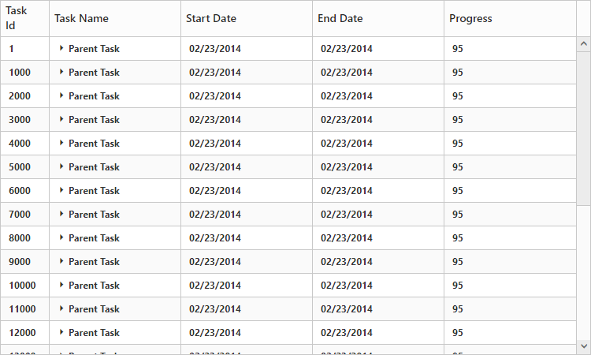
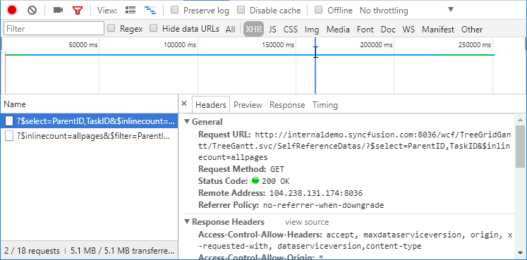

# Data Binding

Data Binding is the process that establishes a connection between the application and different kinds of data sources such as business objects.

## Local Data Binding

In Local Data Binding, datasource for rendering the TreeGrid control is retrieved from the same application locally.

Two types of Data Binding are possible with TreeGrid control, 

* Hierarchical Datasource Binding
* Self-Referential Data Binding (Flat Data)

## Hierarchy Datasource Binding

The following code example shows you how to bind the Hierarchical local data into the TreeGrid control.





public partial class TreeGridController : Controller

{

        // GET: /TreeGridDefault/

        public ActionResult TreeGridDefault()

        {

            var data=this.GetDefaultDataSource();

            ViewBag.datasource = data;

            return View();

        }

        private List<BusinessObject> GetDefaultDataSource()

        {

            List<BusinessObject> BusinessObjectCollection = new List<BusinessObject>();

            BusinessObject Record1 = null;

            Record1 = new BusinessObject()

            {

                TaskId = 1,

                TaskName = "Planning",

                StartDate = "02/03/2014",

                EndDate = "02/07/2014",

                Progress = 100,

                Duration = 5,

                Children=new List<BusinessObject>(),

            };

            BusinessObject Child1=new BusinessObject()

            {

                TaskId = 2, 

                TaskName =  "Plan timeline", 

                StartDate = "02/03/2014", 

                EndDate = "02/07/2014",  

                Duration = 5, 

                Progress = 100 

            };

            BusinessObject Child2 = new BusinessObject()

            {

                TaskId = 3,

                TaskName = "Plan budget",

                StartDate = "02/03/2014",

                EndDate = "02/07/2014",

                Duration = 5,

                Progress = 100

            };

            Record1.Children.Add(Child1);

            Record1.Children.Add(Child2);

            Record1.Children.Add(Child3);

            Record1.Children.Add(Child4);

            BusinessObjectCollection.Add(Record1);

            return BusinessObjectCollection;

        }
		
        public class BusinessObject

        {
            public int TaskId

            {

                get;

                set;

            }

            public string TaskName

            {

                get;

                set;

            }

            public string StartDate

            {

                get;

                set;

            }

            public string EndDate

            {

                get;

                set;

            }

            public int Duration

            {

                get;

                set;

            }

            public int Progress

            {

                get;

                set;

            }

            public List<BusinessObject> Children

            {

                get;

                set;

            }

        }
}



@using Syncfusion.JavaScript

@using Syncfusion.JavaScript.Models

@using Syncfusion.MVC.EJ 

<!DOCTYPE html>     

<html>

<head>

         @*Add script reference and style reference here*@

</head>

<body>

@(Html.EJ().TreeGrid("TreeGridContainer")                                   

       .ChildMapping("Children")                     

       .TreeColumnIndex(1)

       .Columns(co=>

           {

               co.Field("TaskId").headerText("Task Id").Width(45).Add();

               co.Field("TaskName").headerText("Task Name").Add();

               co.Field("StartDate").headerText("Start Date").Add();

               co.Field("EndDate").headerText("End Date").Add();

               co.Field("Duration").headerText("Duration").Add();

               co.Field("Progress").headerText("Progress").Add();

           }

       )

       .Datasource(ViewBag.datasource)

       )

    }

</body>

</html>


  

The output of the above steps is as follows:

## Self-Referential Data Binding (Flat Data)

TreeGrid is rendered from Self-Referential data structures by providing two fields: ID field and parent ID field.

•ID Field- This field contains unique values used to identify nodes. Its name is assigned to the IdMapping property.

•Parent ID Field- This field contains values that indicate parent nodes. Its name is assigned to the ParentIdMapping property.





public partial class TreeGridController : Controller

    {

        // GET: /TreeGridDefault/

        public ActionResult TreeGridDefault()

        {

            var data = this.GetDefaultDataSource();

            ViewBag.datasource = data;

            return View();

        }

        private List<BusinessObject> GetDefaultDataSource()

        {

            List<BusinessObject> list = new List<BusinessObject>();

            list.Add(new BusinessObject()

                {

                    Id = 1,

                    Name = "Parent Task 1",

                    StartDate = "02/03/2014",

                    Duration = 5

                });

            list.Add(new BusinessObject()

            {

                Id = 2,

                Name = "Child Task 1",

                ParentId = 1,

                StartDate = "02/03/2014",

                Duration = 5,

            });

            list.Add(new BusinessObject()

            {

                Id = 3,

                ParentId = 1,

                Name = "Child Task 2",

                StartDate = "02/03/2014",

                Duration = 5,

                PercentDone = 100,

            });

            list.Add(new BusinessObject()

             {

                 Id = 4,

                 ParentId = 1,

                 Name = "Child Task 3",

                 StartDate = "02/03/2014",

                 Duration = 5,

                 PercentDone = 40,

             });

            list.Add(new BusinessObject()

            {

                Id = 5,

                Name = "Parent Task 2",

                StartDate = "02/03/2014",

                Duration = 5,

                PercentDone = 100,

            });

            list.Add(new BusinessObject()

            {

                Id = 6,

                ParentId = 5,

                Name = "Child Task 1",

                StartDate = "02/03/2014",

                Duration = 5,

            });
            //...

            return list;

        }

    }

    public class BusinessObject

    {

        public string StartDate { get; set; }

        public int Id { get; set; }

        public int ParentId { get; set; }

        public string Name { get; set; }

        public int Duration { get; set; }

        public int PercentDone { get; set; }

        public List<BusinessObject> Children

        {

            get;

            set;

        }

    }



    @(Html.EJ().TreeGrid("TreeGridContainer")       

       .TreeColumnIndex(1)

       .IdMapping("Id")

       .parentIdMapping("ParentId")

       .Columns(co=>

           {

               co.Field("Id").headerText("Task Id").Width(45).Add();

               co.Field("Name").headerText("Task Name").Add();

               co.Field("StartDate").headerText("Start Date").Add();

               co.Field("EndDate").headerText("End Date").Add();

               co.Field("Duration").headerText("Duration").Add();

               co.Field("PercentDone").headerText("Progress").Add();

           }

       )

       .Datasource(ViewBag.datasource)

       )


  

The following screenshot shows the output of the above steps,

## Remote data binding

### Load on demand

TreeGrid provides `Load on Demand` support for rendering remote data. Load on demand is considered in TreeGrid for the following actions, 

* Expanding root nodes.
* Navigating pages, with paging enabled in TreeGrid.

When load on demand is enabled, all the root nodes are rendered in collapsed state at initial load.

When load on demand support is enabled in TreeGrid with paging, the current or active page’s root node alone will be rendered in collapsed state. On expanding the root node, the child nodes will be loaded from the remote server. 

When a root node is expanded, its child nodes are rendered and are cached locally, such that on consecutive expand/collapse actions on root node, the child nodes are loaded from the cache instead from the remote server.

Similarly, if the user navigates to a new page, the root nodes of that specific page, will be rendered with request to the remote server.

N> 1. Load on demand support in TreeGrid can be enabled only for remote data.
N> 2. For better initial load time performance, we need to define the “HasChildMapping” property.

Load on demand support in TreeGrid can be enabled by the following ways,

1. By enabling [`EnableLoadOnDemand`](https://help.syncfusion.com/api/js/ejtreegrid#members:enableLoadOnDemand "enableLoadOnDemand") property of TreeGrid control
2. By enabling **CrossDomain** property while binding data source using ejDataManager control.

The following code explains how to use Load on Demand in TreeGrid Control,



@(Html.EJ().TreeGrid("TreeGridContainer")
             .IdMapping("TaskID")
             .ParentIdMapping("ParentID")
             .HasChildMapping("isParent")
             .EnableVirtualization(true)
             .Columns(co =>
               {
                   co.Field("TaskID").HeaderText("Task Id").Width(45).Add();
                   co.Field("TaskName").HeaderText("Task Name").Add();
                   co.Field("StartDate").HeaderText("Start Date").Add();
                   co.Field("EndDate").HeaderText("End Date").Add();                 
                   co.Field("Progress").HeaderText("Progress").Add();
               }
             )
              .Datasource(ds => ds.URL("http://js.syncfusion.com/demos/ejServices/Wcf/TreeGridGantt/TreeGantt.svc/SelfReferenceDatas").CrossDomain(true))
    )



The output for load on demand support in TreeGrid:

The following code snippet shows on how to enable load on demand support using  [`EnableLoadOnDemand`](https://help.syncfusion.com/api/js/ejtreegrid#members:enableLoadOnDemand "enableLoadOnDemand") property.



@(Html.EJ().TreeGrid("TreeGridContainer")
    .EnableLoadOnDemand(true)         
    .Datasource(ds => ds.URL("http://js.syncfusion.com/demos/ejServices/Wcf/TreeGridGantt/TreeGantt.svc/SelfReferenceDatas"))
    )



The following output shows how load on demand works for expanding action

### Load at once:

On remote data binding, for every action such as paging, sorting, filtering, the data will be fetched from remote server each time. To avoid requesting the data from the remote server for each action, we can set TreeGrid to load all the data on initialization and make all the data operations in client side. To enable this, we can use offline property of `ej.DataManager`. the following code example explains this.



@(Html.EJ().TreeGrid("TreeGridContainer")
             .IdMapping("TaskID")
             .ParentIdMapping("ParentID")
             .HasChildMapping("isParent")
             .EnableVirtualization(true)
             .Columns(co =>
               {
                   co.Field("TaskID").HeaderText("Task Id").Width(45).Add();
                   co.Field("TaskName").HeaderText("Task Name").Add();
                   co.Field("StartDate").HeaderText("Start Date").Add();
                   co.Field("EndDate").HeaderText("End Date").Add();                 
                   co.Field("Progress").HeaderText("Progress").Add();
               }
             )
              .Datasource(ds => ds.URL("http://js.syncfusion.com/demos/ejServices/Wcf/TreeGridGantt/TreeGantt.svc/SelfReferenceDatas").Offline(true))
    )



Please refer the [link](https://help.syncfusion.com/js/datamanager/data-binding#offline-mode "offline") for further reference on offline property

**Limitations**:

1. Mapping the expand state of a record using `ExpandStateMapping` property is not supported in load on demand feature.
2. If a root or parent node is in collapsed state (child nodes not yet loaded), then that parent node will not be expanded while inserting new child to that parent node using toolbar icon or drag and drop actions.

