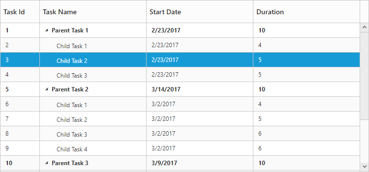

# Data Binding

Data Binding is the process that establishes a connection between the application and different kinds of data sources such as business objects.

## Local Data Binding

In Local Data Binding, datasource for rendering the TreeGrid control is retrieved from the same application locally.

Two types of Data Binding are possible with TreeGrid control, 

* Hierarchical Datasource Binding
* Self-Referential Data Binding (Flat Data)

## Hierarchy Datasource Binding

The following code example shows you how to bind the Hierarchical local data into the TreeGrid control.



CONTROLLER [CS]

public partial class TreeGridController : Controller

    {

        //

        // GET: /TreeGridDefault/

        public ActionResult TreeGridDefault()

        {

            var data=this.GetDefaultDataSource();

            ViewBag.datasource = data;

            return View();

        }

        private List<BusinessObject> GetDefaultDataSource()

        {

            List<BusinessObject> BusinessObjectCollection = new List<BusinessObject>();

            BusinessObject Record1 = null;

            Record1 = new BusinessObject()

            {

                TaskId = 1,

                TaskName = "Planning",

                StartDate = "02/03/2014",

                EndDate = "02/07/2014",

                Progress = 100,

                Duration = 5,

                Children=new List<BusinessObject>(),

            };

            BusinessObject Child1=new BusinessObject()

            {

                TaskId = 2, 

                TaskName =  "Plan timeline", 

                StartDate = "02/03/2014", 

                EndDate = "02/07/2014",  

                Duration = 5, 

                Progress = 100 

            };

            BusinessObject Child2 = new BusinessObject()

            {

                TaskId = 3,

                TaskName = "Plan budget",

                StartDate = "02/03/2014",

                EndDate = "02/07/2014",

                Duration = 5,

                Progress = 100

            };

            //...

          //...

            Record1.Children.Add(Child1);

            Record1.Children.Add(Child2);

            Record1.Children.Add(Child3);

            Record1.Children.Add(Child4);

    //...

    //...

            BusinessObjectCollection.Add(Record1);

            return BusinessObjectCollection;

        }

        public class BusinessObject

        {

            public int TaskId

            {

                get;

                set;

            }

            public string TaskName

            {

                get;

                set;

            }

            public string StartDate

            {

                get;

                set;

            }

            public string EndDate

            {

                get;

                set;

            }

            public int Duration

            {

                get;

                set;

            }

            public int Progress

            {

                get;

                set;

            }

            public List<BusinessObject> Children

            {

                get;

                set;

            }

        }




VIEW [CSHTML]

@using Syncfusion.JavaScript

@using Syncfusion.JavaScript.Models

@using Syncfusion.MVC.EJ 

<!DOCTYPE html>     

<html>

<head>

         @*Add script reference and style reference here*@

</head>

<body>

@(Html.EJ().TreeGrid("TreeGridContainer")                                   

       .ChildMapping("Children")                     

       .TreeColumnIndex(1)

       .Columns(co=>

           {

               co.Field("TaskId").headerText("Task Id").Width(45).Add();

               co.Field("TaskName").headerText("Task Name").Add();

               co.Field("StartDate").headerText("Start Date").Add();

               co.Field("EndDate").headerText("End Date").Add();

               co.Field("Duration").headerText("Duration").Add();

               co.Field("Progress").headerText("Progress").Add();

           }

       )

       .Datasource(ViewBag.datasource)

       )

    }

</body>

</html>



The output of the above steps is as follows:

## Self-Referential Data Binding (Flat Data)

TreeGrid is rendered from Self-Referential data structures by providing two fields: ID field and parent ID field.

•ID Field- This field contains unique values used to identify nodes. Its name is assigned to the IdMapping property.

•Parent ID Field- This field contains values that indicate parent nodes. Its name is assigned to the ParentIdMapping property.



CONTROLLER [CS]

public partial class TreeGridController : Controller

    {

        //

        // GET: /TreeGridDefault/

        public ActionResult TreeGridDefault()

        {

            var data = this.GetDefaultDataSource();

            ViewBag.datasource = data;

            return View();

        }

        private List<BusinessObject> GetDefaultDataSource()

        {

            List<BusinessObject> list = new List<BusinessObject>();

            list.Add(new BusinessObject()

                {

                    Id = 1,

                    Name = "Task 1",

                    StartDate = "02/03/2014",

                    Duration = 5

                });

            list.Add(new BusinessObject()

            {

                Id = 2,

                Name = "Child Task 1",

                ParentId = 1,

                StartDate = "02/03/2014",

                Duration = 5,

            });

            list.Add(new BusinessObject()

            {

                Id = 3,

                ParentId = 1,

                Name = "Child Task 2",

                StartDate = "02/03/2014",

                Duration = 5,

                PercentDone = 100,

            });

            list.Add(new BusinessObject()

             {

                 Id = 22,

                 ParentId = 2,

                 Name = "Sub Child Task 1",

                 StartDate = "02/03/2014",

                 Duration = 5,

                 PercentDone = 40,

             });

            list.Add(new BusinessObject()

            {

                Id = 23,

                ParentId = 2,

                Name = "Sub Child Task 2",

                StartDate = "02/03/2014",

                Duration = 5,

                PercentDone = 100,

            });

            list.Add(new BusinessObject()

            {

                Id = 12,

                ParentId = 22,

                Name = "Inner Child Task 1",

                StartDate = "02/03/2014",

                Duration = 5,

            });

            list.Add(new BusinessObject()

            {

                Id = 13,

                ParentId = 22,

                Name = "Inner Child Task 2",

                StartDate = "02/03/2014",

                Duration = 5,

                PercentDone = 100,

            });

             //...

           //...

            return list;

        }

    }

    public class BusinessObject

    {

        public string StartDate { get; set; }

        public int Id { get; set; }

        public int ParentId { get; set; }

        public string Name { get; set; }

        public int Duration { get; set; }

        public int PercentDone { get; set; }

        public List<BusinessObject> Children

        {

            get;

            set;

        }

    }


VIEW [CSHTML]

    @(Html.EJ().TreeGrid("TreeGridContainer")                                   

       .ChildMapping("Children")                     

       .TreeColumnIndex(1)

       .IdMapping("Id")

       .parentIdMapping("ParentId")

       .Columns(co=>

           {

               co.Field("Id").headerText("Task Id").Width(45).Add();

               co.Field("Name").headerText("Task Name").Add();

               co.Field("StartDate").headerText("Start Date").Add();

               co.Field("EndDate").headerText("End Date").Add();

               co.Field("Duration").headerText("Duration").Add();

               co.Field("PercentDone").headerText("Progress").Add();

           }

       )

       .Datasource(ViewBag.datasource)

       )



The following screenshot shows the output of the above steps,

