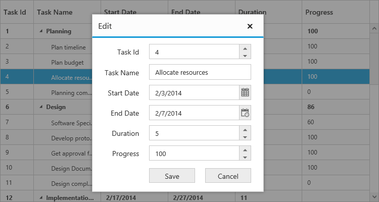

# Editing

TreeGrid provides support to add, edit and delete the records dynamically using `EditSettings` property.

## Add new record

TreeGrid provides support for adding a new record by setting `AllowAdding` property as `true`. You can add new record by toolbar add item click or context menu.

The below code example shows how to enable add option in TreeGrid.



@(Html.EJ().TreeGrid("TreeGridContainer")
      .EditSettings(edit=>
        {
            edit.AllowAdding(true);
        })
      )
@(Html.EJ().ScriptManager())



The above screenshot shows before add a new record in TreeGrid.
{:.caption}

The above screenshot shows after add a new record in TreeGrid.
{:.caption}

## Add row position

Using the `EditSettings.RowPosition` parameter, user can able to insert the record at any desired index at run-time. The user can insert a record dynamically in the following positions

* Top: Top to all the existing records
* Bottom: Bottom to all the existing records
* AboveSelectedRow: Above to the selected row
* BelowSelectedRow: Below to the selected row
* Child: As a child to the selected row 

The below code example shows how to set row position for new record add in TreeGrid.



@(Html.EJ().TreeGrid("TreeGridContainer")
     .EditSettings(edit=>
        {
            edit.AllowAdding(true);
            edit.RowPosition(TreeGridRowPosition.Child);
        })
      )
@(Html.EJ().ScriptManager())



The above screenshot shows new record added in row position of `Child`.
{:.caption}

### Adding records using method

Using [`addRow`](/api/js/ejtreegrid#methods:addrow "addRow") method records can be added dynamically to the TreeGrid. Before calling this method, you should enable the `AllowAdding` property.

The below code snippet explains dynamically inserting a record in TreeGrid. The record will be inserted as a child node to the current selected record.



@(Html.EJ().TreeGrid("TreeGridContainer")
     .EditSettings(edit=>
        {
            edit.AllowAdding(true);            
        })
      )
@(Html.EJ().ScriptManager())



## Edit modes

TreeGrid supports the below editModes, 

* Cell Editing
* Row Editing
* Dialog Editing
* Batch Editing

You can enable editing in TreeGrid by enabling the property `AllowEditing`.

### Cell Editing

Update the record through editing a cell by setting `EditMode` as the `CellEditing`.

The following code example shows you how to enable the `CellEditing` in TreeGrid control.



@(Html.EJ().TreeGrid("TreeGridContainer")
      .EditSettings(edit=>
            {
            edit.AllowEditing(true);
            edit.EditMode(TreeGridEditMode.CellEditing);
            })
      )
@(Html.EJ().ScriptManager())



The output of TreeGrid with `CellEditing` is as follows.

### Prevent cell editing

In cell edit action `BeginEdit` and `EndEdit` events are triggered before and after the editing action. Cell editing for specific cell can be prevented by using `BeginEdit` event.

The following code example show, how to prevent cell editing in TreeGrid.



@(Html.EJ().TreeGrid("TreeGridContainer")
      .EditSettings(edit=>
            {
                  edit.AllowEditing(true);
                  edit.EditMode(TreeGridEditMode.CellEditing);
            })
      .ClientSideEvents(eve=>
            {
                  eve.BeginEdit("beginEdit");
                  eve.EndEdit("endEdit");
            }) 
      )
@(Html.EJ().ScriptManager())



### Row Editing

It is possible to make the entire row to editable state and to update a record by setting `EditMode` as `RowEditing`.

The following code example shows you how to enable `RowEditing` in TreeGrid control.



@(Html.EJ().TreeGrid("TreeGridContainer")
      .EditSettings(edit=>
            {
            edit.AllowEditing(true);
            edit.EditMode(TreeGridEditMode.RowEditing);
            })
      )
@(Html.EJ().ScriptManager())



The following output is displayed as a result of the above code example.

### Dialog Editing

Set the `EditMode` as `DialogEditing` to edit/add a record using dialog.

The following code example shows you how to enable the `DialogEditing` in TreeGrid control.



@(Html.EJ().TreeGrid("TreeGridContainer")
      .EditSettings(edit=>
            {
            edit.AllowEditing(true);
            edit.EditMode(TreeGridEditMode.DialogEditing);
            })
      )
@(Html.EJ().ScriptManager())



The output of the TreeGrid with `DialogEditing` is as follows.

The add and edit dialogs can be opened on custom actions instead of toolbar icons using the methods [`showAddDialog`](https://help.syncfusion.com/api/js/ejtreegrid#methods:showadddialog "showAddDialog") and [`showEditDialog`](https://help.syncfusion.com/api/js/ejtreegrid#methods:showeditdialog "showEditDialog").

### Prevent dialog editing

In dialog editing action `ActionBegin` and `ActionComplete` client side events are triggered before and after the edit action. Dialog editing for specific row can be prevented by using `ActionBegin` event.

The following code example show, how to prevent dialog editing in TreeGrid.



@(Html.EJ().TreeGrid("TreeGridContainer")
      .EditSettings(edit=>
            {
                  edit.AllowEditing(true);
                  edit.EditMode(TreeGridEditMode.DialogEditing);
            })
      .ClientSideEvents(eve=>
            {
                  eve.ActionBegin("actionBegin");
                  eve.ActionComplete("actionComplete");
            }) 
      )
@(Html.EJ().ScriptManager())



N> While saving the edited record `ActionComplete` event will be triggered with updated record value in `data` argument and `requestType` as `recordUpdate`. Using this event we can update the database.

### Batch Editing

In TreeGrid control to save the all the Add, Edit and Delete changes to database with single action, set the `EditMode` as batchEditing.

The following code example shows you how to enable the `BatchEditing` in TreeGrid control.



@(Html.EJ().TreeGrid("TreeGridContainer")

.EditSettings(edit =>

       {

           edit.AllowEditing(true);

           edit.BeginEditAction(TreeGridBeginEditAction.Click);
           
           edit.EditMode(TreeGridEditMode.BatchEditing);

       })

)



The output of the TreeGrid with `BatchEditing` is as follows.

In Batch editing, the Edit mode can be changed to `Cell` or `Row` with `BatchEditSettings` property as per the following code example.



@(Html.EJ().TreeGrid("TreeGridContainer")

.EditSettings(edit =>

       {

           edit.AllowEditing(true);

           edit.BeginEditAction(TreeGridBeginEditAction.Click);
           
           edit.EditMode(TreeGridEditMode.BatchEditing);

           edit.BatchEditSettings(be => { be.EditMode(TreeGridBatchEditMode.Row); });

       })

)



The output of the TreeGrid with `BatchEditSettings` and `EditMode` is as follows.

N> After modifying all the changes in TreeGrid, on clicking `Save` button the [`actionComplete`](https://help.syncfusion.com/api/js/ejtreegrid#events:actioncomplete) event will be triggered with updated records in `batchChanges` argument and `requestType` as `batchSave`. Using this event we can update the all the modified records to database.

## Edit type and its params

The edit type of columns can be customized using `EditType` property of `Columns`. The following controls are supported built-in by `EditType`. You can set the `EditType` based on specific data type of the column.

* **CheckBox** control for boolean data type.
* **NumericTextBox** control for integers, double, and decimal data types.
* **InputTextBox** control for string data type.
* **DatePicker** control for date data type.
* **DateTimePicker** control for date-time data type.
* **DropDownList** control for list of data type.

And also you can define the model for all the EditTypes controls while editing through `EditOptions` property of `Columns`.

The following code example describes the above behavior.



@(Html.EJ().TreeGrid("TreeGridContainer")
      .Columns(co =>
      {
            co.Field("taskID").HeaderText("Task Id").EditType(TreeGridEditingType.Numeric).Add();
            co.Field("taskName").HeaderText("Task Name").EditType(TreeGridEditingType.String).Add();
            co.Field("startDate").HeaderText("Start Date").EditType(TreeGridEditingType.Datepicker).Add();
            co.Field("endDate").HeaderText("End Date").EditType(TreeGridEditingType.Datepicker).Add();
            co.Field("duration").HeaderText("Duration").EditType(TreeGridEditingType.Numeric)
                  .NumericEditOptions(new EditorProperties { DecimalPlaces= 2 }).Add();                 
      })   
      )
@(Html.EJ().ScriptManager())



The above screenshot shows TreeGrid with different Edit type.
{:.caption}

### Assign data source for drop down edit type

In TreeGrid, we need to assign the data source for drop down list control to populate the suggestion list while editing the column in TreeGrid. The `DropdownData` property is used to set the drop down list data source in TreeGrid control.

The following code example shows how to set data source for drop down edit type.



public class TreeGridController : Controller
    {
        //
        // GET: /TreeGridColumn/
      public ActionResult TreeGridColumn()
      {
           //..  
           StageDetails stages = new StageDetails();
           ViewBag.dropData = stages.GetStageCollection();           
           return View();
      }
      public class Stage
      {
            public int id { get; set; }
            public string text { get; set; }
            public string value { get; set; }
      }
      public class StageDetails
      {
            public List<Stage> GetStageCollection()
            {
                  List<Stage> stageCollection = new List<Stage>();
                  stageCollection.Add(new Stage() { id = 1, text = "Low", value = "Low" });
                  stageCollection.Add(new Stage() { id = 2, text = "Normal", value = "Normal" });
                  stageCollection.Add(new Stage() { id = 3, text = "High", value = "High" });
                  stageCollection.Add(new Stage() { id = 4, text = "Critical", value = "Critical" });
                  return stageCollection;
            }
      }      
}





@(Html.EJ().TreeGrid("TreeGridContainer")
      .Columns(co =>
      {
           co.Field("Priority").HeaderText("Priority").EditType(TreeGridEditingType.Dropdown).DropDownData((IEnumerable<object>)ViewBag.dropData).Add();
      })   
      )
@(Html.EJ().ScriptManager())




The above screenshot shows drop down edit type in TreeGrid.
{:.caption}

## Dialog Template

You can edit any of the fields pertaining to a single record of data and apply it to a template so that the same format is applied to all the other records that you may edit later.
Using this template support, you can edit/add the fields that are not bound to TreeGrid columns.
To edit/add the records using dialog template form, set `EditMode` as `DialogEditing` and specify the template id to `DialogEditorTemplateID` property of `EditSettings`.

N> The `value` attribute is used to bind the corresponding field value while editing.
   The `name` attribute is used to get the changed field values while saving the edited record.
   The `id` attribute must to be set in the format of ( treegrid control id + fieldname).

The following code example describes the above behavior.



@(Html.EJ().TreeGrid("TreeGridContainer")
      .EditSettings(edit=>
            {
                  edit.AllowEditing(true);
                  edit.EditMode(TreeGridEditMode.DialogEditing);
                  edit.DialogEditorTemplateID("#template");
            })  
      )
@(Html.EJ().ScriptManager())



The following output is displayed as a result of the above code example.

[Click](https://mvc.syncfusion.com/demos/web/treegrid/dialogediting) here to view the online demo sample for Dialog Template.

### Using methods to open dialog

It is possible to open the add dialog dynamically using [`showAddDialog`](https://help.syncfusion.com/api/js/ejtreegrid#methods:showadddialog "showAddDialog") method.

Similarly, open the edit dialog dynamically using the method [`showEditDialog(index)`](https://help.syncfusion.com/api/js/ejtreegrid#methods:showeditdialog "showEditDialog"), with the index of the row to be edited as parameter.


@(Html.EJ().TreeGrid("TreeGridContainer")
      //.. 
      )
@(Html.EJ().ScriptManager())



## BeginEditAction - edit cell/row by single/double click

In TreeGrid we can perform edit action by single or double click using `BeginEditAction` , default value of this property is `DblClick`.

The following code example shows how to enable single click edit in TreeGrid.


@(Html.EJ().TreeGrid("TreeGridContainer")
      .EditSettings(edit=>
            {
                 //..
                  edit.BeginEditAction(TreeGridBeginEditAction.Click);
            })
      )
@(Html.EJ().ScriptManager())



## Cell Edit Template

Edit template is used to create custom editor for editing the column values. This can be achieved by using `Columns.EditTemplate`.

Following functions required to render edit template in TreeGrid,

* `Create` - It is used to create the control on initialization.
* `Read` - It is used to read the input value on save.
* `Write` - It is used to assign the value to control on editing.

The following code example describes edit template behavior



@(Html.EJ().TreeGrid("TreeGridContainer")
      .Columns(co =>
            {
                  co.Field("TaskName").HeaderText("Task Name").EditTemplate(new TreeGridEditTemplate() { Create="create",Write="write",Read="read" }).Add();
            })
      )
@(Html.EJ().ScriptManager())






The output of the TreeGrid width EditTemplate as follows

The updated record values are maintained in collection in TreeGrid, and the user can retrieve the updated record collection at any time by using the [`getUpdatedRecords`](https://help.syncfusion.com/api/js/ejtreegrid#methods:getupdatedrecords "getUpdatedRecords") method.

[Click](https://mvc.syncfusion.com/demos/web/treegrid/treegridedittemplate) here to view the online demo sample for Edit Template.

## Delete record

TreeGrid provides support to delete a record by enabling `AllowDeleting` property.

The below code example shows how to enable delete option in TreeGrid.



@(Html.EJ().TreeGrid("TreeGridContainer")
     .EditSettings(edit=>
        {
            edit.AllowDeleting(true);            
        })
      )
@(Html.EJ().ScriptManager())



The above screenshot shows before delete a record in TreeGrid.
{:.caption}

The above screenshot shows after delete a record in TreeGrid.
{:.caption}

## Delete confirmation message

Delete confirmation message is used to get the confirmation from the user before deleting action. This confirmation message can be enabled by setting `ShowDeleteConfirmDialog` property as `true`.

The following code snippet explains how to enable delete confirmation message in TreeGrid.



@(Html.EJ().TreeGrid("TreeGridContainer")
     .EditSettings(edit=>
        {
            edit.AllowDeleting(true);
            edit.ShowDeleteConfirmDialog(true);            
        })
      )
@(Html.EJ().ScriptManager())



[Click](https://mvc.syncfusion.com/demos/web/treegrid/treegridediting) here to view the online demo sample for Editing.
