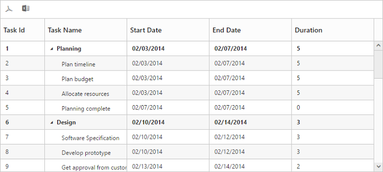

# Export

Exporting feature provides support to export TreeGrid content to excel and PDF files. To export the contents, the `ExcelExport` and `PdfExport` toolbar items must be added in the toolbar using the `ToolbarItems` property of `ToolbarSettings`. When you click, the toolbar exporting icons, it internally invokes the export public method of TreeGrid object to export.

The below code snippet explains the above behavior,





public class TreeGridController  : Controller
    {
         public ActionResult TreeGridExporting()
        {
            ViewBag.datasource = this.GetEditingDataSource();
            return View();
        }

        public void ExportToPdf(string TreeGridModel)
        {
            PdfExport exp = new PdfExport();
            var DataSource = this.GetEditingDataSource();
            TreeGridProperties obj = ConvertTreeGridObject(TreeGridModel);
            exp.Export(obj, DataSource, new TreeGridExportSettings() { Theme = ExportTheme.FlatSaffron },"Export");
        }
           public void ExportToExcel(string TreeGridModel)
        {
            ExcelExport exp = new ExcelExport();
            var DataSource = this.GetEditingDataSource();
            TreeGridProperties obj = ConvertTreeGridObject(TreeGridModel);
            exp.Export(obj, DataSource, "Export.xlsx", ExcelVersion.Excel2010, new TreeGridExportSettings() { Theme = ExportTheme.FlatSaffron});
        }

        private TreeGridProperties ConvertTreeGridObject(string gridProperty)
        {
            JavaScriptSerializer serializer = new JavaScriptSerializer();
            IEnumerable div = (IEnumerable)serializer.Deserialize(gridProperty, typeof(IEnumerable));
            TreeGridProperties gridProp = new TreeGridProperties();
            foreach (KeyValuePair<string, object> ds in div)
            {
                var property = gridProp.GetType().GetProperty(ds.Key, BindingFlags.Instance | BindingFlags.Public | BindingFlags.IgnoreCase);
                if (property != null)
                {
                    Type type = property.PropertyType;
                    string serialize = serializer.Serialize(ds.Value);
                    object value = serializer.Deserialize(serialize, type);
                    property.SetValue(gridProp, value, null);
                }
            }
            return gridProp;
        }
    }





@(Html.EJ().TreeGrid("TreeGridContainer")
    //...
    .ToolbarSettings(tool =>
    {
        tool.ShowToolbar(true);
        tool.ToolbarItems(new List<TreeGridToolBarItems>()
        {                      
            TreeGridToolBarItems.PdfExport, 
            TreeGridToolBarItems.ExcelExport
        });
    })
    .Datasource(ViewBag.datasource)
    )
@(Html.EJ().ScriptManager())



 

The below screen shot shows TreeGrid with excel and PDF exporting enabled.

## Server dependencies
Export Helper functions are available in the Assembly `Syncfusion.EJ.Export`, which is available in the Essential Studio & Essential ASP.NET MVC builds. The list of assemblies needed for TreeGrid Export as follows

* Syncfusion.EJ
* Syncfusion.EJ.Export
* Syncfusion.Linq.Base
* Syncfusion.Compression.Base
* Syncfusion.XlsIO.Base
* Syncfusion.PDF.Base

## Supported Export Types
Currently server helper function allows following two types of exporting.

* Excel
* PDF

## Export Mapper in MVC
Mappers is used to change the default routing path for exporting. By using `Mappers` you can change any action name in controller and the action can be in any controller (Need not to be in TreeGrid View Page Controller).

 



    public  class TreeGridController : Controller
    {
         public void PdfAction(string TreeGridModel)
        {
            PdfExport exp = new PdfExport();
            var DataSource = this.GetEditingDataSource();
            TreeGridProperties obj = ConvertTreeGridObject(TreeGridModel);
            exp.Export(obj, DataSource, new TreeGridExportSettings() { Theme = ExportTheme.FlatSaffron },"Export");
        }
           public void ExcelAction(string TreeGridModel)
        {
            ExcelExport exp = new ExcelExport();
            var DataSource = this.GetEditingDataSource();
            TreeGridProperties obj = ConvertTreeGridObject(TreeGridModel);
            exp.Export(obj, DataSource, "Export.xlsx", ExcelVersion.Excel2010, new TreeGridExportSettings() { Theme = ExportTheme.FlatSaffron});
        }
    }





@(Html.EJ().TreeGrid("TreeGridContainer")
    //...
    .Mappers(map => map.ExportToPdfAction("PdfAction")).ExportToExcelAction("ExcelAction"))
    .ToolbarSettings(tool =>
    {
            tool.ShowToolbar(true);
            tool.ToolbarItems(new List<TreeGridToolBarItems>()
            {                      
                TreeGridToolBarItems.PdfExport,
                TreeGridToolBarItems.ExcelExport

            });
    })   
    )
@(Html.EJ().ScriptManager())



 

[Click](https://mvc.syncfusion.com/demos/web/treegrid/treegridexporting) here to view the online demo sample for Exporting.

## Multiple exporting

Multiple export is used for export more than one TreeGrid object in the same file. Multiple export in TreeGrid can be enabled by setting `AllowMultipleExporting` property to `true`. TreeGrid properties of all the TreeGrid which are available in current page are passed as string array parameter to controller action method.

The following code example describes exporting multiple TreeGrid in PDF format

 



public class TreeGridController : Controller
{
        public ActionResult TreeGridMultipleExporting()
        {
            ViewBag.datasource1 = this.GetPlanDataSource();
            ViewBag.datasource2 = this.GetDesignDataSource();
            ViewBag.datasource3 = this.GetImplementationDataSource();
            return View();
        }

        public void MultipleExportToPdf(string[] TreeGridModel)
        {
            PdfExport exp = new PdfExport();
            var PlanData = this.GetPlanDataSource();
            var DesignData = this.GetDesignDataSource();
            var ImplementationData = this.GetImplementationDataSource();
            PdfDocument document = null;
            int count = 1;
            foreach (string gridProperty in TreeGridModel)
            {
                TreeGridProperties gridProp = this.ConvertTreeGridObject(gridProperty);
                if (count == 1)
                {
                    document = exp.Export(gridProp, PlanData, new TreeGridExportSettings() { Theme = ExportTheme.FlatSaffron }, false, "Planning Phase");
                }
                else if(count == 2)
                {
                    exp.Export(gridProp, DesignData, new TreeGridExportSettings() { Theme = ExportTheme.FlatSaffron }, "Export", document, false, "Design Phase");
                }
                else
                {
                    exp.Export(gridProp, ImplementationData, new TreeGridExportSettings() { Theme = ExportTheme.FlatSaffron }, "Export", document, true, "Implementation Phase");
                }
                count++;
            }
        }

        public void MultipleExportToExcel(string[] TreeGridModel)
        {
            ExcelExport exp = new ExcelExport();
            IWorkbook  workbook = null;
            int count = 1;
            foreach (string gridProperty in TreeGridModel)
            {
                TreeGridProperties gridProp = this.ConvertTreeGridObject(gridProperty);
                if (count == 1)
                {
                    workbook = exp.Export(gridProp, this.GetPlanDataSource(), new TreeGridExportSettings() { Theme = ExportTheme.FlatSaffron }, true, "Planning Phase");
                }
                else if (count == 2)
                {
                    exp.Export(gridProp, this.GetDesignDataSource(), new TreeGridExportSettings() { Theme = ExportTheme.FlatSaffron }, workbook, true, "Design Phase");
                }
                else
                {
                    exp.Export(gridProp, this.GetImplementationDataSource(), "ExcelExport.xlsx", ExcelVersion.Excel2010, new TreeGridExportSettings() { Theme = ExportTheme.FlatSaffron }, workbook, false, "Implementation Phase");
                }
                count++;
            }
        }
}





@(Html.EJ().TreeGrid("TreeGridContainer")
    //...
    .AllowMultipleExporting(true)
    .ToolbarSettings(tool =>
    {
            tool.ShowToolbar(true);
            tool.ToolbarItems(new List<TreeGridToolBarItems>()
            {                      
                TreeGridToolBarItems.PdfExport,
                TreeGridToolBarItems.ExcelExport
            });
    })
    .Mappers(map => map.ExportToPdfAction("MultipleExportToPdf").ExportToExcelAction("MultipleExportToExcel"))
    .Datasource(ViewBag.datasource1)
    )

@(Html.EJ().TreeGrid("TreeGridContainer1")
    //...
    .AllowMultipleExporting(true)
    .Datasource(ViewBag.datasource2)
    )

@(Html.EJ().TreeGrid("TreeGridContainer2")
    //...
    .AllowMultipleExporting(true)
    .Datasource(ViewBag.datasource3)
    )
@(Html.EJ().ScriptManager())



 

[Click](https://mvc.syncfusion.com/demos/web/treegrid/treegridmultipleexporting) here to view the online demo sample for Multiple Exporting.

## Export Theme
The TreeGrid export supports the below themes, 

* flat-azure
* flat-azure-dark
* flat-lime
* flat-lime-dark
* flat-saffron
* flat-saffron-dark
* gradient-azure
* gradient-azure-dark
* gradient-lime
* gradient-lime-dark
* gradient-saffron
* gradient-saffron-dark
* bootstrap-theme

The desired theme should be passed as a parameter to the Export method and the code snippet for this as follows



public void ExcelAction(string TreeGridModel)
{
    ExcelExport exp = new ExcelExport();
    var DataSource = this.GetEditingDataSource();
    TreeGridProperties obj = ConvertTreeGridObject(TreeGridModel);
    exp.Export(obj, DataSource, "Export.xlsx", ExcelVersion.Excel2010, new TreeGridExportSettings() { Theme = ExportTheme.FlatSaffron});
}

