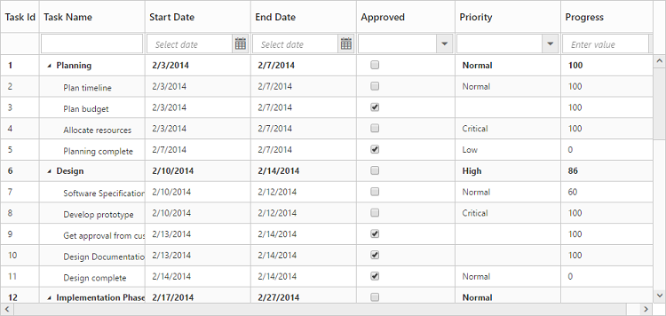
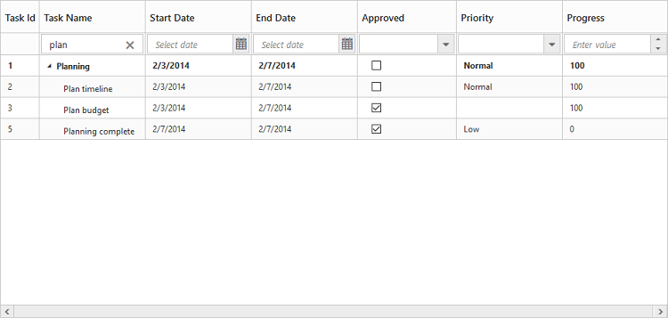
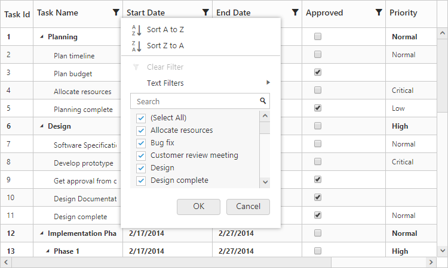
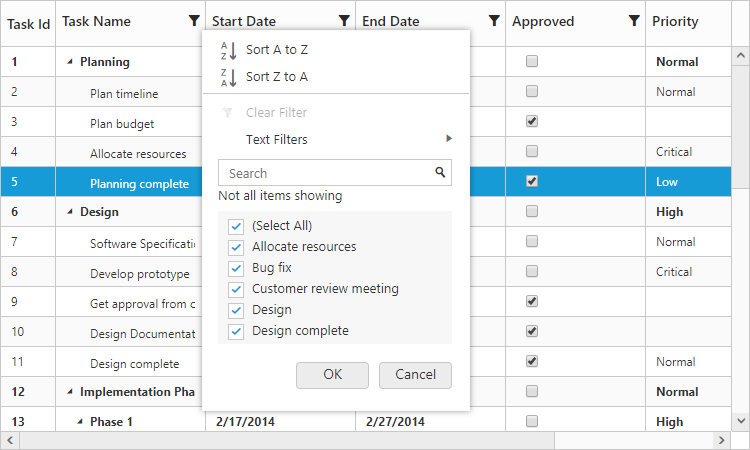
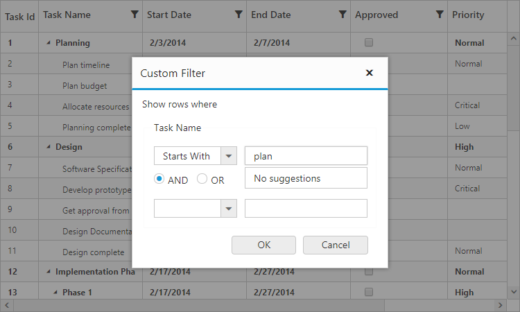
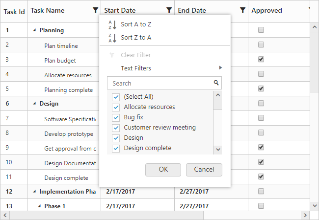
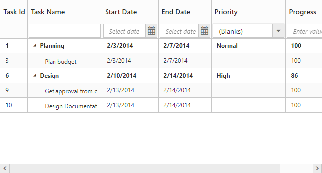
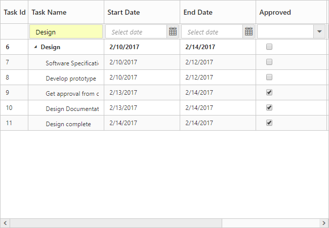
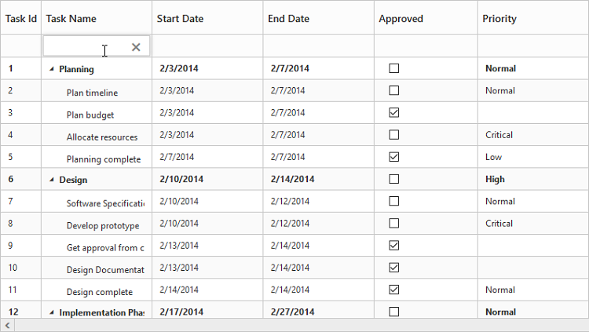
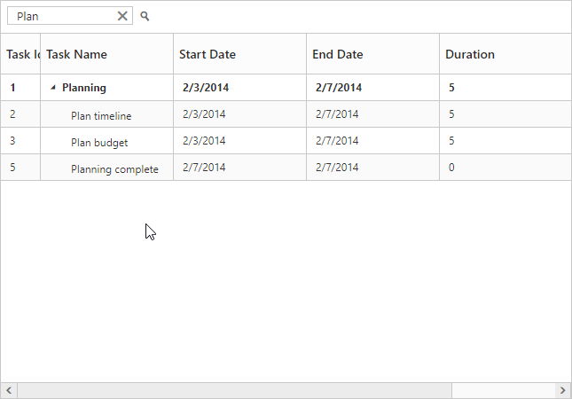

# Filtering

Filtering helps to view specific or related records from data source which meets a given filtering criteria. To enable filtering in TreeGrid, set the `AllowFiltering` as `true`.
The `FilterSettings` property is used to customize the filtering in TreeGrid.

TreeGrid provides support for the following filtering modes.

* FilterBar
* Menu
* Excel

Also, the following filtering types are available in TreeGrid.

* String
* Boolean
* Date
* Numeric
* Dropdown

The below code explains how to enable filtering in TreeGrid.



@(Html.EJ().TreeGrid("TreeGridContainer")
    .AllowFiltering(true)
    )
@(Html.EJ().ScriptManager())



The output of the TreeGrid with filtering enabled is as follows.

The TreeGrid allows the user to filter the columns with custom actions by using the method [`filterColumn`](https://help.syncfusion.com/api/js/ejtreegrid#methods:filtercolumn "filterColumn"). And it is possible to clear the filter for a specific column by using the method [`clearFilter`](https://help.syncfusion.com/api/js/ejtreegrid#methods:clearfilter "clearFilter").

## Filtering Modes

### Filter Bar 

This is the default filtering mode in TreeGrid. It can also be enabled by setting the `FilterSettings.FilterType` as `FilterBar`. When this filtering mode is enabled, a filter row will be displayed below the column header, in which we can provide the filter query.

There are two types of actions available to initiate the filtering process in the filter bar mode, we can set the filter bar mode using `FilterSettings.FilterBarMode` property.

`Immediate`: Filtering action will be initiated immediately on key press, for each character being typed in the filter bar.

`OnEnter`: Filtering action will be initiated only on enter key press in the filter bar.

The below code snippet explains the above behavior.



@(Html.EJ().TreeGrid("TreeGridContainer")
    .AllowFiltering(true)
    .FilterSettings(filtered=>
         {
             filtered.FilterType(TreeGridFilterType.FilterBar);
             filtered.FilterBarMode(TreeGridFilterBarMode.OnEnter);
         })
    )
@(Html.EJ().ScriptManager())



The output of the filtering with filter bar enabled is as follows.

### Menu filtering

Menu filtering can be enabled by setting the `FilterSettings.FilterType` property as `Menu`. The below code snippet explains how to enable menu filtering in TreeGrid.



@(Html.EJ().TreeGrid("TreeGridContainer")
    .AllowFiltering(true)
    .FilterSettings(filtered=>
         {
             filtered.FilterType(TreeGridFilterType.Menu);            
         })
    )
@(Html.EJ().ScriptManager())



The output of the filtering with filter menu enabled is as follows.

### Excel Filtering

Excel filtering can be enabled by setting the `FilterSettings.FilterType` property as `Excel`. The excel menu contains options such as sorting, clear filter and advance filtering options.
The below code snippet explains how to enable excel filtering in TreeGrid.



@(Html.EJ().TreeGrid("TreeGridContainer")
    .AllowFiltering(true)
    .FilterSettings(filtered=>
         {
             filtered.FilterType(TreeGridFilterType.Excel);            
         })
    )
@(Html.EJ().ScriptManager())



The output of the filtering with excel filter enabled is as follows.

#### Checkbox list generation

By default, the checkbox list is generated from distinct values of the filter column from `Datasource` which gives an option to search and select the required items. 
If the number of distinct values are greater than 1000, then the excel filter will display only first 1000 values and show "Not all items shown" label to ensure the best performance on rendering and searching. However, this limit has been customized according to your requirement by setting the `MaxFilterChoices` with required limit in integer.
The below code snippet explains how to change the max filter choices value.



@(Html.EJ().TreeGrid("TreeGridContainer")
    .AllowFiltering(true)
    .FilterSettings(filtered=>
         {
             filtered.FilterType(TreeGridFilterType.Excel);   
             filtered.MaxFilterChoices(5);         
         })
    )
@(Html.EJ().ScriptManager())



The above screen shot shows TreeGrid with `MaxFilterChoices` as 5.

#### Case Sensitivity

To perform filter operation with case sensitive in excel styled filter menu mode by setting the `EnableCaseSensitivity` as `true`.
The below code snippet explains how to enable the case sensitivity in excel filter.



@(Html.EJ().TreeGrid("TreeGridContainer")
    .AllowFiltering(true)
    .FilterSettings(filtered=>
         {
             filtered.FilterType(TreeGridFilterType.Excel);   
             filtered.EnableCaseSensitivity(true);        
         })
    )
@(Html.EJ().ScriptManager())



The above screen shot shows TreeGrid with `EnableCaseSensitivity` set as false in search action.

### Change filter mode for specific column

TreeGrid provides option for changing the filter mode for specific column by using `Columns.FilterType` property. Using this property we can either set `Menu` or `Excel` filter mode when `FilterSettings.FilterType` property as `Menu` or `Excel`.

The following code example show, how to change filter mode for specific column.



@(Html.EJ().TreeGrid("TreeGridContainer")
    .AllowFiltering(true)
    .FilterSettings(filtered=>
         {
             filtered.FilterType(TreeGridFilterType.Menu);                 
         })
     .Columns(co =>
        {           
            co.Field("taskName").HeaderText("Task Name").EditType(TreeGridEditingType.String).FilterType(TreeGridFilterOption.Excel).Add();
        })
    )
@(Html.EJ().ScriptManager())



The above screen shot shows TreeGrid with excel filter mode for `Task Name` column only.  

## Filtering types

By default, the filtering type for a column is inherited from the `Columns.EditType` property. You can also define a specific filtering type for a column using the `Columns.FilterEditType` property.
The below code snippet explains on how to set a filtering type for a column.



@(Html.EJ().TreeGrid("TreeGridContainer")
    .AllowFiltering(true)
    .Columns(co =>
        {
            co.Field("taskID").AllowFiltering(false).Add();
            co.Field("taskName").EditType(TreeGridEditingType.String).FilterEditType(TreeGridFilterEditType.String).Add();
            co.Field("startDate").EditType(TreeGridEditingType.Datepicker).Format("{0:MM/dd/yyyy}").FilterEditType(TreeGridFilterEditType.Datepicker).Add();
            co.Field("priority").EditType(TreeGridEditingType.Dropdown).DropDownData((IEnumerable<object>)ViewBag.dropData).FilterEditType(TreeGridFilterEditType.Dropdown).Add();
            co.Field("progress").EditType(TreeGridEditingType.Numeric).FilterEditType(TreeGridFilterEditType.Numeric).Add();
        }) 
    )
@(Html.EJ().ScriptManager())



### Filtering blank values in drop down filtering

In TreeGrid, it is possible to filter the null or empty string value in drop down filter type by setting `AllowFilteringBlankContent` as `true` in the column definition.



@(Html.EJ().TreeGrid("TreeGridContainer")
    .AllowFiltering(true)
    .Columns(co =>
        {
           co.Field("priority").HeaderText("Priority").FilterEditType(TreeGridFilterEditType.Dropdown).AllowFilteringBlankContent(true).Add();            
        }) 
    )
@(Html.EJ().ScriptManager())



The above screenshot shows TreeGrid with filtering blank content.
{:.caption}

### Filter Hierarchy Modes

TreeGrid provides support for a set of filtering modes with `FilterSettings.FilterHierarchyMode` property.
The below are the type of filter mode available in TreeGrid.

* **Parent**: This is the default filter hierarchy mode in TreeGrid. The filtered record displayed with its parent records, if the filtered records not have any parent record then the filtered record only displayed.
* **Child**  : The filtered record displayed with its child record, if the filtered records not have any child record then the filtered record only displayed.
* **Both**   : The filtered record displayed with its both parent and child record, if the filtered records not have any parent and child record then the filtered record only displayed.
* **None**   : The filtered record only displayed.

The following code example shows how to set filter mode in TreeGrid.


@(Html.EJ().TreeGrid("TreeGridContainer")
    .FilterSettings(filtered =>
        {
            filtered.FilterHierarchyMode(TreeGridFilterHierarchyMode.Child);
        })
    )
@(Html.EJ().ScriptManager())



The above screenshot shows TreeGrid filter with `Child` filter mode.

## Filter columns at initial load

It is also possible to filter one or more columns at load time by providing the `FilterSettings.FilteredColumns.Field`, `FilterSettings.FilteredColumns.Value`, `FilterSettings.FilteredColumns.Predicate` and `FilterSettings.FilteredColumns.Operator` to the `FilterSettings.FilteredColumns` property. The following code example explains how to filter a column on initial load.



@(Html.EJ().TreeGrid("TreeGridContainer")
    .FilterSettings(filtered =>
        {            
            filtered.FilteredColumns(filtered =>
            {
                filtered.Field("taskName").Value("plan").Predicate("and").Operator(FilterOperatorType.StartsWith).Add();
            });                 
        })
    )
@(Html.EJ().ScriptManager())



## Disabling filtering for a specific column 
It is possible to disable filtering for a specific column by setting the `Columns.AllowFiltering` as `false` in the column definition.
The below code snippet explains the above behavior.



@(Html.EJ().TreeGrid("TreeGridContainer")
    .AllowFiltering(true)
    .Columns(co =>
        {
            co.Field("taskID").AllowFiltering(false).Add();           
        }) 
    )
@(Html.EJ().ScriptManager())



The output of the filtering enabled for only one column is as follows.

[Click](https://mvc.syncfusion.com/demos/web/treegrid/treegridcolumnfiltering) to find the demo sample for filtering in TreeGrid

## Toolbox searching

The TreeGrid control has an option to search its content using toolbar search box. The toolbar search box can be enabled by using the `ToolbarSettings.ToolbarItems` property.
The following code example explains how to integrate search text box in toolbar.



@(Html.EJ().TreeGrid("TreeGridContainer")
    .ToolbarSettings(tool =>
                {
                    tool.ShowToolbar(true);
                    tool.ToolbarItems(new List<TreeGridToolBarItems>()
                {
                    TreeGridToolBarItems.Search
                });
            })
    )
@(Html.EJ().ScriptManager())



The above screen shot shows TreeGrid search with **Plan** key word.

The toolbox searching can be customized using the `SearchSettings` property. It is possible to search the TreeGrid content with the specific column values as the query for searching, using the property `SearchSettings.Field`.
The below code example explains searching the TreeGrid content across the "TaskId" and "TaskName" columns.



@(Html.EJ().TreeGrid("TreeGridContainer")
    .SearchSettings(ss =>
            {
                ss.Fields(new List<string> { "TaskId", "TaskName" });
            })
    )
@(Html.EJ().ScriptManager())



It is possible to filter the TreeGrid contents at initial load using the toolbar search, with the `SearchSettings.Key` property.
The below code example explains filtering the TreeGrid contents at initial load with a search key, which will be applied across all the columns.



@(Html.EJ().TreeGrid("TreeGridContainer")
   .SearchSettings(ss =>
             {
                 ss.Key("task 1");
             })
    )
@(Html.EJ().ScriptManager())



TreeGrid provides support for conditional searching with operators in toolbar search using the property `SearchSettings.Operator`. And case sensitivity for the search query can be ignored using the property `SearchSettings.IgnoreCase`.
The below code example explains filtering the TreeGrid content using toolbar search with operators



@(Html.EJ().TreeGrid("TreeGridContainer")
    .SearchSettings(ss =>
        {
            ss.Fields(new List<string> { "TaskName" }).Key("Task 1").Operator(TreeGridSearchOperator.StartsWith).IgnoreCase(false);
        })
    )
@(Html.EJ().ScriptManager())



If the toolbar search textbox is not enabled in TreeGrid, and still if the contents need to be filtered at initial load using the `SearchSettings` property, then the user should enable the `AllowSearching` property along with search settings.



@(Html.EJ().TreeGrid("TreeGridContainer")
    .AllowSearching(true)
    .SearchSettings(ss =>
    {
        ss.Key("Plan");
    })
    )
@(Html.EJ().ScriptManager())


