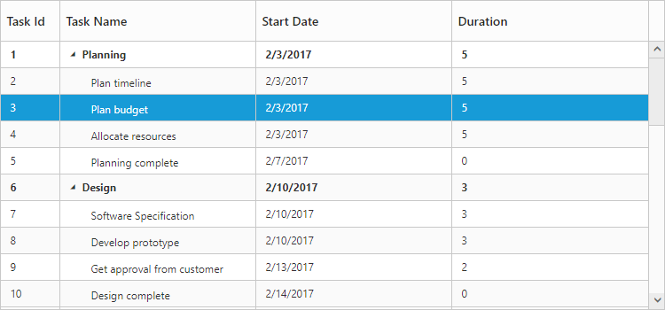
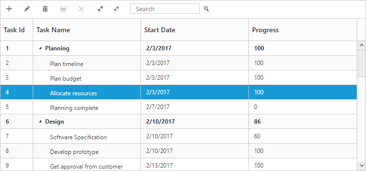
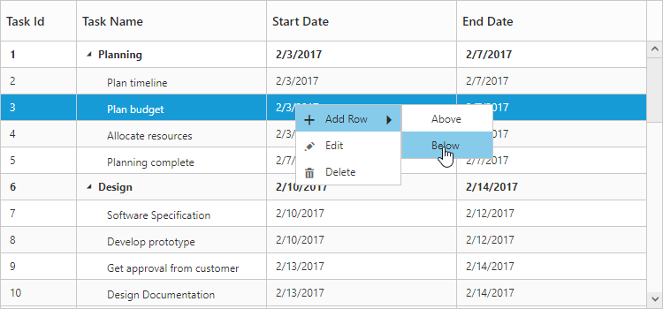

# Getting Started

## Create your first TreeGrid in MVC 

This section explains briefly about the control structure and how to create a TreeGrid.

1. First, create a new MVC Razor project; please refer [MVC-Getting Started](http://help.syncfusion.com/aspnetmvc/getting-started)  documentation to create new project and add necessary DLL’s and script files.

2. Create a data source in Controllers/HomeController.cs file, We can bind datasource to TreeGrid using Datasource property.

3. Add the following code example in the Index.cshtml file to create a TreeGrid control in the View page.	





@(Html.EJ().TreeGrid("TreeGridContainer")
    .ChildMapping("Children")            
    .Columns(co =>
    {
        co.Field("TaskId").HeaderText("Task Id").EditType(TreeGridEditingType.Numeric).Add();
        co.Field("TaskName").HeaderText("Task Name").EditType(TreeGridEditingType.String).Add();
        co.Field("StartDate").HeaderText("Start Date").EditType(TreeGridEditingType.Datepicker).Add();
        co.Field("Duration").HeaderText("Duration").EditType(TreeGridEditingType.Numeric).Add();
    })
    .Datasource(ViewBag.datasource)
    )
    @(Html.EJ().ScriptManager())





public class TreeGridController : Controller
    {
        public ActionResult Index()
        {
            ViewBag.datasource = this.GetData();
            return View();
        }
        private List<BusinessObject> GetData()
        {
            List<BusinessObject> dataCollection = new List<BusinessObject>();

            BusinessObject Record1 = new BusinessObject()
            {
                TaskId = 1,
                TaskName = "Planning",
                StartDate = "02/03/2017",
                Duration = 5,
                Children = new List<BusinessObject>(),
            };

            BusinessObject Child1 = new BusinessObject()
            {
                TaskId = 2,
                TaskName = "Plan timeline",
                StartDate = "02/03/2017",
                Duration = 5
            };

            BusinessObject Child2 = new BusinessObject()
            {
                TaskId = 3,
                TaskName = "Plan budget",
                StartDate = "02/03/2017",
                Duration = 5
            };

            BusinessObject Child3 = new BusinessObject()
            {
                TaskId = 4,
                TaskName = "Allocate resources",
                StartDate = "02/03/2017",
                Duration = 5
            };

            BusinessObject Child4 = new BusinessObject()
            {
                TaskId = 5,
                TaskName = "Planning complete",
                StartDate = "02/07/2017",
                Duration = 0
            };

            Record1.Children.Add(Child1);
            Record1.Children.Add(Child2);
            Record1.Children.Add(Child3);
            Record1.Children.Add(Child4);

            BusinessObject Record2 = new BusinessObject()
            {
                TaskId = 6,
                TaskName = "Design",
                StartDate = "02/10/2017",
                Duration = 3,
                Children = new List<BusinessObject>(),
            };

            BusinessObject Child5 = new BusinessObject()
            {
                TaskId = 7,
                TaskName = "Software Specification",
                StartDate = "02/10/2017",
                Duration = 3
            };

            BusinessObject Child6 = new BusinessObject()
            {
                TaskId = 8,
                TaskName = "Develop prototype",
                StartDate = "02/10/2017",
                Duration = 3
            };

            BusinessObject Child7 = new BusinessObject()
            {
                TaskId = 9,
                TaskName = "Get approval from customer",
                StartDate = "02/13/2017",
                Duration = 2
            };

            BusinessObject Child8 = new BusinessObject()
            {

                TaskId = 10,
                TaskName = "Design complete",
                StartDate = "02/14/2017",
                Duration = 0
            };

            Record2.Children.Add(Child5);
            Record2.Children.Add(Child6);
            Record2.Children.Add(Child7);
            Record2.Children.Add(Child8);
            dataCollection.Add(Record1);
            dataCollection.Add(Record2);
            return dataCollection;
        }
        public class BusinessObject
        {
            public int TaskId { get; set; }
            public string TaskName { get; set; }
            public string StartDate { get; set; }
            public int Duration { get; set; }
            public List<BusinessObject> Children { get; set; }
        }
    }


  

Simple TreeGrid
{:.caption}

## Enable Toolbar

TreeGrid control contains the toolbar options to Add, Edit, Delete, Search,  Expand and Collapse all records. You can enable toolbar using `ToolbarSettings`.



@(Html.EJ().TreeGrid("TreeGridContainer")
    .ToolbarSettings(tool =>
		{
			tool.ShowToolbar(true);
			tool.ToolbarItems(new List<TreeGridToolBarItems>()
		{
			TreeGridToolBarItems.Add,
			TreeGridToolBarItems.Edit,
			TreeGridToolBarItems.Delete,
			TreeGridToolBarItems.Update,
			TreeGridToolBarItems.Cancel,
			TreeGridToolBarItems.ExpandAll,
			TreeGridToolBarItems.CollapseAll,
			TreeGridToolBarItems.Search
		});
	})
    )
@(Html.EJ().ScriptManager())                   


The following screen shot displays a Toolbar in TreeGrid.

Toolbar in TreeGrid
{:.caption}

N> Add, Edit, Delete options are enabled when enabling the `AllowEditing`, `AllowAdding`, `AllowDeleting` in the `EditSettings`.

[Click](toolbar) here to refer more details for TreeGrid ToolbarSettings.

## Enable Sorting

The TreeGrid control contains sorting functionality to arrange the data in ascending or descending order based on a particular column.

### Multicolumn Sorting

You can enable the multicolumn sorting in TreeGrid by setting `AllowMultiSorting` as `true` .You can sort multiple columns in TreeGrid, by selecting the desired column header when holding the **CTRL** key.



@(Html.EJ().TreeGrid("TreeGridContainer") 
	.AllowSorting(true)      
	.AllowMultiSorting(true)                         
	)
@(Html.EJ().ScriptManager())  


[Click](sorting) here to refer more details for TreeGrid Sorting.

## Enable Editing

You can enable Editing in TreeGrid using `EditSettings` illustrated in the following code example.



@(Html.EJ().TreeGrid("TreeGridContainer")
   .EditSettings(edit =>
   {
	   edit.AllowEditing(true);
	   edit.AllowAdding(true);
	   edit.AllowDeleting(true);
	   edit.EditMode(TreeGridEditMode.CellEditing);
   })
   )
@(Html.EJ().ScriptManager())


[Click](editing) here to refer more details for TreeGrid Editing.

## Enable Context Menu

The **Context menu** in TreeGrid control is used to manipulate (add, edit and delete) the tree grid rows. 
In TreeGrid, context menu can be enabled with `ContextMenuSettings` property. The `ContextMenuSettings` property contains two inner properties `ShowContextMenu` and `ContextMenuItems`.


@(Html.EJ().TreeGrid("treegrid1")	
	.ContextMenuSettings(context =>
	{
		context.ShowContextMenu(true);
		context.ContextMenuItems(new List<TreeGridContextMenuItems>(){
			TreeGridContextMenuItems.Add,
			TreeGridContextMenuItems.Edit,
			TreeGridContextMenuItems.Delete
		});
	})
	)
@(Html.EJ().ScriptManager())


The following screenshot displays the Context menu in TreeGrid control.

TreeGrid with Enable Context menu option
{:.caption}

[Click](context-menu) here to refer more details for TreeGrid Editing.

## Enable Column Menu

You can enable the column menu in TreeGrid, by setting the `ShowColumnChooser` as `true`.


               
@(Html.EJ().TreeGrid("TreeGridContainer")
	.ShowColumnChooser(true)
    .AllowSorting(true)
    .AllowMultiSorting(true)	
	)
@(Html.EJ().ScriptManager())



The following screen shot displays TreeGrid control in which column chooser option is enabled

## Define dimension of TreeGrid

By default TreeGrid control was rendered with `100%` width and `450px` height, we can define the dimension of TreeGrid control by using `SizeSettings` property. TreeGrid control width and height can be defined by either `Height` and `Width` properties or by defining inline style in TreeGrid container element. The below code example shows how to define width and height for TreeGrid control.



<!--

-->



N> TreeGrid control will automatically update the width and height value based on container element on window resize action, this can be enabled by setting `IsResponsive` property as `true` for this `Height` and `Width` value will be defined in percentage.
N> We can also render TreeGrid with auto height by setting `SizeSettings.Height` as `auto`.

