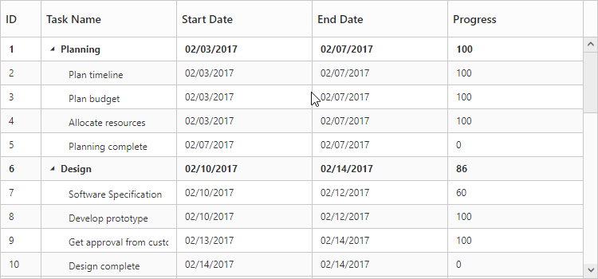

# Rendering the TreeGrid using TreeGridProperties in server-side

The `TreeGridProperties` helps to render the TreeGrid control in server-side.

The following code example explains how to render the TreeGrid control in server-side.





  @(Html.EJ().TreeGrid("TreeGridControl", ViewBag.TreeGridModel))
  





   namespace TreeGrid_MVC.Controllers
{
    public class TreegridController : Controller
    {
        public ActionResult TreeGrid()
        {
            TreeGridProperties treegrid = new TreeGridProperties();
            List<TreeGridColumn> colList = new List<TreeGridColumn>();
            colList.Add(new TreeGridColumn() { Field = "TaskId", HeaderText = "ID", Width = 45 });
            colList.Add(new TreeGridColumn() { Field = "TaskName", HeaderText = "Task Name" });
            colList.Add(new TreeGridColumn() { Field = "StartDate", HeaderText = "Start Date" });
            colList.Add(new TreeGridColumn() { Field = "EndDate", HeaderText = "End Date" });            
            colList.Add(new TreeGridColumn() { Field = "Progress", HeaderText = "Progress" });
            treegrid.TreeColumnIndex = 1;
            treegrid.Columns = colList;
            treegrid.ChildMapping = "Children";
            treegrid.SizeSettings.Width = "750px";
            treegrid.SizeSettings.Height = "350px";
            treegrid.DataSource = GetDefaultData();
            ViewBag.TreeGridModel = treegrid;
            return View();
        }
    }
}
   


 

The below screenshot shows the output of above code example.

