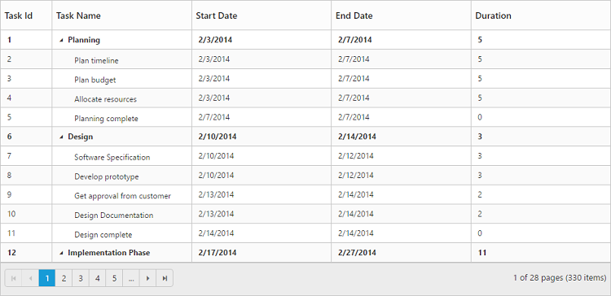
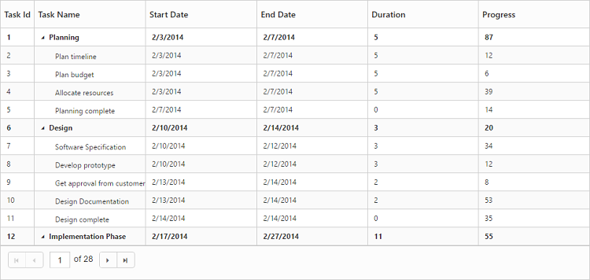

# Paging

TreeGrid provides support for displaying records in paginated view. Paging can be enabled in TreeGrid by setting the `AllowPaging` property as `true`.

The below code snippet explains enable paging in TreeGrid.



@(Html.EJ().TreeGrid("TreeGridContainer")
    .AllowPaging(true)
    )
@(Html.EJ().ScriptManager())



The output of the TreeGrid with paging enabled is displayed below.

## Paging settings

The paging in TreeGrid can be customized by using the `PageSettings` property.

* **PageSize** - Using this property we can limit the number of records to be displayed per page.
* **PageSizeMode** - By setting this property as `Root` we can limit the number of root nodes or the 0th level records to be displayed per page . 
When the `PageSizeMode` property is set as `Root` the number of records to be displayed per page which is defined in the the `PageSize` property will be considered only for the root nodes or the 0th level records.
* **PageCount** - It is used to display the page number to be displayed in the pager.
* **CurrentPage** - This property is used to set the active page to be displayed initially.
* **TotalRecordsCount** - This property is used to limit the total number of records from the data source to be displayed in TreeGrid.
 The following code example explains the properties in pageSettings. 



@(Html.EJ().TreeGrid("TreeGridContainer")
    .AllowPaging(true)
    .PageSettings(page=>
         {
             page.PageCount(5);
             page.CurrentPage(3);
             page.TotalRecordsCount(50);
             page.PageSizeMode(TreeGridPageSizeMode.All);
             page.PageSize(12);
         })
    )
@(Html.EJ().ScriptManager())



[Click](http://mvc.syncfusion.com/demos/web/treegrid/treegridpagingapi) here to find our online demo sample for Paging.

## Pager Template

It is possible to customize the default pager in TreeGrid by using the `PageSettings.Template` property.
The below code snippet explains how to customize the default pager with template



@(Html.EJ().TreeGrid("TreeGridContainer")
    .ClientSideEvents(eve => eve.ActionComplete("complete").Create("create"))
    .AllowPaging(true)
    .PageSettings(pg => pg.Template("#Template"))
    )
@(Html.EJ().ScriptManager())




    #currentPage {
        background-color: white;
    } 

    .darktheme #currentPage {
        background-color: black;
    }

    .e-pagercontainer .e-icon {
        display: inline-block;
        height: 8px;
    }

    .e-pager .e-pagercontainer {
        margin: 0px;
        margin-left: 6px;
    }


 [Click](http://mvc.syncfusion.com/demos/web/treegrid/treegridpagertemplate) here to find our online sample for Pager Template

The below image displays TreeGrid with paging template.

It is possible to navigate to a specific page with a custom action instead of clicking pager button by using the [`gotoPage`]( /api/js/ejtreegrid#methods:gotopage "gotoPage") method.

The below code snippet explains how to navigate to 3rd page in TreeGrid by using `gotoPage` method



        var treeObject = $("#TreeGridContainer").data("ejTreeGrid");
        treeObject.gotoPage(3);



## Paging - Touch Option

With paging and responsive mode enabled in TreeGrid, it is possible to change the current page using swipe action.



@(Html.EJ().TreeGrid("TreeGridContainer")
    .AllowPaging(true)
    .IsResponsive(true)
    )
@(Html.EJ().ScriptManager())

