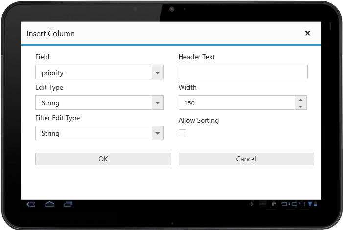
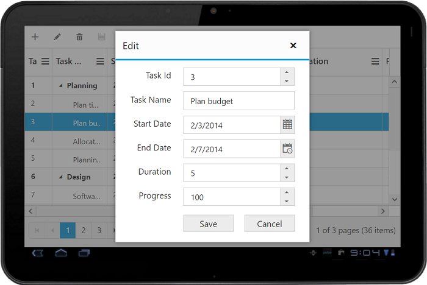

# Responsive

The TreeGrid control has support for responsive behavior based on client browser's width and height. To enable responsive support in TreeGrid, `IsResponsive` property must be enabled.

Please find the example describes the above behavior.



@(Html.EJ().TreeGrid("TreeGridContainer")                              

    .IsResponsive(true)

)



The following output is displayed as a result of the above code example

{:caption}
Responsive TreeGrid in Mobile layout.

{:caption}
Responsive TreeGrid in tablet layout.

## Layout

Below are the modes of responsive layout available in TreeGrid based on client width,

* Mobile(<321px)
* Tablet(321px to 768px)
* Desktop(>768px)

## Mobile Layout

The customized layout for filtering, column chooser operations and add/edit operations in mobile device can be seen in the following screen shots.

{:caption}
filtering in mobile layout.

{:caption}
Add/edit in mobile layout

{:caption}
Column chooser in mobile layout

{:caption}
Insert column options in mobile layout

## Tablet Layout

The customized layout for filtering, column chooser operations and add/edit operations in tablet device can be seen in the following screen shots.

{:caption}
filtering in tablet layout.

{:caption}
Add/edit in tablet layout

{:caption}
Column chooser in tablet layout

{:caption}
Insert column options in tablet layout

## Changing responsive width using method

You can change the minimum responsive width dynamically by using public method `updateResponsiveMinWidth(width)` by passing the width as an argument.
The TreeGrid control get works in responsive mode only when the window width is below the minimum responsive width.

Please find the example describes the above behavior.



<button id="minResponsiveWidth">minResponsiveWidth</button>





@(Html.EJ().TreeGrid("TreeGridContainer")                              

    .IsResponsive(true)

)







The following output is displayed as a result of the above code example

## Priority for columns

Column priorities are used to show or hide the columns based on priority values and browser width to best accommodate the possible columns. Priority value of the column is set by `Columns.Priority` property and the value ranges from one to six.

The following code example explains how to set priority for column


@(Html.EJ().TreeGrid("TreeGridContainer")
    .IsResponsive(true)
    .Columns(co =>
    {
        co.Field("TaskId").HeaderText("Task Id").Width(45).Add();
        co.Field("TaskName").HeaderText("Task Name").Add();
        co.Field("StartDate").HeaderText("Start Date").Add();
        co.Field("EndDate").HeaderText("End Date").Priority(5).Add();
        co.Field("Duration").HeaderText("Duration").Priority(6).Add();
        co.Field("Progress").HeaderText("Progress").Priority(6).Add();
    }
)          


The above screen shot show TreeGrid rendered in browser width of 640 pixels.
{:.caption}