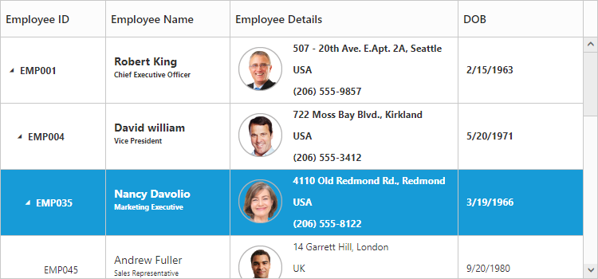

# Rows

The TreeGrid rows displays the information of each row from the bounded data source.

## Row Template

Row template is used to customize the TreeGrid rows based on requirements. In TreeGrid, RowTemplateID and AltRowTemplateID properties are used for customizing the row.

RowTemplateID is used to customize all the rows in TreeGrid. For this property, ID of the row template is to be provided.

AltRowTemplateID is used to customize the alternative rows in TreeGrid. For this property, ID of the alternative row template is to be provided.


 


@(Html.EJ().TreeGrid("TreeGridContainer")

   .ChildMapping("Children")

   .AltRowTemplateId("altRowTemplateScript")

   .RowTemplateId("rowTemplateScript")

   .Columns(co =>

    {

      co.Field("EmployeeID").headerText("Employee ID").Width(45).Add();

      co.Field("Name").headerText("Employee Name").Add();

      co.Field("Address").headerText("Employee Details").Add();

      co.Field("DOB").headerText("DOB")

         .EditType(TreeGridEditingType.Datepicker).Add();

    })

    .SizeSettings(ss => ss.Width("100%").Height("750px"))

     .Datasource(ViewBag.datasource)

    )





public ActionResult TreeGridRowTemplate()

{

   var data = this.getRowData();

   ViewBag.datasource = data;

   return View();

}

private List<RowData> getRowData()

{

   List<RowData> DataCollection = new List<RowData>();

   RowData Record1 = new RowData()

   {

     Name = "Robert King",

     FullName = "Robert King",

     Designation = "Chief Executive Officer",

     EmployeeID = "EMP001",

     Address = "507 - 20th Ave. E.Apt. 2A, Seattle",

     Contact = "(206) 555-9857",

     Country = "USA",

     DOB = "2/15/1963",

     Children = new List<RowData>()

   };

   RowData parent = new RowData()

   {

     Name = "David william",

     FullName = "David william",

     Designation = "Vice President",

     EmployeeID = "EMP004",

     Address = "722 Moss Bay Blvd., Kirkland",

     Country = "USA",

     Contact = "(206) 555-3412",

     DOB = "5/20/1971",

     Children = new List<RowData>()

   };

 Record1.Children.Add(parent);

 parent.Children.Add(Child1);

 Child1.Children.Add(InnerChild1);

 DataCollection.Add(Record1);

 return DataCollection;

}

public class RowData

{

  public string Name { get; set; }

  public string FullName { get; set; }

  public string Designation { get; set; }

  public string EmployeeID { get; set; }

  public string Address { get; set; }

  public string Contact { get; set; }

  public string DOB { get; set; }

  public string Country { get; set; }

  public List<RowData> Children { get; set; }

}


 

The output of TreeGrid with Row Template is as follows.

## Row Drag and Drop

It is possible to dynamically re-arrange the rows in the TreeGrid control by using the AllowDragAndDrop property. With this property, row drag can be enabled or disabled. Rows can be inserted above, below as a sibling or as a child to the existing row with the help of this feature. A default tooltip is rendered while dragging the TreeGrid row and this tooltip can be customized by the DragTooltip property. This propertyhas inner properties such as ShowTooltip, TooltipItems and TooltipTemplate.

The ShowTooltip property is used to enable or disable the tooltip. By default, this property value is false.

The following code explains about enabling the row drag and drop with the default tooltip in the TreeGrid.



@(Html.EJ().TreeGrid("TreeGridContainer")       

.Columns(co =>

{

   co.Field("TaskId").headerText("Task Id"). Add();

   co.Field("TaskName").headerText("Task Name").Add();

})

.AllowDragAndDrop(true)	

.DragTooltip(tooltip => 

{ 

   tooltip.ShowTooltip(true);

}) 

.Render())



The following screenshot depicts a row drag and drop in the TreeGrid.

## Customizing Drag tooltip

The TooltipItems property is used to customize the tooltip items. By using this property, specific fields can be rendered in the tooltip. By default this property value is null, and all the defined field items are rendered in the tooltip.

The following code shows how to render row drag tooltip with the desired field items



@(Html.EJ().TreeGrid("TreeGridContainer")       

.DragTooltip(tt => 

{ 

  tt.ShowTooltip(true);

  tt.TooltipItems(new List<string>(){"TaskId","TaskName","StartDate", "EndDate"});

}) 

.Render())



The TooltipTemplate property renders the template tooltip for row drag and drop in the TreeGrid control by using the JS Render template. You can provide either the id value of the script element or the script element to the property.

The following code shows how to render row drag tooltip with tooltip template.	



 @(Html.EJ().TreeGrid("TreeGridContainer")       

   //...

   .DragTooltip(tt => 

   { 

	  tt.ShowTooltip(true);

	  tt.TooltipTemplate("#customtooltip");

	}) 

  .Render())



