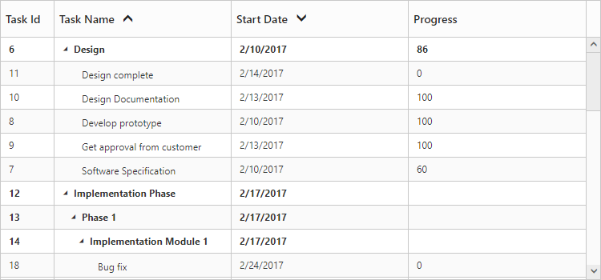
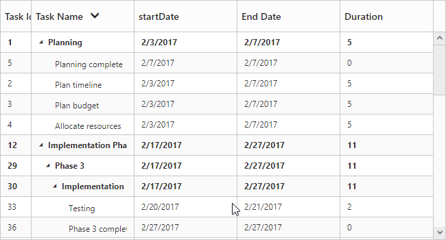

# Sorting

The TreeGrid control for JavaScript has built-in support for Sorting one or more columns.

## Sorting Columns

TreeGrid allows the items to be sorted in ascending or descending order based on the selected column by enabling the `AllowSorting` option in TreeGrid control. The following code example shows you how to enable Sorting in TreeGrid control.



@(Html.EJ().TreeGrid("TreeGridContainer")
        //...
        .AllowSorting(true)
        )        
@(Html.EJ().ScriptManager()) 



## Multicolumn sorting

Gantt allows you to sort multiple columns by clicking the desired column headers while holding the **CTRL** key with `AllowMultiSorting` as `true` . The following code example shows you how to enable multicolumn sorting in Gantt control.



@(Html.EJ().TreeGrid("TreeGridContainer")
    //...
    .AllowSorting(true)
    .AllowMultiSorting(true)
    )
@(Html.EJ().ScriptManager()) 



The following screenshot shows the output of Multicolumn sorting in TreeGrid control.

## Disable sorting for specific column

It is possible to disable sorting for a specific column by setting `AllowSorting` as `false` in the column definition.

The below code snippet demonstrates this.



@(Html.EJ().TreeGrid("TreeGridContainer")
    //...
    .AllowSorting(true)   
    .Columns(co =>
        {
            //..
            co.Field("taskName").HeaderText("Task Name").AllowSorting(false).Add();          
        })  
    )
@(Html.EJ().ScriptManager()) 
   


## Sort column at initial load

In TreeGrid, It is possible to render the control with sorted columns, this can be achieve by using `SortSettings` property. We can add columns which are sorted initially in `SortedColumns` collection. `SortedColumns` collection was defined with `Field` and `Direction` properties.

The following code shows how to add sorted column in TreeGrid.



@(Html.EJ().TreeGrid("TreeGridContainer")
    //...
    .AllowSorting(true)   
    .SortSettings(ss =>
        {
            ss.SortedColumns(cs =>
                {
                    cs.Field("taskName").Direction(TreeGridSortOrder.Descending).Add();
                });
        })
    )
@(Html.EJ().ScriptManager()) 
   


The above screenshot shows TreeGrid rendered with descending order of **Task Name** column.
{:.caption}

