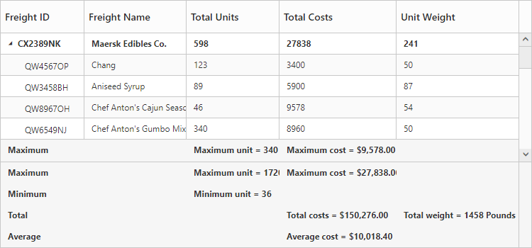
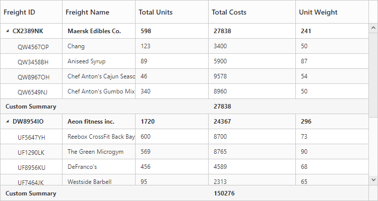

# Summary Row

Summary rows in TreeGrid are used to summarize every hierarchy with the set of predefined summary types using the column values. Using the `SummaryRows` property, user can define the summary rows in TreeGrid and the title for each summary row can be defined using the `SummaryRows.Title` property. And summary for the columns in TreeGrid can be defined by using the `SummaryRows.SummaryColumns` property. Summary rows are enabled by setting the `ShowSummaryRow` property as `true`. The total summary row is the overall summary row displayed for all the rows in the TreeGrid and its visibility can be defined by using the `ShowTotalSummary` property.

### Defining summary columns

Using the **SummaryType** property, user can define the type of summary to be displayed in a column. 
The **DataMember** property is used the map the field values which is used for summary calculations. 
The **DisplayColumn** property is used to specify the column in which the summary to be displayed.
The **Prefix** and **Suffix** properties are used to define the text should be displayed along with the summary column value. 
The **Format** property is used for formatting the summary column value.
The below code snippet explains defining a summary row in TreeGrid,



@(Html.EJ().TreeGrid("TreeGridContainer") 
    .ShowSummaryRow(true)
    .ShowTotalSummary(true)
    .SummaryRows(rows =>
        {
            rows.Title("Maximum").SummaryColumns(col =>
                {
                    col.SummaryType(TreeGridSummaryType.Maximum)
                        .DataMember("TotalUnits")
                        .Prefix("Maximum unit = ")
                        .DisplayColumn("TotalUnits").Add();
                    col.SummaryType(TreeGridSummaryType.Maximum)
                        .DataMember("TotalCosts")
                        .Prefix("Maximum Cost = ")
                        .DisplayColumn("TotalCosts")
                        .Format("{0:C}").Add();
                }).Add();
            rows.Title("Total").SummaryColumns(summary =>
                {
                    summary.SummaryType(TreeGridSummaryType.Sum)
                        .DataMember("TotalCosts")
                        .Prefix("Total costs = ")
                        .DisplayColumn("TotalCosts")
                        .Format("{0:C}").Add();
                    summary.SummaryType(TreeGridSummaryType.Sum)
                        .DataMember("UnitWeight")
                        .Prefix("Total weight = ")
                        .DisplayColumn("UnitWeight")
                        .Suffix("Pounds").Add();
                }).Add();
        })
    )
@(Html.EJ().ScriptManager())



The below screenshot shows the output of above code example.

## Customize height of total summary
Using `TotalSummaryHeight` property we can customize the height of the total summary container.
The below code example shows how to update the footer summary container height.


@(Html.EJ().TreeGrid("TreeGridContainer") 
    .ShowSummaryRow(true)
    .ShowTotalSummary(true)
    .TotalSummaryHeight(120)    
    )
@(Html.EJ().ScriptManager())


The below screenshot shows the output of above code example.

## Expand/collapse total summary row

We can expand/collapse the total summary rows in TreeGrid using following methods.

* Using Expander Icon
* Using Method

### Using Expander Icon

We can enable expander icon in total summary row by using `CollapsibleTotalSummary` property. By default expander icon will be rendered in first row of 0th column in total summary rows.
Please find the below code example to enable collapsible total summary row in TreeGrid.



@(Html.EJ().TreeGrid("TreeGridContainer") 
    .ShowSummaryRow(true)
    .ShowTotalSummary(true)
    .TotalSummaryHeight(120)    
	.CollapsibleTotalSummary(true)
    )
@(Html.EJ().ScriptManager())



N> We can also customize the expander icon column in total summary row by using `_summaryColumnIndex` property and `Load` event.

### Using Method

Total summary rows in TreeGrid can be expanded/collapsed by using [`expandCollapseTotalSummary`](https://help.syncfusion.com/api/js/ejgantt#methods:expandCollapseTotalSummary "expandCollapseTotalSummary") method.
Please find the code example to collapse the total summary rows below.
  


<button onclick="expandCollapse()">expandCollapse</button>
@(Html.EJ().TreeGrid("TreeGridContainer") 
    .ShowSummaryRow(true)
    .ShowTotalSummary(true)
    .TotalSummaryHeight(120)    
	.CollapsibleTotalSummary(true)
    )
@(Html.EJ().ScriptManager())
function expandCollapse() {
            var treeObj = $("#TreeGridContainer").data("ejTreeGrid");
            treeObj.expandCollapseTotalSummary(false);
        }


[Click](http://mvc.syncfusion.com/demos/web/treegrid/treegridsummaryrow) here to view the demo sample for summary row in TreeGrid.

## Custom Summary

Custom summary can be used to create summary values based on your required custom logic and calculations. To enable the custom summary, the `SummaryType` should be set to 'Custom' and the `CustomSummaryValue` property should be defined as function. After the custom calculation, the returned value will be displayed in the corresponding summary cell.



@(Html.EJ().TreeGrid("TreeGridContainer")
    .ShowSummaryRow(true)
    .SummaryRows(su =>
    {
        su.Title("Custom Summary").
            SummaryColumns(
            sc =>
            {
                sc.SummaryType(TreeGridSummaryType.Custom)
                  .CustomSummaryValue("sum")
                  .DisplayColumn("Progress").Add();
            }).Add();
    })
    )

    
    
    



The output of the tree grid with custom summary value is obtained as follows.

