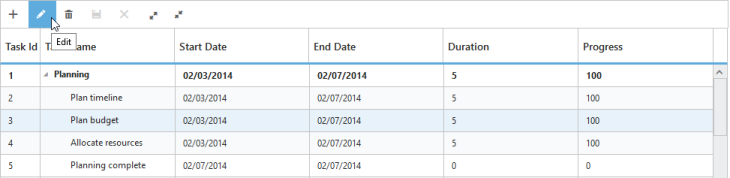

# Toolbar

TreeGrid control contains toolbar options for adding, deleting and editing the records. You can customize the TreeGridToolbar tools by using ToolbarSettings API. 

In TreeGrid by using RowPosition API, the index position for the newly added row can be provided. Default value of the RowPosition property is top. The Enum values for RowPosition API are,

* top
* bottom
* aboveSelectedRow
* belowSelectedRow

You can enable toolbar for TreeGrid, using the following code example.



@(Html.EJ().TreeGrid("TreeGridContainer")

                    //...

.EditSettings(edit =>

               {

                  //...

           edit.RowPosition(TreeGridRowPosition.AboveSelectedRow);

              })

.ToolbarSettings(tool =>

              {

          tool.ShowToolbar(true);

          tool.ToolbarItems(new List<TreeGridToolBarItems>()

                {

                TreeGridToolBarItems.Add,

                TreeGridToolBarItems.Edit,

                TreeGridToolBarItems.Delete,

                TreeGridToolBarItems.Update,                

                TreeGridToolBarItems.Cancel,

                TreeGridToolBarItems.ExpandAll,

                TreeGridToolBarItems.CollapseAll,

                });

              })

.Datasource(ViewBag.datasource)

        )



The following screenshot displays the toolbar option in TreeGrid control

