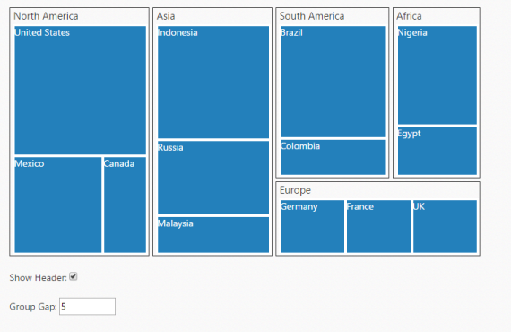

# AngularJS Support

**AngularJS** is a JavaScript framework added to a **HTML** page with a &lt;script&gt; tag. It extends HTML attributes with directives and binds data to HTML with expressions. AngularJS directives allow you to specify custom and reusable HTML tags that moderate the behavior of certain elements. **Angular binding** uses directives to plug its action into the page. Directives, all prefaced with ng-, are placed in HTML attributes. To know more about Angular binding refer to: <http://help.syncfusion.com/aspnetmvc/treemap/angularjs-support>

Apply the plugin and property assigning the **Treemap** element through the directive that starts with the letter “e-“.  The following code illustrates how to bind data to the Treemap  component through Angular support.





    

    
    //References to be added for AngularJS support.

    

    

   
    //Initializes controller

    

    

    //Initializes controller

    

    

    //Initializes TreeMap

    

        <e-levels>

            <e-level e-grouppath="ngroupPath" e-groupgap="ngroupGap" e-showheader="nshowHeader"></e-level>

        </e-levels>

    
 
    

    //Renders a checkbox to change the header visibility

    

        Show Header:  <input type="checkbox" ng-model="nshowHeader" style="outline: none;"/>   

    
 

    //Renders a textbox to change the groupGap value

    

        Group Gap:  <input type="text" id="Text11" ng-model="ngroupGap" style="width: 110px" />

    
 

     

    

    





    public partial class TreeMapController : Controller

    {

        public ActionResult AngularTreeMap()

        {

            return View();

        }

    }


  

