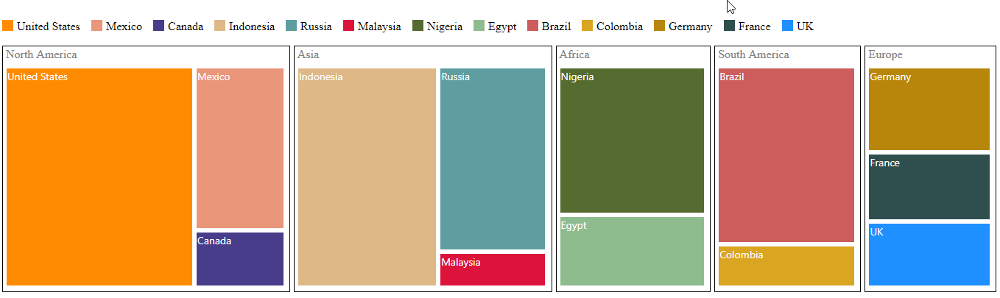

# Customization

**TreeMap** control supports color customization to determine the exact combination of colors for tree nodes displayed in TreeMap and tooltip support to display additional information of treemap data.

## Color 

You can customize the color of leaf nodes in **Treemap** either using ColorMapping support of the **Treemap** or mapping a field in the datasource.

## Binding color from the datasource

You can set color for each leaf items from data source by using `ColorPath` property. 

N> While setting color, do not set any other color mapping for treemap because color mapping has higher priority than `ColorPath` property. And also, if `ColorPath` is set, the legend will be generated for each leaf item in treemap. 



       @(Html.EJ().TreeMap("treemap")
  
         .ColorPath("fill")

    .Render())



**ColorMapping** is categorized into three different types such as,

* `UniColorMapping`
* `RangeBrushColorMapping`
* `DesaturationColorMapping`

## UniColorMapping

You can color, all the leaf nodes with the same color by setting the `Color` value of the `UniColorMapping` property of the TreeMap.



    
    @(Html.EJ().TreeMap("treemap")
  
    .TreeMapUniColorMapping(cm =>

    {

       cm.Color("crimson");

    })

    .Render())



## Range Color Mapping

You can group the leaf nodes based on the range of the data’s color values. You can set a unique color for every ranges. To achieve this, specify the `To` and `From` values as range bound and `Color` or `GradientColors` values to fill the leaf nodes of the particular range, through the `RangeColorMapping` property of the **TreeMap**.



    @(Html.EJ().TreeMap("treemap")

    .TreeMapRangeColorMappings(cm => 

    {

	   cm.To(1).From(0).Color("#77D8D8").Add();

	   cm.To(2).From(0).Color("#AED960").Add();

	   cm.To(3).From(0).Color("#FFAF51").Add();

	   cm.To(4).From(0).Color("#F3D240").Add();

    })

    .Render())



## Desaturation Color Mapping

You can differentiate all the leaf nodes using the `DesaturationColorMapping` property of the TreeMap. Differentiation is achieved, even though same color is applied for all the leaf nodes by varying the opacity of the leaf nodes based on the color value specified in the color value range using `RangeMinimum` and `RangeMaximum` value of the data collection. You can also bound the opacity range by setting `From` and `To` property of the `DesaturationColorMapping`.



    @(Html.EJ().TreeMap("treemap")

    .TreeMapDesaturationColorMapping(cm => 

    {

        cm.To(0.2).From(1).Color("DeepSkyBlue")

        .RangeMinimum(0).RangeMaximum(4); 
    })

    .Render())



## Tooltip

You can enable the tooltip support for the TreeMap by setting the `ShowTooltip` property to true. By default, it takes the property of the bound object that is referred to in the `GroupPath` and displays its content when the corresponding node is tapped. The `TooltipTemplate` is a HTML element that is used to expose the custom template for the tooltip.

## Leaf Item Setting

You can customize the **Leaf level TreeMap** items using `LeafItemsSetting`. In `LeftItemSetting` following customization options are available.

* You can specify the border color using `BorderBrush` property.

* For customizing border thickness, you can use `BorderThickness` property.

* To customize the gap between the leaf items, you can use `Gap` property.

* You can specify the label template for the leaf item using `ItemTemplate` property.

* The Label and tooltip values take the property of bound object that is referred in the `LabelPath` when defined.

* You can specify the position of the leaf labels using `LabelPosition` property.

* You can control the mode of label visibility of the labels using `LabelVisibilityMode` property.

* To show or hide the visibility of the leaf item labels you can use `ShowLabels` property.

* For specifying over flow action of left item labels you can use `TextOverflow` property.



    @(Html.EJ().TreeMap("treemap")

    .DataSource(datasource)
    .ColorValuePath("Growth")
    .WeightValuePath("Population")
    .Levels(lv =>
    {

	   lv.GroupPath("Continent")
	     .GroupGap(5)
	     .Add();                            
    })   
    .TreeMapRangeColorMappings(cm => 
    {
        cm.To(1).From(0).Color("#77D8D8").Add();
        cm.To(2).From(0).Color("#AED960").Add();
        cm.To(3).From(0).Color("#FFAF51").Add();
        cm.To(4).From(0).Color("#F3D240").Add();
    })
    .LeafItemsSetting(li =>
    {
	   li.LabelPath("Region")
	     .ShowLabels(true)
    })
    .ShowTooltip(true)
    .TooltipTemplate("template")                
    .Render())   
    
    
   

    



## Border Brush

You can able to customize the border color of the treemap using the property `BorderBrush`. 



    @(Html.EJ().TreeMap("treemap")
 
        //To set borderBrush API value during initialization 
        .BorderBrush('white')
    )



## Border Thickness

For customizing the border thickness of the treemap, you can use the `BorderThickness` property.



    @(Html.EJ().TreeMap("treemap")
 
        //To set borderThickness API value during initialization 
        .BorderThickness(1)
    )



## Dock Position

You can position the legend at top, bottom, left and right side of the treemap as per your requirement. For changing the position as per your requirement, you can use `DockPosition` property.

<ts name="ej.datavisualization.TreeMap.DockPosition"/>
Specifies the dockPosition for legend

<table class="params">
	<thead>
		<tr>
			<th>Name </th>			
			<th>Description</th>
		</tr>
	</thead>
	<tbody>
		<tr>
			<td class="name">top</td>			
			<td class="description">specifies the top position</td>
		</tr>
		<tr>
			<td class="name">bottom</td>			
			<td class="description">specifies the bottom position</td>
		</tr>
    <tr>
			<td class="name">right</td>			
			<td class="description">specifies the bottom position</td>
		</tr>
    <tr>
			<td class="name">left</td>			
			<td class="description">specifies the left position</td>
		</tr>
	</tbody>
</table>



    @(Html.EJ().TreeMap("treemap")
 
        //To set dockPosition API value during initialization 
        .TreeMapLegend(legend=>legend.DockPosition(TreeMapDockPosition.Top))
    )



## Clicking and Dragging

You can select the single treemap element on click and drag. To click and drag treemap items, you have to enable the `DraggingOnSelection` property.



    @(Html.EJ().TreeMap("treemap")
 
        //To set draggingOnSelection API value during initialization 
        .DraggingOnSelection(false)    
    )



For selecting the group element of treemap while clicking and dragging, you can use `DraggingGroupOnSelection` property.



    @(Html.EJ().TreeMap("treemap")
 
        //To set draggingGroupOnSelectionAPI value during initialization 
        .DraggingGroupOnSelection(false)
    )



## Fill with Gradient

You can customize that whether gradient color have to be applied for treemap or not. This can be customized using the property `EnableGradient`.



    @(Html.EJ().TreeMap("treemap")
 
        //To set enableGradient API value during initialization 
        .EnableGradient(true)
    )


## Responsive Treemap

You can customize whether treemap have to be responsive or not while resizing the container. For making treemap responsive you can use `EnableResize` or `IsResponsive` property.



    @(Html.EJ().TreeMap("treemap")
 
        //To set enableResize API value during initialization 
        .EnableResize(false)



## GroupColorMapping

You can customize the color of the each group using `GroupColorMapping` property. To use group color mapping, kindly specify `GroupID` and `RangeColorMapping` inside the `GroupColorMapping`. 



	@(Html.EJ().TreeMap("treemap")
    
    //To set groupColorMapping API value during initialization 
	.TreeMapGroupColorMapping( )
  


## GroupSelectionMode

You can specifies the selection mode of the treemap using `GroupSelectionMode` property. You can set either group selection mode value as `Default` or  `Multiple`. 



    @(Html.EJ().TreeMap("treemap")

        // Set the selection mode during initialization.                                        
        .GroupSelectionMode(GroupSelectionMode.Default)



## Header

You can specify the header for the parent item using the property `Header`. This is applicable only for hierarchical data source. 



    @(Html.EJ().TreeMap("treemap")

        //To set header API value during initialization 
        .Header("Country")



## Specifying HierarchicalDatasource

You can specify whether data source bound for the treemap is hierarchical or not using the property `IsHierarchicalDatasource`.



    @(Html.EJ().TreeMap("treemap")

        //To set isHierarchicalDatasource API value during initialization 
        .IsHierarchicalDatasource(true)



## Treemap Items

You can specify the treemap items which you want to display in the treemap using the property `TreeMapItems`.

