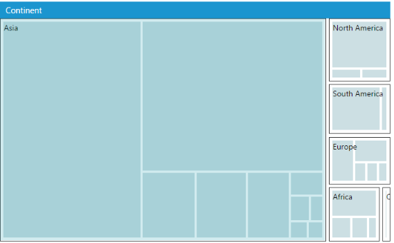
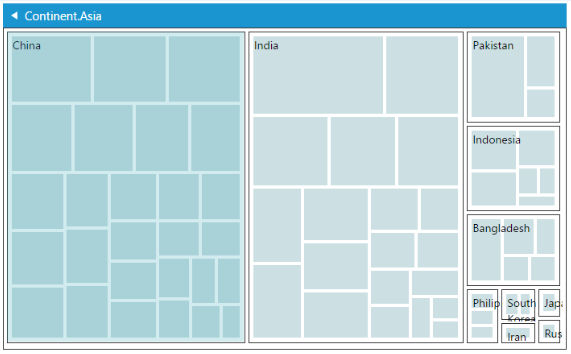

# Drill Down Support

Treemap enables drill down to expose the hierarchy achieved by clicking on a node and this results in enabling the Treemap to move to the next level or sub level and can return back to the normal Treemap view by clicking on the node header. Only a single level of the Treemap is visible at once.

## Enabling Drill Down

Treemap elements can be drilled down by setting the EnableDrillDown property to true. You can view the hierarchy of the Treemap by clicking on the treemap items and can move to the previous level by clicking on the drill down header. The header color can be customized by changing the values in the property DrillDownHeaderColor and the selection color can be done by changing the DrillDownSelectionColor property.

_Drill down Properties_

<table>
<tr>
<th>
Property</th><th>
Type</th><th>
Description</th></tr>
<tr>
<td>
enableDrillDown</td><td>
bool</td><td>
Gets or sets a value that indicates whether the drill down feature is enabled or not</td></tr>
<tr>
<td>
drillDownHeaderColor</td><td>
string</td><td>
Gets or sets a color for header during drill down</td></tr>
<tr>
<td>
drillDownSelectionColor</td><td>
string</td><td>
Gets or sets a color for highlighting tree map item during drill down.</td></tr>
</table>



@(Html.EJ().TreeMap("treemap")

                .DataSource(datasource)

                .EnableDrillDown(true)   

.DrillDownHeaderColor("#199DAF")

.DrillDownSelectionColor("#199DAF")

                .WeightValuePath("Population")

                .Levels(lv =>

                {

                    lv.GroupPath("Continent")                                    

                                    .HeaderHeight(25)

                                    .GroupGap(5)

                                    .ShowLabels(true).Add();

                    lv.GroupPath("Country")                                    

                                    .HeaderHeight(25)

.GroupGap(0)

                                    .ShowLabels(true).Add();

                    lv.GroupPath("Name")                                   

                                    .HeaderHeight(25)

.GroupGap(0)

                                    .ShowLabels(true).Add();

                })

    )



_Before Drill Down_

_After Drill Down_

