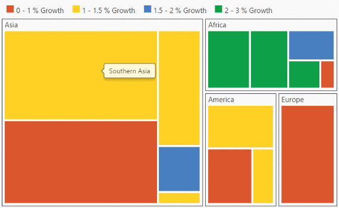

# Getting Started

This section explains briefly about how to create a TreeMap in your application with ASP.NET MVC .

## Configure a TreeMap

You can configure an MVC TreeMap in simple steps. This manual provides instructions on how to configure TreeMap with grouping of populated datum based on population growth in population in each continent.  It also provides a walk-through on some of the customization feature available in TreeMap control.

## Create a simple MVC Application

You can create a new ASP.NET MVC project Razor application by adding the necessary dll's and scripts.

## Add Data 

You can populate the TreeMap data inside the controller. For example, you can populate data of few countries from the following location.

~/Controller/TreeMapController.cs



    public class TreeMapPopulationData

    {

        public string Continent { get; set; }

        public string Region { get; set; }

        public int Growth { get; set; }

        public long Population { get; set; }

        public static List<TreeMapPopulationData> GetData()

        {

            List<TreeMapPopulationData> population = new List<TreeMapPopulationData>();

            population.Add(new TreeMapPopulationData() { Continent = "Asia", Region = "Southern Asia", Growth = 1.32, Population = 1749046000});

            population.Add(new TreeMapPopulationData() { Continent = "Asia", Region = "Eastern Asia", Growth = 0.57, Population = 1620807000});

            population.Add(new TreeMapPopulationData() { Continent = "Asia", Region = "South-Eastern Asia", Growth = 1.20, Population = 618793000});

            population.Add(new TreeMapPopulationData() { Continent = "Asia", Region = "Western Asi", Growth = 1.98, Population = 245707000});

            population.Add(new TreeMapPopulationData() { Continent = "Asia", Region = "Central Asia", Growth = 1.43, Population = 64370000});

            population.Add(new TreeMapPopulationData() { Continent = "Europe", Region = "Europe", Growth = 0.10, Population = 742452000});

            population.Add(new TreeMapPopulationData() { Continent = "America", Region = "South America", Growth = 1.06, Population = 406740000});

            population.Add(new TreeMapPopulationData() { Continent = "America", Region = "Northern America", Growth = 0.85, Population = 355361000});

            population.Add(new TreeMapPopulationData() { Continent = "America", Region = "Central America", Growth = 1.40, Population = 167387000});

            population.Add(new TreeMapPopulationData() { Continent = "Africa", Region = "Eastern Africa", Growth = 2.89, Population = 373202000});

            population.Add(new TreeMapPopulationData() { Continent = "Africa", Region = "Western Africa", Growth = 2.78, Population = 331255000});

            population.Add(new TreeMapPopulationData() { Continent = "Africa", Region = "Northern Africa", Growth = 1.70, Population = 210002000});

            population.Add(new TreeMapPopulationData() { Continent = "Africa", Region = "Middle Africa", Growth = 2.79, Population = 135750000});

            population.Add(new TreeMapPopulationData() { Continent = "Africa", Region = "Southern Africa", Growth = 0.91, Population = 60425000});

            return population;

        }

    }



 > Note: Population data is referred from [List of continents by population](http://en.wikipedia.org/wiki/List_of_continents_by_population)
 
## Initialize TreeMap

1. Create a 
 tag with a specific id and set the height and width to determine the TreeMap size to be rendered in “TreeMap.cshtml” file
   
   ~~~ html

		  
 

		  
            

   ~~~
   {:.prettyprint }

2. Add the following code in “TreeMap.cshtml” file to create the TreeMap control in a View page.

   ~~~ html

		  
 

			  @(Html.EJ().TreeMap("treemap")                

			   .Render())

		  
            

   ~~~
   {:.prettyprint }

3. Add the TreeMap() action in “TreeMapController.cs” as illustrated in the following code sample.

   ~~~ cs

		public ActionResult TreeMap()

		{

			ViewData["datasource"] = TreeMapPopulationData.GetData();

			return View();

		}

   ~~~
   {:.prettyprint }

## Data Source

The DataSource property accepts the collection values as input. For example, you can provide the list of objects as input.

## Weight Value Path 

You can calculate the size of the object using WeightValuePath of TreeMap.

1. Populate the TreeMap by using the above properties.

   ~~~ html

		@{

		    var datasource = ViewData["datasource"];    

		}

		<html xmlns="http://www.w3.org/1999/xhtml">

		<head> // ...

		</head>

		<body>

		

		@(Html.EJ().TreeMap("treemap")

				.DataSource(datasource)

				.WeightValuePath("Population")

			       .Render())

		

		// ...

		</body>

		</html>

   ~~~
   {:.prettyprint }

2. Final TreeMap.cshtml file is illustrated in the following code sample.

   ~~~ html

		@{

		    var datasource = ViewData["datasource"];    

		}

		<html xmlns="http://www.w3.org/1999/xhtml">

		<head> 

		

		

		     

		

		<body>

		

		@(Html.EJ().TreeMap("treemap")

				.DataSource(datasource)

				.WeightValuePath("Population") 

			       .Render())

		    
   

		    @(Html.EJ().ScriptManager())

		</body>

		</html>

   ~~~
   {:.prettyprint }

The following image displays a TreeMap with default properties using the above code. 

## GroupTreeMap Items using Levels

You can group TreeMap Items using levels in TreeMap.

### Group Path

You can use GroupPath property for every flat level of the TreeMap control. It is a path to a field on the source object that serves as the “Group” for the level specified. You can group the data based on the GroupPath in the TreeMap control. When the GroupPath is not specified, then the items are not grouped and the data is displayed in the order specified in the DataSource.

### Group Gap

You can use GroupGap property to separate the items from every flat level and to differentiate the levels mentioned in the TreeMap control.

The following code sample explains how to group TreeMap Items using ‘Levels’



@(Html.EJ().TreeMap("treemap")

                .DataSource(datasource)

                .WeightValuePath("Population")

                .Levels(lv =>

                    {

                        lv.GroupPath("Continent")

                            .GroupGap(5).Add();                            

                    })   

               .Render())



The following screenshot displays grouping of TreeMapItems using Levels.

## Customize TreeMap Appearance by Range

You can differentiate the nodes based on its value and color ranges using Range color. You can also define the color value range using From and To properties. 

### Color Value Path

The ColorValuePath of TreeMap is a path to a field on the source object. You can determine the color for the object using ColorValuePath of TreeMap.

The following code sample explains how to customize TreeMap Appearance by Range.



@(Html.EJ().TreeMap("treemap")

                .DataSource(datasource)

                .WeightValuePath("Population")                             

                .Levels(lv =>

                    {

                        lv.GroupPath("Continent")

                            .GroupGap(5).Add();                            

                    })   

                .ColorValuePath("Growth")

                .TreeMapRangeColorMappings(cm => 

                    {

                      cm.To(1).From(0).Color("#DC562D").Add();

                      cm.To(1.5).From(1).Color("#FED124").Add();

                      cm.To(2).From(1.5).Color("#487FC1").Add();

                      cm.To(3).From(2).Color("#0E9F49").Add();

                    })

               .Render())   



The following screenshot displays customized TreeMap Appearance by Range

## Enable Tooltip

You can enable the tooltip by setting ShowTooltip property to ‘true’. By default, it takes the property of the bound object that is referred in the WeightValuePath and displays its content when the corresponding node is hovered. You can customize the template for tooltip using TooltipTemplate property.

### Leaf Item Settings

You can customize the Leaf level TreeMap items using LeafItemSettings. The Label and tooltip values take the property of bound object that is referred in the LabelPath when defined.

The following code sample displays how the tooltip is enabled.



      @(Html.EJ().TreeMap("treemap")

                .DataSource(datasource)

                  .WeightValuePath("Population")                             

                  .Levels(lv =>

                    {

                        lv.GroupPath("Continent")

                            .GroupGap(5).Add();                            

                    })   

                  .ColorValuePath("Growth")

.TreeMapRangeColorMappings(cm => 

                    {

                      cm.To(1).From(0).Color("#DC562D").Add();

                      cm.To(1.5).From(1).Color("#FED124").Add();

                      cm.To(2).From(1.5).Color("#487FC1").Add();

                      cm.To(3).From(2).Color("#0E9F49").Add();

                    })

.ShowTooltip(true)

                 .LeafItemsSettings(lls =>

                   {

                       lls.LabelPath("Region");

                   })

               .Render())



The following screenshot displays the TreeMap when the Tooltip is enabled.

## Legend

You can set the color value of leaf nodes using TreeMap Legend. This legend is appropriate only for the TreeMap whose leaf nodes are colored using RangeColorMapping.

You can set ShowLegend property value to ‘_true_’ to make a Legend visible.

### Label for Legend

You can customize the labels of the legend item using LegendLabel property of RangeColorMapping. 

The following code sample displays how to add labels for legend in a TreeMap.



      @(Html.EJ().TreeMap("treemap")

                .DataSource(datasource)

                .WeightValuePath("Population") 

                .Levels(lv =>

                    {

                        lv.GroupPath("Continent")

                            .GroupGap(5).Add();                            

                    })   

                  .ColorValuePath("Growth")

.TreeMapRangeColorMappings(cm => 

                    {

                      cm.To(1).From(0).Color("#DC562D").Legendlabel("0 - 1 % Growth").Add();

                      cm.To(1.5).From(1).Color("#FED124").Legendlabel("1 - 1.5 % Growth").Add();

                      cm.To(2).From(1.5).Color("#487FC1").Legendlabel("1.5 - 2 % Growth").Add();

                      cm.To(3).From(2).Color("#0E9F49").Legendlabel("2 - 3 % Growth").Add();                   

                   })

                .ShowTooltip(true)

                 .LeafItemsSettings(lls =>

                   {

                       lls.LabelPath("Region");

                   })

                .ShowLegend(true)

               .Render())



The following screenshot displays the TreeMap when Labels are enabled.

