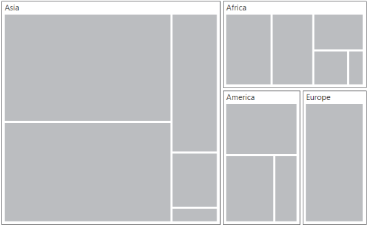
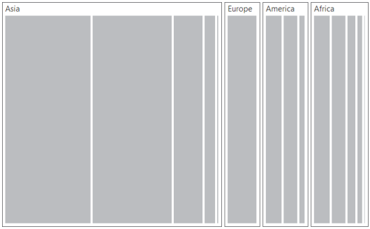
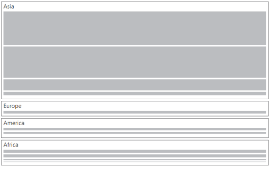

# Layout

You can decide on the visual representation of nodes belonging to all the treemap levels using the `ItemsLayoutMode` property of the TreeMap.

There are four different TreeMap layouts such as

* Squarified Layout
* SliceAndDiceAuto Layout
* SliceAndDiceHorizontal Layout
* SliceAndDiceVertical Layout

## Squarified Layout

`Squarifiedlayout` creates rectangles with best aspect ratio.



	@(Html.EJ().TreeMap("treemap")

		.DataSource(datasource)

		.ColorValuePath("Growth")

		.WeightValuePath("Population")               

		.Levels(lv =>

		{

			lv.GroupPath("Continent")

			  .GroupGap(5).Add();

		})     

		.ItemsLayoutMode("Squarified")           

		.Render())



## SliceAndDiceAuto Layout

`SliceAndDiceAuto` layout creates rectangles with high aspect ratio and displays them sorted both horizontally and vertically.



	@(Html.EJ().TreeMap("treemap")

		.ItemsLayoutMode("SliceAndDiceAuto ")

		.Render())



## SliceAndDiceHorizontal Layout

`SliceAndDiceHorizontal` layout creates rectangles with high aspect ratio and displays them sorted horizontally.



	@(Html.EJ().TreeMap("treemap")

		.ItemsLayoutMode("SliceAndDiceHorizontal ")

		.Render())



## SliceAndDiceVertical Layout

`SliceAndDiceVertical` layout creates rectangles with high aspect ratio and displays them sorted vertical.



	@(Html.EJ().TreeMap("treemap")

		.ItemsLayoutMode("SliceAndDiceVertical ")

		.Render())



