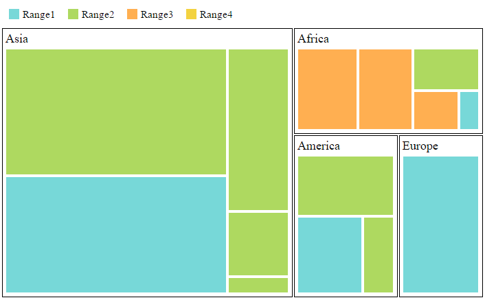

# TreeMap Elements

TreeMap contains various elements such as,

* Legend
* Headers
* Labels

## Legend

You can set the color value of leaf nodes using `TreeMapLegend`. This legend is appropriate only for the TreeMap whose leaf nodes are colored using `RangeColorMapping`.

You can set `ShowLegend` property value to “True” to enable or disable legend visibility.

### TreeMap Legend

You can decide the size of the legend icons by setting `IconWidth` and `IconHeight` properties of the `TreeMapLegend` property avail in TreeMap.

### Label for Legend

You can customize the labels of the legend item using `LegendLabel` property of `RangeColorMapping`. 



	@(Html.EJ().TreeMap("treemap")

		.DataSource(datasource)

		.ColorValuePath("Growth")

		.WeightValuePath("Population")

		.ShowLegend(true)

		.Levels(lv =>

		{                          

			lv.GroupPath("Continent")

		  		.GroupGap(5)

		  		.Add();

		})   

		.TreeMapRangeColorMappings(cm => 

		{

			cm.To(1).From(0).Color("#77D8D8").Legendlabel("Range1").Add();

			cm.To(2).From(0).Color("#AED960").Legendlabel("Range2").Add();

			cm.To(3).From(0).Color("#FFAF51").Legendlabel("Range3").Add();

			cm.To(4).From(0).Color("#F3D240").Legendlabel("Range4").Add();

		})

		.TreeMapLegend(legend =>

		{

			legend. IconWidth(20)

			  . IconHeight(20);

		})

		.Render())



## Header

You can set headers for each level by setting the `ShowHeader` property of the each TreeMap levels. The `HeaderHeight` property helps to set the height of the header and Group path value determines the header value. You can customize the default header appearance by setting the `HeaderTemplate` of the TreeMap levels.



	@(Html.EJ().TreeMap("treemap")

		.DataSource(datasource)

		.ColorValuePath("Growth")

		.WeightValuePath("Population")

		.ShowLegend(true)

		.TreeMapLegend(legend =>

		{

			legend.IconWidth(17)

			.IconHeight(17);

		})

		.TreeMapRangeColorMappings(cm => 

		{

			cm.To(1).From(0).Color("#77D8D8").Legendlabel("Range1").Add();

			cm.To(2).From(0).Color("#AED960").Legendlabel("Range2").Add();

			cm.To(3).From(0).Color("#FFAF51").Legendlabel("Range3").Add();

			cm.To(4).From(0).Color("#F3D240").Legendlabel("Range4").Add();

		})

		.Levels(lv =>

		{

			lv.GroupPath("Continent")

				.GroupGap(5)

				.HeaderHeight(30)                           

				.HeaderTemplate("template").Add();                            

		})   
   		
		.Render())

  		              



## Customizing the header

The text in the header can be customized by triggering the event **HeaderTemplateRendering** of the **TreeMap**. This event is triggered before rendering the header template. 



	@(Html.EJ().TreeMap("treemap")

		.DataSource(datasource)

		.ColorValuePath("Growth")

		.WeightValuePath("Population")

		.ShowLegend(true)

		.HeaderTemplateRendering("loadTemplate")

		.TreeMapLegend(tl =>

		{

			tl.IconWidth(17)

			.IconHeight(17);

		})		

		.Levels(lv =>

		{

			lv.GroupPath("Continent")

				.GroupGap(5)

				.HeaderHeight(30)                           

				.HeaderTemplate("headertemplate").Add();                            

		})   
   		
		.Render())

  		  

		   function loadTemplate(sender) {
        		//...                   
    	   }            



## Label

You can also set labels for the leaf nodes by setting the `ShowLabels` property as true. `GroupPath` value is displayed as a label for leaf nodes. You can customize the default label appearance by setting the `LabelTemplate` of the TreeMap levels.



	@(Html.EJ().TreeMap("treemap")

		.DataSource(datasource)

		.ColorValuePath("Growth")

		.WeightValuePath("Population")

		.ShowLegend(true)

		.TreeMapLegend(legend =>

		{

			legend. IconWidth(17)

			  . IconHeight(17);

		})

		.Levels(lv =>

		{

			lv.GroupPath("Continent")

			  .GroupGap(5)

			  .HeaderHeight(30)                           

			  .HeaderTemplate("headerTemplate").Add();                            

		})   

	 	.TreeMapRangeColorMappings(cm => 

		{

			cm.To(1).From(0).Color("#77D8D8").Legendlabel("Range1").Add();

			cm.To(2).From(0).Color("#AED960").Legendlabel("Range2").Add();

			cm.To(3).From(0).Color("#FFAF51").Legendlabel("Range3").Add();

			cm.To(4).From(0).Color("#F3D240").Legendlabel("Range4").Add();

		})

	  	.LeafItemsSetting(li =>

		{

			 li.LabelPath("Region")

			   .ShowLabels(true)

				.LabelTemplate("labelTemplate");

		})

	 	.Render())

		      

		 



## Customizing the Overflow labels

You can handle the label overflow, by specifying any one of the following values to the property `TextOverflow`as

**None**       - By specifying textOverflow as “none”, it displays the default label text.
**Hide**       - By specifying textOverflow as “hide”, You can hide the label, when it exceeds the header width.
**Wrap**       - By specifying textOverflow as “wrap”, you can wrap the label text.
**Wrapbyword** - By specifying textOverflow as “wrapbyword”, you can wrap the label text by word.



	@(Html.EJ().TreeMap("treemap")

		.DataSource(datasource)

		.ColorValuePath("Growth")

		.WeightValuePath("Population")

		.ShowLegend(true)

		.HeaderTemplateRendering("loadTemplate")

		.TreeMapLegend(tl =>

		{

			tl.IconWidth(17)

			.IconHeight(17);

		})		

		.Levels(lv =>

		{

			lv.GroupPath("Continent")

				.GroupGap(5)

				.HeaderHeight(30)                           

				.HeaderTemplate("headertemplate").Add();                            

		})  

		.LeafItemsSetting(li =>

		{

			 li.LabelPath("Region")

			   .ShowLabels(true)

			   .TextOverFlow(TextOverFlow.Wrap)

				.LabelTemplate("labeltemplate");

		}) 
   		
		.Render())

  		  
		           



