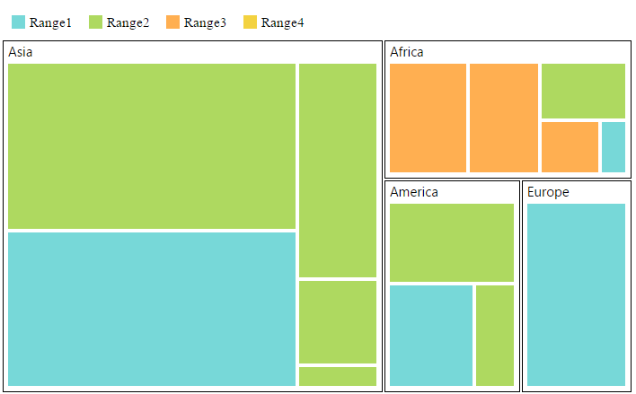

# TreeMap Elements

TreeMap contains various elements such as,

* Legend
* Headers
* Labels

## Legend

You can set the color value of **leaf nodes** using `TreeMapLegend`. This legend is appropriate only for the TreeMap whose leaf nodes are colored using `RangeColorMapping`.

You can set `ShowLegend` property value to “true” to enable or disable legend visibility.

### TreeMap Legend

You can customize the treemap legend using following properties

* For customizing the alignment of legend, you can use `Alignment` property.

* You can set the legend column count using `ColumnCount` property.

* To set the dock position of the legend text, you can use `DockPosition`.

* You can specify the size of the legend by setting `Height` and `Width` of the `TreeMapLegend`.

* You can decide the size of the legend icons by setting `IconWidth` and `IconHeight` properties of the `TreeMapLegend` property avail in TreeMap.

* You can customize the left and right label text for the legend using `LeftLabel` and `RightLabel` properties.

* To set the legend mode as default or interactive, you can use `Mode` property.

* Using the property `Template`, you can specify template for legend settings.

* To set the legend title, you can use the `Title` property of the `LegendSettings`.

### Label for Legend

You can customize the labels of the legend item using `LegendLabel` property of `RangeColorMapping`. 



	@(Html.EJ().TreeMap("treemap")

		.DataSource(datasource)

		.ColorValuePath("Growth")

		.WeightValuePath("Population")

		.ShowLegend(true)

		.Levels(lv =>

		{                          

			lv.GroupPath("Continent")

		  		.GroupGap(5)

		  		.Add();

		})   

		.TreeMapRangeColorMappings(cm => 

		{

			cm.To(1).From(0).Color("#77D8D8").LegendLabel("Range1").Add();

			cm.To(2).From(0).Color("#AED960").LegendLabel("Range2").Add();

			cm.To(3).From(0).Color("#FFAF51").LegendLabel("Range3").Add();

			cm.To(4).From(0).Color("#F3D240").LegendLabel("Range4").Add();

		})

		.TreeMapLegend(legend =>

		{

			legend. IconWidth(20)

			  . IconHeight(20);

		})

		.Render())



### Interactive Legend

The legends can be made interactive with an arrow mark indicating the exact range color in the legend when the mouse hovers over the corresponding treemap items. You can enable this option by setting `Mode` property in `Legend settings` value as “interactive” and default value of `Mode` property is “default” to enable the normal legend.

#### Title for Interactive Legend

You can provide the title for interactive legend by using `Title` property in `LegendSettings`.

#### Label for Interactive Legend

You can provide the left and right labels to interactive legend by using `LeftLabel` and `RightLabel` properties in `LegendSettings`. 



	@(Html.EJ().TreeMap("treemap")          
                // ...
                 .ShowLegend(true)
                 .TreeMapLegend(legend =>
                    {                                     
                    legend.DockPosition(TreeMapDockPosition.Top)
                    .Height(20)
                    .Width(150)
                    .Mode(LegendMode.Interactive)
                    .Title("population")
                    .LeftLabel("20000000")
                    .RightLabel("300000000");
                	})
    )



## Header

You can set headers for each level by setting the `ShowHeader` property of the each TreeMap levels. The `HeaderHeight` property helps to set the height of the header and Group path value determines the header value. You can customize the default header appearance by setting the `HeaderTemplate` of the TreeMap levels.



	@(Html.EJ().TreeMap("treemap")

		.DataSource(datasource)

		.ColorValuePath("Growth")

		.WeightValuePath("Population")

		.ShowLegend(true)

		.TreeMapLegend(legend =>

		{

			legend.IconWidth(17)

			.IconHeight(17);

		})

		.TreeMapRangeColorMappings(cm => 

		{

			cm.To(1).From(0).Color("#77D8D8").LegendLabel("Range1").Add();

			cm.To(2).From(0).Color("#AED960").LegendLabel("Range2").Add();

			cm.To(3).From(0).Color("#FFAF51").LegendLabel("Range3").Add();

			cm.To(4).From(0).Color("#F3D240").LegendLabel("Range4").Add();

		})

		.Levels(lv =>

		{

			lv.GroupPath("Continent")

				.GroupGap(5)

				.HeaderHeight(30)                           

				.HeaderTemplate("template").Add();                            

		})   
   		
		.Render())

  		              



## Customizing the header

The text in the header can be customized by triggering the event `HeaderTemplateRendering` of the **TreeMap**. This event is triggered before rendering the header template. 

	

    @(Html.EJ().TreeMap("treemap")
              .Levels(lv =>
                {
                    lv.GroupPath("Continent")                                    
                                    .HeaderHeight(25)
									.HeaderTemplate('Template')
                                    .ShowHeader(false)
									.GroupGap(5)
									.LabelPosition(DockPosition.TopLeft)
                                    .ShowLabels(true).Add();                 
                })
                .HeaderTemplateRendering("loadTemplate")           
     )

	  

    



## Label

You can also set labels for the leaf nodes by setting the `ShowLabels` property as true. `GroupPath` value is displayed as a label for leaf nodes. You can customize the default label appearance by setting the `LabelTemplate` of the TreeMap levels.



	@(Html.EJ().TreeMap("treemap")

		.DataSource(datasource)

		.ColorValuePath("Growth")

		.WeightValuePath("Population")

		.ShowLegend(true)

		.TreeMapLegend(legend =>

		{

			legend. IconWidth(17)

			  . IconHeight(17);

		})

		.Levels(lv =>

		{

			lv.GroupPath("Continent")

			  .GroupGap(5)

			  .HeaderHeight(30)                           

			  .HeaderTemplate("headerTemplate").Add();                            

		})   

	 	.TreeMapRangeColorMappings(cm => 

		{

			cm.To(1).From(0).Color("#77D8D8").LegendLabel("Range1").Add();

			cm.To(2).From(0).Color("#AED960").LegendLabel("Range2").Add();

			cm.To(3).From(0).Color("#FFAF51").LegendLabel("Range3").Add();

			cm.To(4).From(0).Color("#F3D240").LegendLabel("Range4").Add();

		})

	  	.LeafItemsSetting(li =>

		{

			 li.LabelPath("Region")

			   .ShowLabels(true)

				.LabelTemplate("labelTemplate");

		})

	 	.Render())

		      

		 



## Customizing the Overflow labels

You can handle the label overflow, by specifying any one of the following values to the property `TextOverflow`as

**None**       - It displays the default label text.
**Hide**       - You can hide the label, when it exceeds the header width.
**Wrap**       - You can wrap the label text by letter.
**WrapByWord** - You can wrap the label text by word.



	@(Html.EJ().TreeMap("treemap")
    		.Levels(level =>
                {
                    level.GroupPath("Continent")                                    
                                    .HeaderHeight(25)
									.HeaderTemplate('Template')
                                    .ShowHeader(false)
									.GroupGap(5)
									.LabelPosition(DockPosition.TopLeft)
                                    .ShowLabels(true).Add();                 
                })
            .HeaderTemplateRendering("loadTemplate")    
		 	.LeafItemsSetting(leaf =>
                   {
                       leaf.ShowLabels(true)
						  .TextOverflow(TextOverflow.Wrap);
                   }) 

	)
                 



## Palette Color Mapping

Treemap is having support for `PaletteColorMapping`. You can set the color for palette color mapping using the property `Color` in palette color mapping.



	@(Html.EJ().TreeMap("treemap")

	.TreeMapPaletteColorMapping(

		//..
	 )
  


