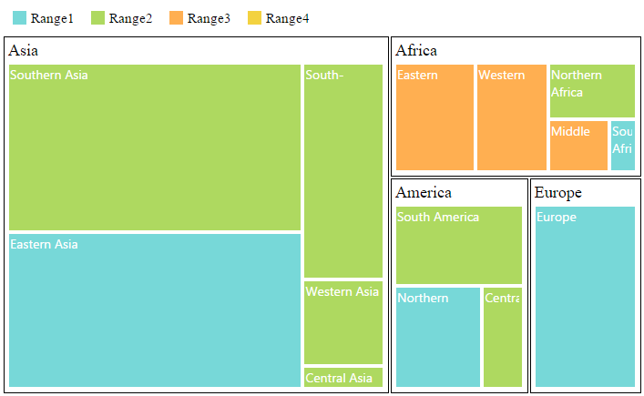

## TreeMap Elements

TreeMap contains various elements such as,

* Legend
* Headers
* Labels

Legend

You can set the color value of leaf nodes using TreeMapLegend. This legend is appropriate only for the TreeMap whose leaf nodes are colored using RangeColorMapping.

You can set ShowLegend property value to “True” to enable or disable legend visibility.

TreeMap Legend

You can decide the size of the legend icons by setting IconWidth and IconHeight properties of the TreeMapLegend property avail in TreeMap.

Label for Legend

You can customize the labels of the legenditem using LegendLabel property of RangeColorMapping. 



[MVC]

[CSHTML]

         @(Html.EJ().TreeMap("treemap")

                .DataSource(datasource)

                .ColorValuePath("Growth")

                .WeightValuePath("Population")

                .ShowLegend(true)

                .Levels(lv =>

                    {                          

                        lv.GroupPath("Continent")

                          .GroupGap(5)

                          .Add();

                    })   

                .TreeMapRangeColorMappings(cm => 

                    {

                    cm.To(1).From(0).Color("#77D8D8").Legendlabel("Range1").Add();

                    cm.To(2).From(0).Color("#AED960").Legendlabel("Range2").Add();

                    cm.To(3).From(0).Color("#FFAF51").Legendlabel("Range3").Add();

                    cm.To(4).From(0).Color("#F3D240").Legendlabel("Range4").Add();

                    })

                .TreeMapLegend(tl =>

                    {

                            tl. IconWidth(20)

                              . IconHeight(20);

                    })

               .Render())



{  | markdownify }
{:.image }

Header

You can set headers for each level by setting the ShowHeader propery of the each TreeMap levels. The HeaderHeight property helps to set the height of the header and Group path value determines the header value. You can customize the default header appearance by setting the HeaderTemplate of the TreeMap levels.



[MVC]

[CSHTML]

           @(Html.EJ().TreeMap("treemap")

                .DataSource(datasource)

                .ColorValuePath("Growth")

                .WeightValuePath("Population")

                .ShowLegend(true)

                .TreeMapLegend(tl =>

                    {

                            tl.IconWidth(17)

                            .IconHeight(17);

                    })

                .TreeMapRangeColorMappings(cm => 

                    {

                    cm.To(1).From(0).Color("#77D8D8").Legendlabel("Range1").Add();

                    cm.To(2).From(0).Color("#AED960").Legendlabel("Range2").Add();

                    cm.To(3).From(0).Color("#FFAF51").Legendlabel("Range3").Add();

                    cm.To(4).From(0).Color("#F3D240").Legendlabel("Range4").Add();

                    })

                .Levels(lv =>

                    {

                        lv.GroupPath("Continent")

                            .GroupGap(5)

.HeaderHeight(30)                           

                            .HeaderTemplate("headertemplate").Add();                            

                    })   

               .Render())

      
  

                    



{  | markdownify }
{:.image }

Label

You can also set labels for the leaf nodes by setting the ShowLabels property as true. Group path value is displayed as a label for leaf nodes. You can customize the default label appearance by setting the LabelTemplate of the TreeMap levels.



[MVC]

[CSHTML]

        @(Html.EJ().TreeMap("treemap")

                .DataSource(datasource)

                .ColorValuePath("Growth")

                .WeightValuePath("Population")

                .ShowLegend(true)

                .TreeMapLegend(tl =>

                    {

                        tl. IconWidth(17)

                          . IconHeight(17);

                    })

                .Levels(lv =>

                    {

                        lv.GroupPath("Continent")

                          .GroupGap(5)

                          .HeaderHeight(30)                           

                          .HeaderTemplate("headertemplate").Add();                            

                    })   

                 .TreeMapRangeColorMappings(cm => 

                    {

                    cm.To(1).From(0).Color("#77D8D8").Legendlabel("Range1").Add();

                    cm.To(2).From(0).Color("#AED960").Legendlabel("Range2").Add();

                    cm.To(3).From(0).Color("#FFAF51").Legendlabel("Range3").Add();

                    cm.To(4).From(0).Color("#F3D240").Legendlabel("Range4").Add();

                    })

                  .LeafItemsSetting(li =>

                    {

                         li.LabelPath("Region")

                           .ShowLabels(true)

                            .LabelTemplate("labeltemplate");

                    })

                 .Render())

            

      



{  | markdownify }
{:.image }

