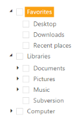

## Accessibility

TreeView provides full keyboard support. You can interact with the TreeView control using the keyboard. It is compatible with the standard keyboard navigation and you can focus on TreeView with a predefined Alt and Key combination. Also, you can navigate through the nodes, expand or collapse, select, check and uncheck nodes with the provided shortcut keys. You can access the TreeView with the shortcut keys by using the AllowKeyboardNavigation property.

This feature is mainly useful for all the keyboard users to access the TreeView with the keyboard shortcut keys.

The following table showcases the various keyboard shortcuts available in the TreeView control. 

_Table_ _3__: Keyboard Shortcuts_

<table>
<tr>
<td>
Keys </td><td>
Functions</td></tr>
<tr>
<td>
      Alt+j</td><td>
Focuses the control.</td></tr>
<tr>
<td>
F2</td><td>
Edit the selected node. </td></tr>
<tr>
<td>
Ctrl + X</td><td>
Cut the selected node.</td></tr>
<tr>
<td>
Ctrl + C</td><td>
Copy the selected node.</td></tr>
<tr>
<td>
Ctrl + V</td><td>
Paste the cut or copied nodes to selected node.</td></tr>
<tr>
<td>
Delete key</td><td>
Delete the selected node.</td></tr>
<tr>
<td>
Down</td><td>
Selected next node.</td></tr>
<tr>
<td>
Up</td><td>
Selected previous node.</td></tr>
<tr>
<td>
Right</td><td>
Expand selected node. </td></tr>
<tr>
<td>
Left</td><td>
Collapse selected node.</td></tr>
<tr>
<td>
Enter</td><td>
Select node.</td></tr>
<tr>
<td>
Space</td><td>
Toggle Checks and Unchecks.</td></tr>
<tr>
<td>
Home</td><td>
Selected first child node.</td></tr>
<tr>
<td>
End</td><td>
Selected last child node.</td></tr>
</table>

The following steps explain how to enable the AllowKeyboardNavigation property for TreeView.

1. In the View page, add TreeView helper to configure TreeView.

<table>
<tr>
<td>
[View]\\ To configure TreeView in the CSHTML page@Html.EJ().TreeView("treeview").Items(items =>      {             items.Add().Text("Favorites").Expanded(true).Children(child =>             {                   child.Add().Text("Desktop");                   child.Add().Text("Downloads");                   child.Add().Text("Recent places");             });             items.Add().Text("Libraries").Expanded(true).Children(child =>             {                    child.Add().Text("Documents").Children(child1 =>                    {                                child1.Add().Text("My Documents");                                child1.Add().Text("Public Documents");                    });                    child.Add().Text("Pictures").Children(child1 =>                    {                            child1.Add().Text("My Pictures");                            child1.Add().Text("Public Pictures");                    });                    child.Add().Text("Music").Children(child1 =>                     {                            child1.Add().Text("My Music");                            child1.Add().Text("Public Music");                     });                     child.Add().Text("Subversion");              });              items.Add().Text("Computer").Children(child =>              {                     child.Add().Text("Folder(C)");                     child.Add().Text("Folder(D)");                     child.Add().Text("Folder(E)");               });     }).ShowCheckbox(true).AllowEditing(true).AllowKeyboardNavigation(true)</td></tr>
<tr>
<td>
[JavaScript]</td></tr>
</table>

2. Define CSS class for customizing the TreeView.

[CSS]

The output for TreeView when AllowKeyboardNavigation is set to “True”.

{{ '' | markdownify }}
{:.image }

_Figure_ _58__: TreeView with allowKeyboardNavigation_

