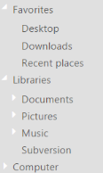
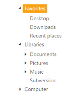

## Appearance and Styling

Css Class

Sets the root class for TreeView theme. This CssClassAPI helps you to use custom skinning option for TreeView control. By defining the root class using this API, you can include this root class in CSS.

The following steps explain enabling the CssClass property for TreeView.

1. In the View page, add TreeView helper to configure TreeView.

[View]

\\ To configure TreeView in the CSHTML page.

    @Html.EJ().TreeView("treeview").Items(items =>

         {

                        items.Add().Text("Favorites").Expanded(true).Children(child =>

               {

                     child.Add().Text("Desktop");

                     child.Add().Text("Downloads");

                     child.Add().Text("Recent places");

                });

                    items.Add().Text("Libraries").Expanded(true).Children(child =>

                {

                      child.Add().Text("Documents").Children(child1 =>

                      {

                                child1.Add().Text("My Documents");

                                child1.Add().Text("Public Documents");

                      });

                      child.Add().Text("Pictures").Children(child1 =>

                      {

                            child1.Add().Text("My Pictures");

                            child1.Add().Text("Public Pictures");

                       });

                       child.Add().Text("Music").Children(child1 =>

                        {

                            child1.Add().Text("My Music");

                            child1.Add().Text("Public Music");

                        });

                        child.Add().Text("Subversion");

                   });

                   items.Add().Text("Computer").Children(child =>

                   {

                        child.Add().Text("Folder(C)");

                        child.Add().Text("Folder(D)");

                        child.Add().Text("Folder(E)");

                   });

                }).CssClass("customCss")

2. Define CSS class for customizing the TreeView.

[CSS]

    .customCss .e-treeview {

        background-color: #E0E0E0;

        /* Old browsers */

        color: white;

        border: 1px solid transparent;

        border-image: initial;

    }

The following screenshot displays the TreeView component, configured based on CSS class.

{  | markdownify }
{:.image }

_Figure_ _59__: TreeView based on CSS class_

Adjusting TreeView Size

You can adjust the TreeView size, height and width, by using the properties Width and Height.

Height

You can customize the Height of the TreeView control by using the height property.

The following steps explain how to use the Height property of TreeView.

1. In the View page, add TreeView helper to configure TreeView.

[View]

\\ To configure TreeView in the CSHTML page

  @Html.EJ().TreeView("treeview").Items(items =>

         {

               items.Add().Text("Favorites").Expanded(true).Children(child =>

               {

                        child.Add().Text("Desktop");

                        child.Add().Text("Downloads");

                        child.Add().Text("Recent places");

                });

                items.Add().Text("Libraries").Expanded(true).Children(child =>

                {

                      child.Add().Text("Documents").Children(child1 =>

                            {

                                child1.Add().Text("My Documents");

                                child1.Add().Text("Public Documents");

                            });

                       child.Add().Text("Pictures").Children(child1 =>

                        {

                            child1.Add().Text("My Pictures");

                            child1.Add().Text("Public Pictures");

                        });

                       child.Add().Text("Music").Children(child1 =>

                        {

                            child1.Add().Text("My Music");

                            child1.Add().Text("Public Music");

                        });

                       child.Add().Text("Subversion");

                  });

                  items.Add().Text("Computer").Children(child =>

                  {

                        child.Add().Text("Folder(C)");

                        child.Add().Text("Folder(D)");

                        child.Add().Text("Folder(E)");

                   });

            }).Height("75px")

The following screenshot displays the appearance of Height of the TreeView component.

{  | markdownify }
{:.image }

_Figure_ _60__: TreeView with height property_

Width

You can customize the width of the TreeView control by using the Width property. 

The following steps explain how to use the width property for TreeView.

1. In the View page, add TreeView helper to configure TreeView.

[View]

\\ To configure TreeView in the CSHTML page

    @Html.EJ().TreeView("treeview").Items(items =>

                {

                    items.Add().Text("Favorites").Expanded(true).Children(child =>

                    {

                        child.Add().Text("Desktop");

                        child.Add().Text("Downloads");

                        child.Add().Text("Recent places");

                    });

                    items.Add().Text("Libraries").Expanded(true).Children(child =>

                    {

                      child.Add().Text("Documents").Children(child1 =>

                           {

                                child1.Add().Text("My Documents");

                                child1.Add().Text("Public Documents");

                            });

                      child.Add().Text("Pictures").Children(child1 =>

                        {

                            child1.Add().Text("My Pictures");

                            child1.Add().Text("Public Pictures");

                        });

                        child.Add().Text("Music").Children(child1 =>

                        {

                            child1.Add().Text("My Music");

                            child1.Add().Text("Public Music");

                        });

                        child.Add().Text("Subversion");

                    });

                    items.Add().Text("Computer").Children(child =>

                    {

                        child.Add().Text("Folder(C)");

                        child.Add().Text("Folder(D)");

                        child.Add().Text("Folder(E)");

                    });

                }).Width("300px")

The following screenshot displays the appearance of width of the TreeView component.

{  | markdownify }
{:.image }

_Figure_ _61__: TreeView with width property_

