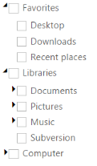
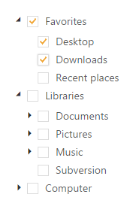
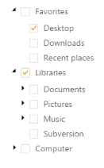
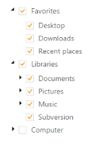

## Checkbox Support

TreeView allows you to check or uncheck the nodes. When you check the parent node of TreeView, the corresponding child nodes are automatically moved to checked state. A parent node check state is automatically set to indeterminate when it has checked and unchecked child nodes. To enable this feature, set the ShowCheckbox property to “True”.

The following steps explain how you can enable the ShowCheckbox property for TreeView.

1. In the View page, add TreeView helper to configure TreeView.

[View]

\\ To configure TreeView in the CSHTML page

@Html.EJ().TreeView("treeview").Items(items =>

    {

        items.Add().Text("Favorites").Expanded(true).Children(child =>

                   {

                       child.Add().Text("Desktop");

                       child.Add().Text("Downloads");

                       child.Add().Text("Recent places");

                   });

        items.Add().Text("Libraries").Expanded(true).Children(child =>

        {

            child.Add().Text("Documents").Children(child1 =>

                {

                    child1.Add().Text("My Documents");

                    child1.Add().Text("Public Documents");

                });

            child.Add().Text("Pictures").Children(child1 =>

            {

                child1.Add().Text("My Pictures");

                child1.Add().Text("Public Pictures");

            });	

            child.Add().Text("Music").Children(child1 =>

            {

                child1.Add().Text("My Music");

                child1.Add().Text("Public Music");

            });

            child.Add().Text("Subversion");

        });

        items.Add().Text("Computer").Children(child =>

        {

            child.Add().Text("Folder(C)");

            child.Add().Text("Folder(D)");

            child.Add().Text("Folder(E)");

        });

    }).ShowCheckbox (true)

The following image is the output for TreeView when ShowCheckbox is set to “True”.

{{ '' | markdownify }}
{:.image }

_Figure_ _42__: TreeView with checkbox_

Auto Check Parent Node

To overcome the default functionality of TreeView, when you don’t want the parent node check state being moved to indeterminate state and when you check the corresponding child node, you can enable the property AutoCheckParentNode. You can specify the property AutoCheckParentNode in TreeView as follows.

[View]

@Html.EJ().TreeView("treeview").Items(items =>

    {

        items.Add().Text("Favorites").Expanded(true).Children(child =>

                   {

                       child.Add().Text("Desktop");

                       child.Add().Text("Downloads");

                       child.Add().Text("Recent places");

                   });

        items.Add().Text("Libraries").Expanded(true).Children(child =>

        {

            child.Add().Text("Documents").Children(child1 =>

                {

                    child1.Add().Text("My Documents");

                    child1.Add().Text("Public Documents");

                });

            child.Add().Text("Pictures").Children(child1 =>

            {

                child1.Add().Text("My Pictures");

                child1.Add().Text("Public Pictures");

            });

            child.Add().Text("Music").Children(child1 =>

            {

                child1.Add().Text("My Music");

                child1.Add().Text("Public Music");

            });

            child.Add().Text("Subversion");

        });

        items.Add().Text("Computer").Children(child =>

        {

            child.Add().Text("Folder(C)");

            child.Add().Text("Folder(D)");

            child.Add().Text("Folder(E)");

        });

    }).AutoCheckParentNode(true).ShowCheckbox(true)

{{ '' | markdownify }}
{:.image }

_Figure_ _42__: TreeView with AutoCheckParentNode enabled_

Auto Check Nodes

By default while checking a parent node, it will affect the child nodes and vice versa. If you don’t want this functionality (checking a node affecting other node means) you cn disable this using AutoCheck property.

[View]

@Html.EJ().TreeView("treeview").Items(items =>

    {

        items.Add().Text("Favorites").Expanded(true).Children(child =>

                   {

                       child.Add().Text("Desktop");

                       child.Add().Text("Downloads");

                       child.Add().Text("Recent places");

                   });

        items.Add().Text("Libraries").Expanded(true).Children(child =>

        {

            child.Add().Text("Documents").Children(child1 =>

                {

                    child1.Add().Text("My Documents");

                    child1.Add().Text("Public Documents");

                });

            child.Add().Text("Pictures").Children(child1 =>

            {

                child1.Add().Text("My Pictures");

                child1.Add().Text("Public Pictures");

            });

            child.Add().Text("Music").Children(child1 =>

            {

                child1.Add().Text("My Music");

                child1.Add().Text("Public Music");

            });

            child.Add().Text("Subversion");

        });

        items.Add().Text("Computer").Children(child =>

        {

            child.Add().Text("Folder(C)");

            child.Add().Text("Folder(D)");

            child.Add().Text("Folder(E)");

        });

    }).AutoCheck(false).ShowCheckbox(true)

{{ '' | markdownify }}
{:.image }

_Figure_ _42__: TreeView with AutoCheck disabled_

Checked Nodes

You can specify the Checked Nodes in TreeView initially by using the property CheckedNodes. Checked Nodes index collection is given to the integer array. You can specify the property CheckedNodes in TreeView control as follows.

[View]

@{List<int> nodes = new List<int>() { 0,4 }; }

@Html.EJ().TreeView("treeview").Items(items =>

    {

        items.Add().Text("Favorites").Expanded(true).Children(child =>

                   {

                       child.Add().Text("Desktop");

                       child.Add().Text("Downloads");

                       child.Add().Text("Recent places");

                   });

        items.Add().Text("Libraries").Expanded(true).Children(child =>

        {

            child.Add().Text("Documents").Children(child1 =>

                {

                    child1.Add().Text("My Documents");

                    child1.Add().Text("Public Documents");

                });

            child.Add().Text("Pictures").Children(child1 =>

            {

                child1.Add().Text("My Pictures");

                child1.Add().Text("Public Pictures");

            });

            child.Add().Text("Music").Children(child1 =>

            {

                child1.Add().Text("My Music");

                child1.Add().Text("Public Music");

            });

            child.Add().Text("Subversion");

        });

        items.Add().Text("Computer").Children(child =>

        {

            child.Add().Text("Folder(C)");

            child.Add().Text("Folder(D)");

            child.Add().Text("Folder(E)");

        });

    })ShowCheckbox(true).CheckedNodes(nodes)

{{ '' | markdownify }}
{:.image }

_Figure_ _42__: TreeView with Checkednodes_

