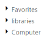
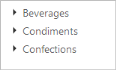

# Data Binding 

The TreeView is populated with the node information taken from a data source. The TreeView supports binding data sources containing hierarchical data and supports both local data and remote data, for retrieving data from a specified data source. You can also display the hierarchical data in TreeView. TreeView exposes its specific data-related properties allowing you to specify which data source field the node information has to be retrieved from.

You can populate TreeView items using data binding support such as Local (List of Objects) and OData services. 

## Fields

The Field property in TreeView includes the data source fields and it can be set with appropriate values as follows.

_MVC field properties_

<table>
<tr>
<th>
Name</th><th>
Type</th><th>
Default</th><th>
Description</th></tr>
<tr>
<td>
DataSource</td><td>
Object</td><td>
Null</td><td>
datasource receives  DataManager object and List of Objects as its value</td></tr>
<tr>
<td>
Query</td><td>
Object</td><td>
Null</td><td>
It receives query to retrieve data from the table (query is same as SQL). Example:  ej.Query().from("Categories").select("CategoryID,CategoryName").take(3);</td></tr>
<tr>
<td>
TableName</td><td>
String</td><td>
Null</td><td>
It receives table name to execute query on the corresponding table.</td></tr>
<tr>
<td>
Id</td><td>
String</td><td>
Null</td><td>
Specifies the id to TreeView node items list.</td></tr>
<tr>
<td>
ParentId</td><td>
String</td><td>
Null</td><td>
Specifies the parent id of the table.</td></tr>
<tr>
<td>
Text</td><td>
String</td><td>
Null</td><td>
Specifies the text of TreeView node items list.</td></tr>
<tr>
<td>
SpriteCssClass</td><td>
String</td><td>
Null</td><td>
Specifies the sprite CSS class to “li” item list.</td></tr>
<tr>
<td>
LinkAttribute</td><td>
String</td><td>
Null</td><td>
Specifies the link attribute to “a” tag in item list.</td></tr>
<tr>
<td>
ImageAttribute</td><td>
String</td><td>
Null</td><td>
Specifies the image attribute to “img” tag inside items list.</td></tr>
<tr>
<td>
HtmlAttribute</td><td>
String</td><td>
Null</td><td>
Specifies the html attributes to “li” item list.</td></tr>
<tr>
<td>
ImageUrl</td><td>
String</td><td>
Null</td><td>
Specifies the image URL to “img” tag inside item list. </td></tr>
<tr>
<td>
Expanded</td><td>
String</td><td>
Null</td><td>
If it’s true the expanded property, corresponding node will expand.</td></tr>
<tr>
<td>
Child</td><td>
String</td><td>
Null</td><td>
If a parent have child node to pass the same mapper for child.</td></tr>
<tr>
<td>
HasChild</td><td>
String</td><td>
Null</td><td>
A parent node have child, we must this value as true.</td></tr>
<tr>
<td>
Selected</td><td>
String</td><td>
Null</td><td>
A TreeView control has only one node selected at time.</td></tr>
<tr>
<td>
IsChecked</td><td>
String</td><td>
Null</td><td>
If it’s true then, Checkbox node will be checked.</td></tr>
<tr>
<td>
Value</td><td>
String</td><td>
Null</td><td>
Specifies the value of the TreeView node items.</td></tr>
</table>

## Local Data

To bind the Local Data to the TreeView control, create List of Objects as shown in the following code snippet and map the List properties with its appropriate data source field. You can bind data to TreeView by mapping fields such as DataSource, Id, ParentId, Text, HasChild and Expanded. 

The following steps explain how you can bind local data to TreeView.

1. In the Controller page, add a class and define the properties (or) in the Models, add a class as shown below.
   
   ~~~ csharp

	// Add the following data list to be bind in the controller page and define the corresponding data.

	// Define local data source elements with  fields            

	public class treeviewData

	{

	   //TreeView data source should have Id, ParentId and Text as mandatory

		public int Id { get; set; }

	   // ParentId takes the value of the parent nodes Id

		public int Pid { get; set; }

	   //Text to be displayed in the TreeView node

		public string Name { get; set; }

	   //Set to true if node has children

		public bool HasChild { get; set; }      

	}

   ~~~
   

2. In the controller page, create a List of specified class type.

   ~~~ csharp  

	//Refer the Model in the controller

	using <Applicationname>.Models;

	public ActionResult Index()

	{

	   List<treeviewData> localData = new List<treeviewData>();

		localData.Add(new treeviewData{ id= 1, name= "Favorites", hasChild= true });

		localData.Add(new treeviewData{ id= 2, pid= 1, name= "Desktop" });

		localData.Add(new treeviewData{ id= 3, pid= 1, name= "Downloads" });

		localData.Add(new treeviewData{ id = 4, pid = 1, name = "Recent places" });

		localData.Add(new treeviewData{ id= 5, name= "libraries", hasChild= true });

		localData.Add(new treeviewData{ id= 6, pid= 5, name= "Documents", hasChild= true });

		localData.Add(new treeviewData{ id= 7, pid= 6, name= "My Documents" });

		localData.Add(new treeviewData{ id= 8, pid= 6, name= "Public Documents" });

		localData.Add(new treeviewData{ id= 9, pid= 5, name= "Pictures", hasChild= true });

		localData.Add(new treeviewData{ id= 10, pid= 9, name= "My Pictures" });

		localData.Add(new treeviewData{ id= 11, pid= 9, name= "Public Pictures" });

		localData.Add(new treeviewData{ id= 12, pid= 5, name= "Music", hasChild= true });

		localData.Add(new treeviewData{ id= 13, pid= 9, name= "My Music" });

		localData.Add(new treeviewData{ id= 14, pid= 9, name= "Public Music" });

		localData.Add(new treeviewData{ id= 15, pid= 5, name= "Subversion" });

		localData.Add(new treeviewData{ id= 16, name= "Computer", hasChild= true });

		localData.Add(new treeviewData{ id= 17, pid= 16, name= "Folder(C)" });

		localData.Add(new treeviewData{ id= 18, pid= 16, name= "Folder(D)" });

		localData.Add(new treeviewData{ id= 19, pid= 16, name= "Folder(F)" });

		ViewBag.datasource = localData;

		return View();

	}

   ~~~
   

3. In the View page, add TreeView helper and map the properties defined in <list> to the corresponding fields in datasource.

   ~~~ cshtml

	@Html.EJ().TreeView("tree").TreeViewFields(s => s.Datasource((IEnumerable<treeviewData>)ViewBag.datasource).Id("id").ParentId("pid").Text("name").HasChild("hasChild"))

   ~~~
   

The output for TreeView control with Local Data binding is as follows.

TreeView with local data-binding
{:.caption}

## Remote Data

You can bind TreeView to Remote Data using DataManager and the query in fields is used to retrieve the data. DataManager supports the following types of data-binding: Lsit of Objects, Web Services, oData. It uses two different classes; ej.DataManager for processing, and ej.Query for serving data. ej.DataManager communicates with data source and ej.Query generates data queries that are read by the DataManager. In the following link, how to create DataManager is explained in full detail.

<http://docs.syncfusion.com/aspnetmvc/treeview/data-binding>

The following steps explain how you can bind remote data to TreeView control.

1. In the View page, add TreeView helper to configure TreeView.

2. In the DataSource field assign remote data source. Here dataManager gets the remote web service and filters the data using Query. The select property of ejQuery is used to retrieve the specified columns from the data source.

3. Assign dataSource and query property values to bind the remote data. Map the corresponding fields in TreeView control as follows.

   ~~~ cshtml

	@Html.EJ().TreeView("treeView").TreeViewFields(s => s.Datasource(s1 => s1.URL("http://mvc.syncfusion.com/Services/Northwnd.svc/")).Query(" ej.Query().from('Categories').select('CategoryID,CategoryName').take(3)").Id("CategoryID").Text("CategoryName").Child(s2 => s2.Datasource(s3 => s3.URL("http://mvc.syncfusion.com/Services/Northwnd.svc/")).TableName("Products").Id("ProductID").ParentId("CategoryID").Text("ProductName"))) 

   ~~~
   

The output for TreeView control with Remote Data binding is as follows.

