# Getting Started

This section explains briefly about how to create a TreeView in ASP.NET MVC platform.

## Create your first TreeView in MVC

The Essential ASP.NET MVC TreeView control represents hierarchical data in a tree-like structure. It allows you to edit, drag items to other TreeView, add check boxes, etc. In the following section, you can learn how to customize TreeView in a real time Mail Box Scenario that helps you to showcase items in a Mailbox with necessary features of TreeView. The following screenshot illustrates the functionality of TreeView with Drag and Drop option.

{ 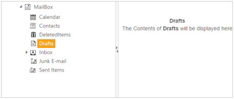 | markdownify }
{:.image }

In the above screenshot, you can select the mailbox items and you can write the corresponding functions for the selected item. You can drag and drop the item from one group to another group using the Drag and Drop option. You can use the Splitter control to split the mail options and its corresponding functions.

Create the Splitter 

The Essential ASP.NET MVC Splitter is a layout control that allows you to divide a web page into distinct areas by using resizable panes. Many Splitter panes are created and placed inside the Splitter control and the split bars are inserted automatically between the adjacent panes. For more information about the Splitter you can refer the Splitter-Getting Started documentation.

1. Create a MVC Project and add necessary Dll’s and scripts with the help of the given [MVC-Getting Started](http://help.syncfusion.com/ug/js/Documents/gettingstartedwithmv.htm) Documentation.
2. Add the following code example to the corresponding view page for rendering the Splitter window.

[C#]

@Html.EJ().Splitter("outer").Height("250").Width("601").Orientation(Orientation.Horizontal).PaneProperties(

    p =>

    {

        p.Add().ContentTemplate(

            @&lt;div&gt;&lt;/div&gt;);

        p.Add().ContentTemplate(

            @&lt;div&gt;&lt;/div&gt;);        

    })

3. Execute the above code example to render the following output.

{ 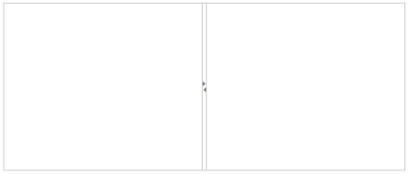 | markdownify }
{:.image }

Configure TreeView inside the Splitter widget 

Essential ASP.NET MVC TreeView widget basically renders with built-in features like keyboard navigation with animations and flexible API’s. Essential ASP.NET MVC TreeView can be generated from UL LI elements, local data source or using OData service.

In this application, you can create the TreeView with the Local data source. 

You can style the right pane and render TreeView by adding &lt;div&gt; element within the Splitter&lt;div&gt; elements for the Mailbox application.

Add the following style section to render the Splitter layout.

[CSS]

&lt;style&gt;

        #outer

        {

            font-size: 14px;

            font-family:sans-serif;

        }

        .cont

        {

            padding: 40px 0 0 10px;

            text-align: center;

        }	

        .splitdiv

        {

            height:100%;

            padding-left:30px;

        }

   &lt;/style&gt;

Add TreeView initialization inside the Splitter section.

[C#]

@Html.EJ().Splitter("outer").Height("250").Width("601").Orientation(Orientation.Horizontal).PaneProperties(

        p =>

        {

            p.Add().ContentTemplate(

                @&lt;div class="splitdiv"&gt;

                  &lt;div&gt;

@Html.EJ().TreeView("treeView")

                  &lt;/div&gt; 

               &lt;/div&gt;);

            p.Add().ContentTemplate(

                @&lt;div&gt;

                        &lt;div class="cont"&gt;

                            &lt;!-- Div elements for displaying the messages--&gt;

                            
My Mail Box

                            &lt;div class="mailCont"&gt; &lt;/div&gt;

                        &lt;/div&gt;

                    &lt;/div&gt;);        

             })

Execute the above code example to render the following output.

{ 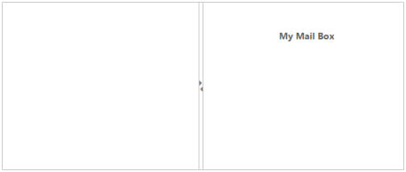 | markdownify }
{:.image }

Configure Data Source

Create the Data Source as List of Objects for TreeView and initialize as follows.

Add the following data list to bind in the controller page and define the corresponding data.

[Model]

public class Outlookitems

    {

       //Treeview data source should have Id, ParentId and Text as mandatory

        public int Id { get; set; }

       // ParentId takes the value of the parent nodes Id

        public int Pid { get; set; }

       //Text to be displayed in the treeview node

        public string Name { get; set; }

       //Set to true if node has children

        public bool HasChild { get; set; }

      //Set to true if node to be expanded initially

        public bool Expanded { get; set; }

      //Image icon for nodes taken from the sprite css classes

        public string SpriteCss { get; set; }

    }

[Controller]

//Refer the Model in the controller

using &lt;Applicationname&gt;.Models;

public ActionResult Index()

        {

            List<Outlookitems> items=new List<Outlookitems>();

            //List items for Mailbox treeview

            items.Add(new Outlookitems { Id = 1, Name = "MailBox", HasChild = true, SpriteCss = "mailicon sprite-root", Expanded = true });

            items.Add(new Outlookitems { Id = 2, Pid = 1, Name = "Calendar", SpriteCss = "mailicon sprite-calendar" });

            items.Add(new Outlookitems { Id = 3, Pid = 1, Name = "Contacts", SpriteCss = "mailicon sprite-contacts" });

            items.Add(new Outlookitems { Id = 4, Pid = 1, Name = "DeletedItems", SpriteCss = "mailicon sprite-deleted" });

            items.Add(new Outlookitems { Id = 5, Pid = 1, Name = "Drafts", SpriteCss = "mailicon sprite-drafts" });

            items.Add(new Outlookitems { Id = 6, Pid = 1, Name = "Inbox", SpriteCss = "mailicon sprite-inbox" });

            items.Add(new Outlookitems { Id = 7, Pid = 6, Name = "Incidents ", SpriteCss = "mailicon sprite-folder" });

            items.Add(new Outlookitems { Id = 8, Pid = 6, Name = "Forums ", SpriteCss = "mailicon sprite-folder" });

            items.Add(new Outlookitems { Id = 9, Pid = 6, Name = "Issue Reports ", SpriteCss = "mailicon sprite-folder" });

            items.Add(new Outlookitems { Id = 10, Pid = 1, Name = "Junk E-mail ", SpriteCss = "mailicon sprite-junk" });

            items.Add(new Outlookitems { Id = 11, Pid = 1, Name = "Sent Items ", SpriteCss = "mailicon sprite-sentitems" });

            ViewData["Items"] = items;

            return View();

        }

Add the following code example in the Splitter section to render the TreeView in the right side pane.

[View]

@* Refer the model in view page*@

@model IEnumerable< _Applicationname_.Models.Outlookitems>

@*TreeView code inside splitter section*@

@&lt;div class="splitdiv"&gt;

    &lt;div&gt;

        @Html.EJ().TreeView("treeView").TreeViewFields(s => s.Datasource((IEnumerable<loadondemand>).ViewBag.datasource).Id("Id").ParentId("Pid").Text("Name").HasChild("HasChild").Expanded("Expanded"))

    &lt;/div&gt; 

&lt;/div&gt;);

Execute the above code example to render the following output.

{ 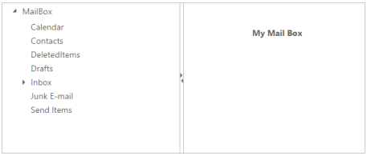 | markdownify }
{:.image }

Configure TreeView with Sprite Icons

To design the TreeView tolook like Mail options application, you can create the SpriteCSS styles for using Mail Icons from the following image source. The source image is taken from the following installed location. 

_[Installed Drive]:\Users\[user name]\AppData\Local\Syncfusion\EssentialStudio\XX.X.X.XX\MVC \Samples\web\Images\mail\ mailicons.png_

> {  | markdownify }
{:.image }
_Note: XX.X.X.XX represents the Essential Studio version number that you are using currently._

Copy the “mailicons.png” from the above location and paste it in your MVC application.

You can show the Sprite image icons in TreeView loaded inside the &lt;styles&gt; tag, using the styles shown in the following code example.

 &lt;style&gt;

.mailicon

        {

            background-image: url("../Images/mailicons.png");

            display: inline-block;

            overflow: hidden;

            background-repeat: no-repeat;

            text-align: center;

            vertical-align: middle;

            width: 20px;

            height: 18px;

        }

        .sprite-calendar

        {

            background-position: -25px -255px;

        }

        .sprite-contacts

        {

            background-position: -26px -429px;

        }

        .sprite-deleted

        {

            background-position: -24px -152px;

        }

        .sprite-drafts

        {

            background-position:-24px -83px;

        }

        .sprite-folder

        {

            background-position: -24px -464px;

        }

        .sprite-folders

        {

            background-position: -24px -222px;

        }

        .sprite-inbox

        {

            background-position: -25px -13px;

        }

        .sprite-junk

        {

            background-position: -23px -187px;

        }

        .sprite-notes

        {

            background-position: -26px -394px;

        }

        .sprite-outbox

        {

            background-position: 0 -414px;

            width: 16px;

            height: 16px;

        }

        .sprite-root

        {

            background-position: -25px -49px;

        }

        .sprite-sentitems

        {

            background-position: -26px -118px;

        }

&lt;/style&gt; 

@*TreeView code inside splitter section*@

@&lt;div class="splitdiv"&gt;

       &lt;div&gt;

           @Html.EJ().TreeView("treeView").TreeViewFields(s => s.Datasource((IEnumerable<loadondemand>).ViewBag.datasource).Id("id").ParentId("pid").Text("name").HasChild("hasChild").Expanded("expanded").SpriteCssClass("spriteCss"))

             &lt;/div&gt; 

        &lt;/div&gt;); 

Execute the above code to render the TreeView with Mail Icons.

{ 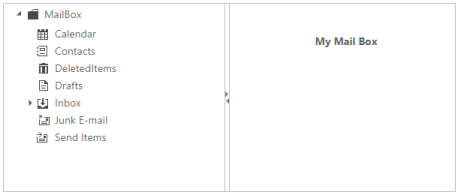 | markdownify }
{:.image }

Set the Node Editing Option 

To rename the mail folders, set allowEdit property to True. You can also use F2 key or double-click the node to rename the node.

@*TreeView code inside splitter section*@

    @&lt;div class="splitdiv"&gt;

      &lt;div&gt;

         @Html.EJ().TreeView("treeView").TreeViewFields(s => s.Datasource((IEnumerable<loadondemand>).ViewBag.datasource).Id("id").ParentId("pid").Text("name").HasChild("hasChild").Expanded("expanded").SpriteCssClass("spriteCss")).AllowEditing(true)

       &lt;/div&gt; 

    &lt;/div&gt;);

Execute the above code example to render node editing.

{ 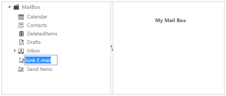 | markdownify }
{:.image }

Set the Drag and Drop Option 

In this application you can Drag and Drop the folders anywhere inside the mailbox by setting the DragAndDrop option to True. 

Execute the following code example to Drag and Drop the nodes anywhere within the TreeView.

@*TreeView code inside splitter section*@

    @&lt;div class="splitdiv"&gt;

       &lt;div&gt;

             @Html.EJ().TreeView("treeView").TreeViewFields(s => s.Datasource((IEnumerable<loadondemand>).ViewBag.datasource).Id("id").ParentId("pid").Text("name").HasChild("hasChild").Expanded("expanded").SpriteCssClass("spriteCss")).AllowEditing(true).AllowDragAndDrop(true)

       &lt;/div&gt; 

    &lt;/div&gt;);

Configure Events for the TreeView

When you click on the Mailbox folder item, the corresponding navigation action is performed in the Select event and this is achieved by declaring the Select event with the corresponding call back function.  You can rename the folder names and it is not renamed as empty. This validation process is done manually in the InlineEditValidation event.

@*TreeView code inside splitter section*@

@&lt;div class="splitdiv"&gt;

    &lt;div&gt;

@* mapping Local Data Source with the fields property of TreeView with client side events for node selection and inline edit validation, by enabling the property AllowEdit  *@

      @Html.EJ().TreeView("treeView").TreeViewFields(s => s.Datasource((IEnumerable<loadondemand>).ViewBag.datasource).Id("id").ParentId("pid").Text("name").HasChild("hasChild").Expanded("expanded").SpriteCssClass("spriteCss")).AllowEditing(true).AllowDragAndDrop(true).ClientSideEvents(s=> s.NodeSelect("treeclicked").InlineEditValidation("validateFolder"))

    &lt;/div&gt; 

  &lt;/div&gt;);

&lt;script type="text/javascript"&gt;

    function validateFolder(args) {

            //write your code here for other folder creation process.

            if (args.newText === "") //Validate the modified text of mailfolder.

            {

                args.cancel = true;

                alert("Folder name cannot be renamed to empty. Please provide some name.");

            }

        }

    function treeclicked(args) {

        //write your code here for other process on selecting tree nodes.

      $(".mailHead").html(args.value);

 $(".mailCont").html("The Contents of &lt;b&gt;" + args.value + "&lt;/b&gt; will be displayed here");

      }

&lt;/script&gt;

Execute the above code example to render TreeView. When you select the mail folder in the TreeView, the corresponding action takes place by raising the Select event. 

{  | markdownify }
{:.image }

> {  | markdownify }
{:.image }
_Note: The inline edit validation is done when “InlineEditValidation” event occurs, as in the screenshot as follows. The “InlineEditValidation” event rises only when the “AllowEditing” property is set to True._

{ 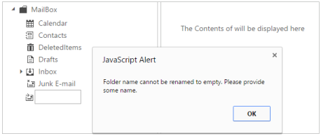 | markdownify }
{:.image }

Add or Delete the Folders using Context Menu 

You can add or remove the nodes dynamically during runtime. It is achieved by adding the Context Menu option to the TreeView. In the Context Menu, you can configure add or remove the node functions to the TreeView. The following code example illustrates how to configure the Context Menu elements for the TreeView.

Initialize the ContextMenu in the Splitter section as follows.

@*TreeView code inside splitter section*@

       @&lt;div class="splitdiv"&gt;

           &lt;div&gt;

                @Html.EJ().TreeView("treeView").TreeViewFields(s => s.Datasource((IEnumerable<loadondemand>).ViewBag.datasource).Id("id").ParentId("pid").Text("name").HasChild("hasChild").Expanded("expanded").SpriteCssClass("spriteCss")).AllowEditing(true).AllowDragAndDrop(true).ClientSideEvents(s => s.NodeSelect("treeclicked").InlineEditValidation("validateFolder"))

             &lt;/div&gt;

       &lt;!-- Initialize Elements for the context menu --&gt;

            &lt;div&gt;

               @Html.EJ().Menu("treeviewMenu").Items(items =>

          {

              items.Add().Text("New Folder");

              items.Add().Text("Delete Folder");          }).OpenOnClick(false).MenuType(MenuType.ContextMenu).ContextMenuTarget("#treeView").ClientSideEvents(s => s.Click("menuclick").BeforeOpen("beforeOpen"))

                 &lt;/div&gt;           

&lt;/div&gt;);

Initialize the Context Menu in the script section to create new folder and delete folder.

&lt;script type="text/javascript"&gt;

var nodeIndex = 1, treeviewObj, selectedNode;

      //Refer code for Tree click event and node editing validation 

        function beforeOpen(args) {

//creating the treeview object before the context menu opens with the selected node

            treeviewObj = $("#treeView").data("ejTreeView");// Creating the treeview object

            if (!$(args.target).hasClass("e-text"))

                args.cancel = true; //write your code here for other process.

            else {

                selectedNode = args.target;

                treeviewObj.selectNode(selectedNode); //selectNode method for treeview.

            }

        }

        function menuclick(args) {

            treeviewObj = $("#treeView").data("ejTreeView");// Creating the treeview object

            if (args.events.text == "New Folder") {

                //creating the new node in the treeview using addNode method

                treeviewObj.addNode("New Folder" + nodeIndex, selectedNode);

                nodeIndex++;

            }

            else if (args.events.text == "Delete Folder") {

                //Deleting the existing node in the treeview

                treeviewObj.removeNode(selectedNode);

            }

        }

    &lt;/script&gt;

The following screenshot illustrates adding of new folder in the TreeView using the Context Menu. You can right-click on the TreeView Node and select the new folder option in the Context Menu for the selected folder. 

{ 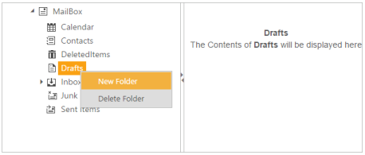 | markdownify }
{:.image }

In the following screenshot the new folder is added as the child of the “Drafts” folder.

{ 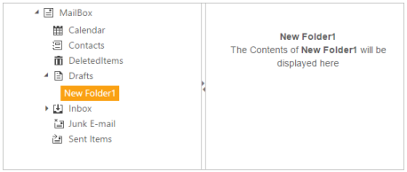 | markdownify }
{:.image }

The following screenshot illustrates the deleting of new folder that is created as a child of the “Drafts” folder. You can right-click New Folder1 and select the Delete Folder option in the Context Menu.

{ 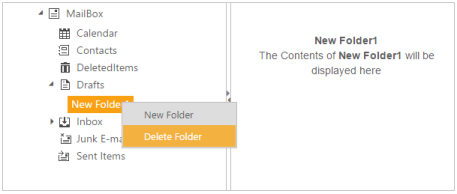 | markdownify }
{:.image }

The following screenshot displays the TreeView after deleting the folder that is created.

{ 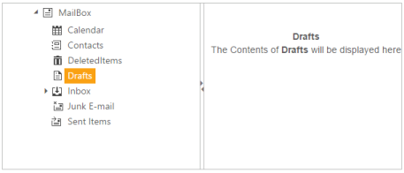 | markdownify }
{:.image }

