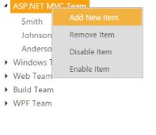

# How To

## Update the modified data from tree to database.

TreeView allows us to get the updated tree data after performing such operation like node editing, drag and drop, add and remove node. Using [getTreeData](http://help.syncfusion.com/js/api/ejtreeview#methods:gettreedata) method you can get the updated tree data.

Refer the following code block to know how to get updated data from TreeView.

In the controller page, create a data list that contains the details about tree nodes and specify the method to store modified data.
    
    
    
    
    
    public partial class TreeViewController : Controller
        {
            List<LoadData> load = new List<LoadData>();
            public ActionResult TreeViewFeatures()
            {
                var storedData = System.Web.HttpContext.Current.Session ["modifiedData"];
                if (storedData == null)
                {
                    load.Add(new LoadData { Id = 1, Parent = 0, Text = "Item 1", Expanded = true });
                    load.Add(new LoadData { Id = 2, Parent = 0, Text = "Item 2" });
                    load.Add(new LoadData { Id = 3, Parent = 0, Text = "Item 3" });
                    load.Add(new LoadData { Id = 4, Parent = 0, Text = "Item 4" });
                    load.Add(new LoadData { Id = 5, Parent = 1, Text = "Item 1.1" });
                    load.Add(new LoadData { Id = 6, Parent = 1, Text = "Item 1.2" });
                    load.Add(new LoadData { Id = 7, Parent = 1, Text = "Item 1.3" });
                    load.Add(new LoadData { Id = 8, Parent = 3, Text = "Item 3.1" });
                    load.Add(new LoadData { Id = 9, Parent = 3, Text = "Item 3.2" });
                    load.Add(new LoadData { Id = 10, Parent = 5, Text = "Item 1.1.1" });
                    ViewBag.datasource = load;
                }
                else
                    ViewBag.datasource = storedData;
                return View();
            }
            public ActionResult StoreData(List<LoadData> data)
            {
                System.Web.HttpContext.Current.Session ["modifiedData"] = data;
                return View("TreeViewFeatures");
            }
        }
        
    
    
    
    
In the view page, add TreeView helper and specify the scripts for sending modified data through AJAX action with that also specify clear cache option.
    
    
    
    
    
    @using TreeView_Doc.Models
    
    

        @(Html.EJ().TreeView("treeView")
            .TreeViewFields(field =>
                field.Datasource((IEnumerable<LoadData>)ViewBag.datasource)
                .Id("Id")
                .ParentId("Parent")
                .Text("Text")
                .Expanded("Expanded")
            )
            .ClientSideEvents(events =>
                events.Create("onCreate")
            )
        )
        @(Html.EJ().Button("move")
            .Text("Move Node")
            .Size(ButtonSize.Normal)
            .ClientSideEvents(events => 
                events.Click("moveNode")
            )
        )
        @(Html.EJ().Button("clear")
            .Text("Clear Cache")
            .Size(ButtonSize.Normal)
            .ClientSideEvents(events => 
                events.Click("clearCache")
            )
        )
    

    
    
    
    
You can also get the updated data source for remote data binding after performing the operation like editing, selecting/unselecting, expanding/collapsing, checking/unchecking and removing node. You cannot get the updated data source when you perform operation like drag and drop, adding node for remote data binding.

The updated data source also contains custom attributes ("ContactTitle", "OrderID", "EmployeeID", "Freight") if you return these from server.

Refer the following code block to know more about how to get updated data with custom attributes from TreeView for remote data binding.

In the view page, add TreeView helper and specify the scripts for getting updated data source.


<button id="btn1" onclick="getSelectedNodeObject()">GetSelectedNodeObject</button>

@Html.EJ().TreeView("tree1").TreeViewFields(s => s.Datasource(data => data.URL("//js.syncfusion.com/ejServices/Wcf/Northwind.svc/").CrossDomain(true))
        .Query("ej.Query().from('Orders').select('CustomerID,OrderID,EmployeeID,Freight').take(3)").Id("CustomerID").Text("CustomerID")
        .Child(c => c.Datasource(childData => childData.URL("//js.syncfusion.com/ejServices/Wcf/Northwind.svc/").CrossDomain(true))
        .Query("ej.Query().from('Customers').select('CustomerID,ContactTitle,ContactName,Country')").Id("Country").ParentId("CustomerID").Text("ContactName")))


    
## TreeView context menu to process node operations.

TreeView control is availed with the context menu options that open on right-click, over the node. Other than the default menu items available, you can add the new node dynamically in TreeView and also delete the item, enable and disable the item in TreeView. It is achieved by adding the Context Menu option to the TreeView.

**Menu Item**

By default, the context menu options are provided with four items namely: Add New Item, Delete Item, Enable Item and Disable Item. When you want to customize and use your own custom menu items, then you can customize the TreeView with the desired collections.

The following code example illustrates how to configure the context menu elements for the TreeView and in the following example, you have to specify the menu type as ej.MenuType.ContextMenu and in the menuClick function, you can check the cases with add, delete, remove or enable item in TreeView.

And each functionality in the context menu option is done by specific methods. For example, you have added the new item in TreeView by using the addNode() method, delete the item using removeNode() method, disable the item using disableNode() method and enable the item enableNode() method respectively.

The following steps explain how you can enable the **ShowCheckbox** property for TreeView.

In the view page, add TreeView helper and specify context menu.
    
    
    
    
    
    

        @Html.EJ().TreeView("treeview").Items(items =>
        {
            items.Add().Text("Favorites").Expanded(true).Children(child =>
            {
                child.Add().Text("Desktop");
                child.Add().Text("Downloads");
                child.Add().Text("Recent places");
            });
            items.Add().Text("Libraries").Expanded(true).Children(child =>
            {
                child.Add().Text("Documents").Children(child1 =>
                    {
                        child1.Add().Text("My Documents");
                        child1.Add().Text("Public Documents");
                    });
                child.Add().Text("Pictures").Children(child1 =>
                    {
                        child1.Add().Text("My Pictures");
                        child1.Add().Text("Public Pictures");
                    });
                child.Add().Text("Music").Children(child1 =>
                    {
                        child1.Add().Text("My Music");
                        child1.Add().Text("Public Music");
                    });
                child.Add().Text("Subversion");
            });
            items.Add().Text("Computer").Children(child =>
            {
                child.Add().Text("Folder(C)");
                child.Add().Text("Folder(D)");
                child.Add().Text("Folder(E)");
            });
        })
    

    

        @(Html.EJ().Menu("treeviewMenu")
            .Items(items =>
            {
                items.Add().Text("Add New Item");
                items.Add().Text("Remove Item");
                items.Add().Text("Disable Item");
                items.Add().Text("Enable Item");
            })
            .OpenOnClick(false)
            .MenuType(MenuType.ContextMenu)
            .ShowSubLevelArrows(true)
            .ContextMenuTarget("#treeview")
            .ClientSideEvents(events =>
                events.Click("menuClick")
                .BeforeOpen("beforeOpen")
            )
        )
    

    
      
    
    
    
    
    
    
The output for the context menu for TreeView control is as follows.

## Sorted data using refresh method

TreeView allows you to refresh the entire tree data by using [refresh](http://help.syncfusion.com/js/api/ejtreeview#methods:refresh) method. Refer the below code block to know how to sort entire tree data using refresh method.

In the controller page, create a data list that contains the details about tree nodes.
    
    
    
    
    
        public partial class TreeViewController : Controller
        {
            List<LoadData> load = new List<LoadData>();
            public ActionResult TreeViewFeatures()
            {
                load.Add(new LoadData { Id = 1, Parent = 0, Text = "Item 1", Expanded = true });
                load.Add(new LoadData { Id = 2, Parent = 0, Text = "Item 3" });
                load.Add(new LoadData { Id = 3, Parent = 0, Text = "Item 2" });
                load.Add(new LoadData { Id = 4, Parent = 0, Text = "Item 4" });
                load.Add(new LoadData { Id = 5, Parent = 1, Text = "Item 1.1" });
                load.Add(new LoadData { Id = 6, Parent = 1, Text = "Item 1.2" });
                load.Add(new LoadData { Id = 7, Parent = 1, Text = "Item 1.3" });
                load.Add(new LoadData { Id = 8, Parent = 3, Text = "Item 3.1" });
                load.Add(new LoadData { Id = 9, Parent = 3, Text = "Item 3.2" });
                load.Add(new LoadData { Id = 10, Parent = 5, Text = "Item 1.1.1" });
                ViewBag.datasource = load;
                return View();
            }
        }
        
    
    
    
    
In the view page, add TreeView helper and map the properties defined in to the corresponding fields in data source with that specify the scripts for sorting and refreshing tree data.
    
    
    
    
    
    

        @(Html.EJ().TreeView("treeView")
            .TreeViewFields(field => 
                field.Datasource((IEnumerable<LoadData>)ViewBag.datasource)
                .Id("Id")
                .ParentId("Parent")
                .Text("Text")
                .Expanded("Expanded")
            )
        )
        @(Html.EJ().Button("move")
            .Text("Sort Countries")
            .Size(ButtonSize.Normal)
            .ClientSideEvents(events =>
                events.Click("sortCountries")
            )
        )
    

    
    
    
    
    
    
## Persist updated data after edit, add and remove node

TreeView allows us to persist the updated data after performing some tree operations like node add and delete. Refer the following code block to know how to persist updated tree data after refresh.

The [nodeAdd](https://help.syncfusion.com/api/js/ejtreeview#events:nodeadd), [nodeCut](https://help.syncfusion.com/api/js/ejtreeview#events:nodecut), [nodeDelete](https://help.syncfusion.com/api/js/ejtreeview#events:nodedelete) and [nodePaste](https://help.syncfusion.com/api/js/ejtreeview#events:nodepaste) events occurs based on Treeview node manipulation. The [beforeAdd](https://help.syncfusion.com/api/js/ejtreeview#events:beforeadd), 
[beforeCut](https://help.syncfusion.com/api/js/ejtreeview#events:beforecut), [beforeDelete](https://help.syncfusion.com/api/js/ejtreeview#events:beforedelete) and [beforePaste](https://help.syncfusion.com/api/js/ejtreeview#events:beforepaste) events are triggered before the TreeView component node manipulation.

In the controller page, create a data list that contains the details about tree nodes and specify the method to store modified data.
    
    
    
    
    
        public partial class TreeViewController : Controller
        {
            List<LoadData> load = new List<LoadData>();
            public ActionResult TreeViewFeatures()
            {
                var storedData = System.Web.HttpContext.Current.Session["modifiedData"];
                if (storedData == null)
                {
                    load.Add(new LoadData { Id = 1, Parent = 0, Text = "Item 1", Expanded = true });
                    load.Add(new LoadData { Id = 2, Parent = 0, Text = "Item 2" });
                    load.Add(new LoadData { Id = 3, Parent = 0, Text = "Item 3" });
                    load.Add(new LoadData { Id = 4, Parent = 0, Text = "Item 4" });
                    load.Add(new LoadData { Id = 5, Parent = 1, Text = "Item 1.1" });
                    load.Add(new LoadData { Id = 6, Parent = 1, Text = "Item 1.2" });
                    load.Add(new LoadData { Id = 7, Parent = 1, Text = "Item 1.3" });
                    load.Add(new LoadData { Id = 8, Parent = 3, Text = "Item 3.1" });
                    load.Add(new LoadData { Id = 9, Parent = 3, Text = "Item 3.2" });
                    load.Add(new LoadData { Id = 10, Parent = 5, Text = "Item 1.1.1" });
                    ViewBag.datasource = load;
                }
                else
                    ViewBag.datasource = storedData;
                return View();
            }
            public ActionResult StoreData(List<LoadData> data)
            {
                System.Web.HttpContext.Current.Session["modifiedData"] = data;
                return View("TreeViewFeatures");
            }
        }
        
    
    
    
    
In the view page, add TreeView helper and specify the scripts for sending modified data through AJAX action.
    
    
    
    
    
    @using TreeView_Doc.Models
    
    @(Html.EJ().TreeView("treeView")
        .TreeViewFields(field =>
            field.Datasource((IEnumerable<LoadData>)ViewBag.datasource)
            .Id("Id")
            .ParentId("Parent")
            .Text("Text")
            .Expanded("Expanded")
        )
        .ClientSideEvents(events => 
            events.Create("onCreate")
            .NodeAdd("updateData")
            .NodeEdit("updateData")
            .NodeDelete("updateData")
        )
    )
    @(Html.EJ().Button("clear")
        .Text("Clear Cache")
        .Size(ButtonSize.Normal)
        .ClientSideEvents(events =>
            events.Click("clearCache")
        )
    )
    @(Html.EJ().Button("add")
        .Text("Add Node")
        .Size(ButtonSize.Normal)
        .ClientSideEvents(events =>
            events.Click("addNode")
        )
    )
    @(Html.EJ().Button("remove")
        .Text("Remove Node")
        .Size(ButtonSize.Normal)
        .ClientSideEvents(events => 
            events.Click("removeNode")
        )
    )
    
    
    
    
    
    
    
## Filtering nodes in TreeView

You can able to filter TreeView nodes based on node text. Refer the below code blocks to filter tree nodes based on the node text.

In the controller page, create a data list that contains the details about tree nodes.
    
    
    
    
    
        public partial class TreeViewController : Controller
        {
            List<LoadData> load = new List<LoadData>();
            public ActionResult TreeViewFeatures()
            {
                load.Add(new LoadData { Id = 1, Parent = 0, Text = "Item 1", Expanded = true });
                load.Add(new LoadData { Id = 2, Parent = 0, Text = "Item 3" });
                load.Add(new LoadData { Id = 3, Parent = 0, Text = "Item 2" });
                load.Add(new LoadData { Id = 4, Parent = 0, Text = "Item 4" });
                load.Add(new LoadData { Id = 5, Parent = 1, Text = "Item 1.1" });
                load.Add(new LoadData { Id = 6, Parent = 1, Text = "Item 1.2" });
                load.Add(new LoadData { Id = 7, Parent = 1, Text = "Item 1.3" });
                load.Add(new LoadData { Id = 8, Parent = 3, Text = "Item 3.1" });
                load.Add(new LoadData { Id = 9, Parent = 3, Text = "Item 3.2" });
                load.Add(new LoadData { Id = 10, Parent = 5, Text = "Item 1.1.1" });
                ViewBag.datasource = load;
                return View();
            }
        }
        
    
    
    
    
In the view page, add TreeView helper and map the properties defined in to the corresponding fields in data source with that specify the script for filtering tree nodes.
    
    
    
    
    
    

        

            Treeview with Filtering Nodes
        

        

            <!-- TextBox Element -->
            @(Html.EJ().MaskEdit("inputBox")
                .Width("100%")
                .InputMode(InputMode.Text)
                .MaskFormat("")
                .ClientSideEvents(events =>
                    events.Change("searchNodes")
                )
            )
            <!-- TreeView Element -->
            @(Html.EJ().TreeView("treeView")
                .TreeViewFields(field =>
                    field.Datasource((IEnumerable<LoadData>)ViewBag.datasource)
                    .Id("Id")
                    .ParentId("Parent")
                    .Text("Text")
                    .Expanded("Expanded")
                )
                .Width("100%")
                .ClientSideEvents(events =>
                    events.Create("onCreate")
                )
            )
        

    

    
    
    
    
    
    
    
    
## AngularJS data binding to update data while add and remove node

TreeView allows us to bind and update tree data in mapped data component while add and removing node using AngularJS binding. Refer the below code block to know how to update data using AngularJS binding.
    
    
    
    
    
    

        

            

                

                    <button type="button" ng-click="add()">Add</button>
                    <button type="button" ng-click="remove()">Remove</button>
                    

                

                

                    <table>
                        <tr>
                            <td>
                                
direct to $scope.dataList

                                

                                    <input type="text" ng-model="icon.name" class="sampleText" /><button type="button" ng-click="delete(icon.iconId)">Delete</button> 
                                

                            </td>
                        </tr>
                    </table>
                

            

        

    

    
    
    
    
    
    
    
## Set tooltip for TreeView nodes

TreeView allows you to set tooltip option to TreeView nodes using [fields.linkAttribute](http://help.syncfusion.com/js/api/ejtreeview#members:fields-linkattribute) property of TreeView. Refer the below code block to know how to set tooltip for TreeView nodes.

In the model page, add a class and define the properties as shown below.
    
    
    
    
    
    namespace TreeView_Doc.Models
    {
        public class LoadData
        {
            public int Id { get; set; }
            public int Parent { get; set; }
            public string Text { get; set; }
            public bool Expanded { get; set; }
            public object LinkAttribute { get; set; }
        }
        public class LinkAttribute
        {
            public string Title { get; set; }
        }
    }
    
    
    
    
    
In the controller page, create a data list that contains the details about tree nodes.
    
    
    
    
    
        public partial class TreeViewController : Controller
        {
            List<LoadData> load = new List<LoadData>();
            public ActionResult TreeViewFeatures()
            {
                load.Add(new LoadData
                {
                    Id = 1,
                    Parent = 0,
                    Text = "Item 1",
                    Expanded = true,
                    LinkAttribute = new LinkAttribute()
                    {
                        Title = "First Item"
                    }
                });
                load.Add(new LoadData
                {
                    Id = 2,
                    Parent = 0,
                    Text = "Item 2",
                    LinkAttribute = new LinkAttribute()
                    {
                        Title = "Second Item"
                    }
                });
                load.Add(new LoadData
                {
                    Id = 3,
                    Parent = 0,
                    Text = "Item 3"
                });
                load.Add(new LoadData
                {
                    Id = 4,
                    Parent = 0,
                    Text = "Item 4"
                });
                load.Add(new LoadData
                {
                    Id = 5,
                    Parent = 1,
                    Text = "Item 1.1"
                });
                load.Add(new LoadData
                {
                    Id = 6,
                    Parent = 1,
                    Text = "Item 1.2"
                });
                load.Add(new LoadData
                {
                    Id = 7,
                    Parent = 1,
                    Text = "Item 1.3"
                });
                load.Add(new LoadData
                {
                    Id = 8,
                    Parent = 3,
                    Text = "Item 3.1"
                });
                load.Add(new LoadData
                {
                    Id = 9,
                    Parent = 3,
                    Text = "Item 3.2"
                });
                load.Add(new LoadData
                {
                    Id = 10,
                    Parent = 5,
                    Text = "Item 1.1.1"
                });
                ViewBag.datasource = load;
                return View();
            }
        }
        
    
    
    
    
In the view page, add TreeView helper and map the properties defined in to the corresponding fields in data source
    
    
    
    
    
    @(Html.EJ().TreeView("treeView")
        .TreeViewFields(field =>
            field.Datasource((IEnumerable<LoadData>)ViewBag.datasource)
            .Id("Id")
            .ParentId("Parent")
            .Text("Text")
            .Expanded("Expanded")
            .LinkAttribute("LinkAttribute")
        )
    )
    
    
    
    
    
## Auto hide/show the expand/collapse icon of TreeView

You can able to display expand icon on mouse entering into TreeView and hide while leaving from the TreeView. Refer the below code block to know how to hide/ show the expand/collapse icons automatically based on mouse position.

In the controller page, create a data list that contains the details about tree nodes.
    
    
    
    
    
        public partial class TreeViewController : Controller
        {
            List<LoadData> load = new List<LoadData>();
            public ActionResult TreeViewFeatures()
            {
                load.Add(new LoadData { Id = 1, Parent = 0, Text = "Item 1", Expanded = true });
                load.Add(new LoadData { Id = 2, Parent = 0, Text = "Item 3" });
                load.Add(new LoadData { Id = 3, Parent = 0, Text = "Item 2" });
                load.Add(new LoadData { Id = 4, Parent = 0, Text = "Item 4" });
                load.Add(new LoadData { Id = 5, Parent = 1, Text = "Item 1.1" });
                load.Add(new LoadData { Id = 6, Parent = 1, Text = "Item 1.2" });
                load.Add(new LoadData { Id = 7, Parent = 1, Text = "Item 1.3" });
                load.Add(new LoadData { Id = 8, Parent = 3, Text = "Item 3.1" });
                load.Add(new LoadData { Id = 9, Parent = 3, Text = "Item 3.2" });
                load.Add(new LoadData { Id = 10, Parent = 5, Text = "Item 1.1.1" });
                ViewBag.datasource = load;
                return View();
            }
        }
        
    
    
    
    
In the view page, add TreeView helper and map the properties defined in to the corresponding fields in data source with that specify the scripts to hide and show the icons of tree nodes.
    
    
    
    
    
    

        <!-- TreeView Element -->
        @(Html.EJ().TreeView("treeView")
            .TreeViewFields(field =>
                field.Datasource((IEnumerable<LoadData>)ViewBag.datasource)
                .Id("Id")
                .ParentId("Parent")
                .Text("Text")
                .Expanded("Expanded")
            )
            .ClientSideEvents(events => 
                events.Create("onCreate")
            )
        )
    

    
    
    
    
    
    
    
## Customize the expand/collapse icons of TreeView

You can able to customize the TreeView expand and collapse icon by using “cssClass” property of TreeView. Refer the below code block to know how to customize the expand/collapse icons.

In the view page, add TreeView helper and map the properties defined in to the corresponding fields in data source with that specify the styles for customizing expand/ collapse icon of TreeView.
    
    
    
    
    
    

        <!-- TreeView Element -->
        @(Html.EJ().TreeView("treeView")
            .TreeViewFields(field =>
                field.Datasource((IEnumerable<LoadData>)ViewBag.datasource)
                .Id("Id")
                .ParentId("Parent")
                .Text("Text")
                .Expanded("Expanded")
            )
            .CssClass("customize")
        )
    

    
    
    
    
    
    
    
## In form post, how to get all checked nodes details of TreeView in server end

You have to create a hidden element for storing custom details of checked nodes and add it to the form element. These details will be sent to server at the time of form submit. 

Refer the following code block to know how to get checked nodes details in server end 

In the view page, add TreeView helper and specify the scripts for adding checked node details in form element.
    
    
    
    
    
    

        <form action="\TreeView\CheckedNodes" method="post" id="myForm">
            @Html.EJ().TreeView("tree").Items(items =>
                    {
                        items.Add().Text("Item 1").Children(child =>
                        {
                            child.Add().Text("Item 1.1").Children(child1 =>
                            {
                                child1.Add().Text("Item 1.1.1");
                            });
                        });
                        items.Add().Text("Item 2").Expanded(true).Children(child =>
                        {
                            child.Add().Text("Item 2.1");
                            child.Add().Text("Item 2.2");
                        });
                        items.Add().Text("Item 3").Children(child =>
                        {
                            child.Add().Text("Item 3.1");
                        });
                    }).ShowCheckbox(true)
            <input type="submit" id="submit" value="GetCheckedNodes" />
    
        </form>
    

    
    
    
    
    
    
    
In the controller page, configure following settings to get the checked node details in form submit.
    
    
    
    
    
        public partial class TreeViewController : Controller
        {
            public ActionResult TreeViewFeatures()
            {
                return View();
            }
            // on data all checkedNodes are received
            public ActionResult CheckedNodes(List<string> checkedNodes)
            {
                ViewBag.CheckedNodes = checkedNodes;
                return PartialView();
            }
        }
    
    
    
    
    
Using following partial view page, you can display the custom details of checked nodes.
    
    
    
    <html>
    <body>
        <h3>Checked node ID</h3>
        <ul>
            @*using ViewBag, we can get the checked node details*@
            @if (ViewBag.CheckedNodes != null)
            {
                foreach (var nodes in ViewBag.CheckedNodes)
                {
                    <li>@nodes</li>
                }
            }
        </ul>
    </body>
    </html>
    
    

## Populate data for TreeView using AJAX

TreeView provides AJAX action supports to populate the data for rendering TreeView nodes. Refer the following code blocks to achieve this behavior. 

In the model page, specify the TreeView node properties as shown below.
    
    
    
    
    
        public class TreeViewData
        {
            public int id { get; set; }
            public int parentId { get; set; }
            public string name { get; set; }
            public bool hasChild { get; set; }
            public bool expanded { get; set; }
        }
    
    
    
    
    
In the controller page, create a data list which contains the details about tree nodes and specify AJAX action handling method.
    
    
    
    
    
        public partial class TreeViewController : Controller
        {
            public ActionResult TreeViewFeatures()
            {
                return View();
            }
            List<TreeViewData> m_templateData;
            public List<TreeViewData> TemplateData
            {
                get
                {
                    if (m_templateData == null)
                        InitializeTemplateData();
                    return m_templateData;
                }
            }
            private void InitializeTemplateData()
            {
                m_templateData = new List<TreeViewData>();
                m_templateData.Add(new TreeViewData
                {
                    id = 1,
                    parentId = 0,
                    name = "Local Disk(C:)",
                    hasChild = true
                });
                m_templateData.Add(new TreeViewData
                {
                    id = 2,
                    parentId = 1,
                    name = "Folder 1"
                });
                m_templateData.Add(new TreeViewData
                {
                    id = 3,
                    parentId = 1,
                    name = "Folder 2"
                });
                m_templateData.Add(new TreeViewData
                {
                    id = 4,
                    parentId = 1,
                    name = "Folder 3",
                    hasChild = true
                });
                m_templateData.Add(new TreeViewData
                {
                    id = 20,
                    parentId = 4,
                    name = "File 1"
                });
                m_templateData.Add(new TreeViewData
                {
                    id = 21,
                    parentId = 4,
                    name = "File 2"
                });
                m_templateData.Add(new TreeViewData
                {
                    id = 22,
                    parentId = 4,
                    name = "File 3"
                });
                m_templateData.Add(new TreeViewData
                {
                    id = 5,
                    parentId = 0,
                    name = "Local Disk(D:)",
                    hasChild = true
                });
                m_templateData.Add(new TreeViewData
                {
                    id = 6,
                    parentId = 5,
                    name = "Folder 4",
                    hasChild = true
                });
                m_templateData.Add(new TreeViewData
                {
                    id = 7,
                    parentId = 6,
                    name = "File 4"
                });
                m_templateData.Add(new TreeViewData
                {
                    id = 8,
                    parentId = 6,
                    name = "File 5"
                });
            }
            public ActionResult GetAllData()
            {
                return Json(TemplateData, JsonRequestBehavior.AllowGet);
            }
        }
    
    
    
    
    
In the view page, add TreeView helper and map the properties defined to the corresponding fields in data source.
    
    
    
    
    
    @using TreeView_Doc.Models
    
    @(Html.EJ().TreeView("treeView")
        .TreeViewFields(field =>
            field.Datasource(data =>
                data.URL(@Url.Content("GetAllData"))            
            )
            .Id("id")
            .ParentId("parentId")
            .Text("name")
            .HasChild("hasChild")
            .Expanded("expanded")
        )
    )
    
    
    
    
    
## Populate data for TreeView using XML data source

TreeView provides XML data binding support to populate the data for rendering TreeView nodes, so that values can be mapped to the TreeView fields from an existing XML data source as below.
    
    
    
    
    
    @* In the View page, add TreeView helper and map the properties defined to the corresponding fields in data source.*@
    
    @(Html.EJ().TreeView("treeView")
        .TreeViewFields(field =>
            field.Datasource((IEnumerable<FileList>)ViewBag.datasource)
            .Id("Name")
            .ParentId("Parent")
            .Text("Name")
        )
    )
    
    
    
    
    
        //In controller part, need to convert XML data into List of Objects for specifying the list data in TreeView DataSource.
        public partial class TreeViewController : Controller
        {
            public ActionResult TreeViewFeatures()
            {
                XElement element = XElement.Load(Server.MapPath("~/App_Data/XMLFile1.xml"));
                List<FileList> fileList = ToFileList(element);
                ViewBag.datasource = fileList;
                return View();
            }
            //Convert XML element to List of Objects
            private List<FileList> ToFileList(XElement element)
            {
                if (element != null && element.HasElements)
                {
                    List<FileList> employees = new List<FileList>();
                    AddChildElements(element, employees);
                    return employees;
                }
                return null;
            }
            private FileList ToFileItem(XElement element, string parentId)
            {
                return new FileList()
                {
                    Name = element.Attribute("Text").Value,
                    Parent = parentId
                };
            }
            private void AddChildElements(XElement element, List<FileList> employees)
            {
                foreach (var child in element.Elements("RootItem"))
                {
                    var employee = ToFileItem(child, element.Attribute("Text").Value);
                    employees.Add(employee);
                    AddChildElements(child, employees);
                }
                foreach (var child in element.Elements("Item"))
                {
                    var employee = ToFileItem(child, element.Attribute("Text").Value);
                    employees.Add(employee);
                }
            }
        }
    
    
    
    
    
    
    <?xml version="1.0" encoding="utf-8" ?>
    
    <items Text="0">
    
    <RootItem Text="Favorites" Url="#">
    
        <Item Text="Desktop" Url="#"></Item>
    
        <Item Text="Downloads" Url="#"></Item>
    
        <Item Text="Recent places" Url="#"></Item>
    
    </RootItem>
    
    
    
    <RootItem Text="Libraries" Url="#">
    
        <RootItem Text="Documents" Url="#">
    
        <Item Text="My Documents" Url="#"></Item>
    
        <Item Text="Public Documents" Url="#"></Item>
    
        </RootItem>
    
        <RootItem Text="Pictures" Url="#">
    
        <Item Text="My Pictures" Url="#"></Item>
    
        <Item Text="Public Pictures" Url="#"></Item>
    
        </RootItem>
    
        <RootItem Text="Music" Url="#">
    
        <Item Text="My Music" Url="#"></Item>
    
        <Item Text="Public Music" Url="#"></Item>
    
        </RootItem>
    
    </RootItem>
    
    <RootItem Text="Computer" Expanded="True" Url="#">
    
        <Item Text="Folder(C)" Url="#"></Item>
    
        <Item Text="Folder(D)" Url="#"></Item>
    
        <Item Text="Folder(F)" Url="#"></Item>
    
    </RootItem>
    
    </items>
    
    
    
    

