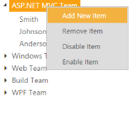

# Treeview with context menu support

TreeView control is availed with the context menu options that open on right-click, over the node. Other than the default menu items available, you can add the new node dynamically in TreeView and also delete the item, enable and disable the item in TreeView. It is achieved by adding the Context Menu option to the TreeView.

## Menu Item

By default, the context menu options are provided with four items namely: Add New Item, Delete Item, Enable Item and Disable Item. When you want to customize and use your own custom menu items, then you can customize the TreeView with the desired collections. 

The following code example illustrates how to configure the context menu elements for the TreeView and in the following example, you have to specify the menu type as ej.MenuType.ContextMenu and in the menuClick function, you can check the cases with add, delete, remove or enable item in TreeView. 

And each functionality in the context menu option is done by specific methods. For example, you have added the new item in TreeView by using the addNode() method, delete the item using removeNode() method, disable the item using disableNode() method and enable the item enableNode() method respectively.

The following steps explain how you can enable the ShowCheckbox property for TreeView.

In the View page, add TreeView helper to configure TreeView.



\\ To configure TreeView in the CSHTML page

   @Html.EJ().TreeView("treeview").Items(items =>

         {

               items.Add().Text("Favorites").Expanded(true).Children(child =>

               {

                        child.Add().Text("Desktop");

                        child.Add().Text("Downloads");

                        child.Add().Text("Recent places");

                });

                items.Add().Text("Libraries").Expanded(true).Children(child =>

                {

                      child.Add().Text("Documents").Children(child1 =>

                           {

                                child1.Add().Text("My Documents");

                                child1.Add().Text("Public Documents");

                           });

                      child.Add().Text("Pictures").Children(child1 =>

                        {

                            child1.Add().Text("My Pictures");

                            child1.Add().Text("Public Pictures");

                        });

                        child.Add().Text("Music").Children(child1 =>

                        {

                            child1.Add().Text("My Music");

                            child1.Add().Text("Public Music");

                        });

                        child.Add().Text("Subversion");

                  });

                  items.Add().Text("Computer").Children(child =>

                  {

                        child.Add().Text("Folder(C)");

                        child.Add().Text("Folder(D)");

                        child.Add().Text("Folder(E)");

                   });

            })

    

    

        @Html.EJ().Menu("treeviewMenu").Items(items =>

            {

                items.Add().Text("Add New Item");

                items.Add().Text("Remove Item");

                items.Add().Text("Disable Item");

                items.Add().Text("Enable Item");

            }).OpenOnClick(false).MenuType(MenuType.ContextMenu).ShowSubLevelArrows(true).ContextMenuTarget("#treeview").ClientSideEvents(s => s.Click("menuclick").BeforeOpen("beforeOpen"))

    



Define the events in the script as follows,





The output for the context menu for TreeView control is as follows.

_Figure_ _62_: Context Menu for TreeView

