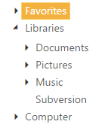

# Node Persistence Handling

The TreeView allows for Persistence of its expanded and collapsed state across page view. When you want to maintain the state of the node, like expand or collapse the node, check or uncheck the node, or node display arrangement after a post back, this behavior is achieved by using the EnablePersistence property.

To enable Persistence of a node, you can set the appropriate value for the EnablePersistence property. To enable this feature, set the EnablePersistence property as True.

The following steps explain how you can enable the EnablePersistence property for TreeView.

1. In the View page, add TreeView helper to configure TreeView.



// To configure TreeView in the CSHTML page

@Html.EJ().TreeView("treeview").Items(items =>

    {

items.Add().Text("Favorites").Expanded(true).Children(child =>

		   {

			   child.Add().Text("Desktop");

			   child.Add().Text("Downloads");

			   child.Add().Text("Recent places");

		   });

items.Add().Text("Libraries").Expanded(true).Children(child =>

{

	child.Add().Text("Documents").Children(child1 =>

		{

			child1.Add().Text("My Documents");

			child1.Add().Text("Public Documents");

		});

	child.Add().Text("Pictures").Children(child1 =>

	{

		child1.Add().Text("My Pictures");

		child1.Add().Text("Public Pictures");

	});

	child.Add().Text("Music").Children(child1 =>

	{

		child1.Add().Text("My Music");

		child1.Add().Text("Public Music");

	});

	child.Add().Text("Subversion");

});

items.Add().Text("Computer").Children(child =>

{

	child.Add().Text("Folder(C)");

	child.Add().Text("Folder(D)");

	child.Add().Text("Folder(E)");

});

}).EnablePersistence(true)



The output for TreeView when EnablePersistence is set to True is as follows.

TreeView with enablePersistence
{:.caption}

