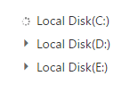

# Populate Data

TreeView can be populated with local or remote data source using a property [DataSource](http://help.syncfusion.com/cr/cref_files/aspnetmvc/Syncfusion.EJ~Syncfusion.JavaScript.TreeViewFieldsBuilder~Datasource.html), which is the member of “**TreeViewFields**” property.

In TreeView, you should use “**TreeViewFields**” property to go with data source. It specifies the mapping fields for the data source to receive the data, query to process the data and field mappers to map the data members.

## Fields

Below table list outs the field members with description.
  
<table>
<tr>
<td>
    {{'**Properties**'| markdownify }}
</td>
<td>
    {{'**Description**'| markdownify }}
</td>
</tr>
<tr>
<td>
DataSource
</td>
<td>
The data source contains the list of data for generating the TreeView list. Also contains properties to load data from remote data source.
</td>
</tr>
<tr>
<td>
Query
</td>
<td>
It specifies the query to retrieve the data from the online server.
</td>
</tr>
<tr>
<td>
TableName
</td>
<td>
It specifies the name of the table from which data to be processed from given data source.
</td>
</tr>
<tr>
<td>
Id
</td>
<td>
It specifies the ID of the node.
</td>
</tr>
<tr>
<td>
ParentId
</td>
<td>
It specifies the parent id of the node
</td>
</tr>
<tr>
<td>
Text
</td>
<td>
It specifies the text content of the node.
</td>
</tr>
<tr>
<td>
HasChild
</td>
<td>
It specifies the node has child (which is the nested or inner level of nodes). Also it’s used in load on demand of tree data.
</td>
</tr>
<tr>
<td>
Expanded
</td>
<td>
It specifies the tree node to be in expanded state
</td>
</tr>
<tr>
<td>
Selected
</td>
<td>
It specifies the select node at initialize. [note: only one node get selected]
</td>
</tr>
<tr>
<td>
IsChecked 
</td>
<td>
It specifies the node to be in checked state, if tree node represented with checkboxes. 
</td>
</tr>
<tr>
<td>
ImageUrl
</td>
<td>
It defines the image location.
</td>
</tr>
<tr>
<td>
ImageAttribute
</td>
<td>
It defines the image attributes such as height, width, styles, etc.
</td>
</tr>
<tr>
<td>
SpriteCssClass
</td>
<td>
It defines the sprite CSS for the image tag.
</td>
</tr>
<tr>
<td>
HtmlAttribute
</td>
<td>
It defines the HTML attributes such as class and styles for a node ("li" tag).
</td>
</tr>
<tr>
<td>
LinkAttribute
</td>
<td>
It defines the HTML attributes such as class and styles for a link tag, which is child of node.
</td>
</tr>
<tr>
<td>
Child
</td>
<td>
It used to specify the properties of child nodes in TreeView
</td>
</tr>
</table>

Mapping all fields with data source

In the model page, specify the TreeView node properties as shown below.
    
        
    
    
        public class LoadData
        {
            public int Id { get; set; }
            public int Parent { get; set; }
            public string Text { get; set; }
            public string SpriteImage { get; set; }
            public string ImageURL { get; set; }
            public bool HasChild { get; set; }
            public bool Expanded { get; set; }
            public bool Selected { get; set; }
            public bool NodeChecked { get; set; }
            public object NodeProperty { get; set; }
            public object LinkProperty { get; set; }
            public object ImageProperty { get; set; }
        }
        
    
    
    
    
In the controller page, create a data list which contains the details about tree nodes.
    
    
    
    
    
        public partial class TreeViewController : Controller
        {
            List<LoadData> treeData = new List<LoadData>();
            public ActionResult TreeViewFeatures()
            {
                treeData.Add(new LoadData
                {
                    Id = 1,
                    Parent = 0,
                    Text = "Item 1",
                    Expanded = true,
                    NodeProperty = new Dictionary<string, string>() {
                    { "class", "text-blue" },
                    { "value", "Item 1" }
                    }
                });
                treeData.Add(new LoadData
                {
                    Id = 2,
                    Parent = 0,
                    Text = "Item 2",
                    LinkProperty = new Dictionary<string, string>() {
                    { "class", "text-underline" },
                    { "href", "http://www.syncfusion.com" },
                    { "target", "_blank"}
                    }
                });
                treeData.Add(new LoadData
                {
                    Id = 3,
                    Parent = 0,
                    Text = "Item 3",
                    Selected = true,
                    SpriteImage = "mailicon sprite-calendar"
                });
                treeData.Add(new LoadData
                {
                    Id = 4,
                    Parent = 0,
                    Text = "Item 4",
                    NodeChecked = true,
                    ImageProperty = new Dictionary<string, string>() {
                    { "width", "20px" },
                    { "height", "20px" }
                    },
                    ImageURL = "http://cdn.syncfusion.com/13.3.0.7/js/web/flat-azure/images/ajax-loader.gif"
                });
                treeData.Add(new LoadData
                {
                    Id = 5,
                    Parent = 1,
                    Text = "Item 1.1"
                });
                treeData.Add(new LoadData
                {
                    Id = 6,
                    Parent = 1,
                    Text = "Item 1.2"
                });
                treeData.Add(new LoadData
                {
                    Id = 7,
                    Parent = 1,
                    Text = "Item 1.3"
                });
                treeData.Add(new LoadData
                {
                    Id = 8,
                    Parent = 3,
                    Text = "Item 3.1"
                });
                treeData.Add(new LoadData
                {
                    Id = 9,
                    Parent = 3,
                    Text = "Item 3.2"
                });
                treeData.Add(new LoadData
                {
                    Id = 10,
                    Parent = 5,
                    Text = "Item 1.1.1"
                });
                ViewBag.datasource = treeData;
                return View();
            }
        }
        
    
    
    
    
In the view page, add TreeView helper and map the properties defined to the corresponding fields in data source.
    
    
    
    
    
    @using TreeView_Doc.Models
    
    

        @(Html.EJ().TreeView("treeView")
            .TreeViewFields(field =>
                field.Datasource((IEnumerable<LoadData>)ViewBag.datasource)
                .Id("Id")
                .ParentId("Parent")
                .Text("Text")
                .Expanded("Expanded")
                .IsChecked("NodeChecked")
                .Selected("Selected")
                .SpriteCssClass("SpriteImage")
                .ImageUrl("ImageURL")
                .LinkAttribute("LinkProperty")
                .HtmlAttribute("NodeProperty")
                .ImageAttribute("ImageProperty")
            )
            .ShowCheckbox(true)
        )
    

    
    
    
    
    
N>**If you want to display nodes in root level, exclude parent attribute or specify “0” in corresponding value.**

## Local data

TreeView can be rendered from a self-referential data by providing the two required fields “**id”**and “**parent**”. 

In the controller page, create a data list which contains the details about tree nodes.
    
    
    
    
    
        public partial class TreeViewController : Controller
        {
            List<LoadData> load = new List<LoadData>();
            public ActionResult TreeViewFeatures()
            {
                load.Add(new LoadData { Id = 1, Parent = 0, Text = "Item 1" });
                load.Add(new LoadData { Id = 2, Parent = 0, Text = "Item 2" });
                load.Add(new LoadData { Id = 3, Parent = 0, Text = "Item 3" });
                load.Add(new LoadData { Id = 4, Parent = 1, Text = "Item 1.1" });
                load.Add(new LoadData { Id = 5, Parent = 1, Text = "Item 1.2" });
                load.Add(new LoadData { Id = 6, Parent = 3, Text = "Item 3.1" });
                ViewBag.datasource = load;
                return View();
            }
        }
        
    
    
    
    
Above data can be directly assigned to [DataSource](http://help.syncfusion.com/cr/cref_files/aspnetmvc/Syncfusion.EJ~Syncfusion.JavaScript.TreeViewFieldsBuilder~Datasource.html) property and mapping data fields with respect to the mapper field in order to form TreeView.
    
    
    
    
    
    @(Html.EJ().TreeView("tree")
        .TreeViewFields(field =>
            field.Datasource((IEnumerable<LoadData>)ViewBag.datasource)
            .Id("Id")
            .ParentId("Parent")
            .Text("Text")
        )
    )
    
    
    
    
### Nested Object Support

The nested object support is provided for the TreeView component. Please find the following data list which contains the details about tree nodes.
    
    
    
    
        public partial class TreeViewController : Controller
        {
            List<LoadData> load = new List<LoadData>();
            public ActionResult TreeViewFeatures()
            {
                load.Add(new LoadData { Id = 1, Parent = 0, Text = new InnerData { nodeName = "Item 1" } });
                load.Add(new LoadData { Id = 2, Parent = 0, Text = new InnerData { nodeName = "Item 2" } });
                load.Add(new LoadData { Id = 3, Parent = 0, Text = new InnerData { nodeName = "Item 3" } });
                load.Add(new LoadData { Id = 4, Parent = 1, Text = new InnerData { nodeName = "Item 1.1" } });
                load.Add(new LoadData { Id = 5, Parent = 1, Text = new InnerData { nodeName = "Item 1.2" } });
                load.Add(new LoadData { Id = 6, Parent = 3, Text = new InnerData { nodeName = "Item 3.1" } });
                ViewBag.datasource = load;
                return View();
            }
        }
        public class LoadData
        {
            public int Id { get; set; }
            public int Parent { get; set; }
            public InnerData Text { get; set; }
        }
        public class InnerData
        {
            public string nodeName { get; set; }
        }

    
    
    
    
Above data can be directly assigned to [DataSource](http://help.syncfusion.com/cr/cref_files/aspnetmvc/Syncfusion.EJ~Syncfusion.JavaScript.TreeViewFieldsBuilder~Datasource.html) property and mapping data fields with respect to the mapper field in order to form TreeView.
    
    
    
    
    
    @(Html.EJ().TreeView("tree")
        .TreeViewFields(field =>
            field.Datasource((IEnumerable<LoadData>)ViewBag.datasource)
            .Id("Id")
            .ParentId("Parent")
            .Text("Text.nodeName")
        )
    )
    
    
    
## Remote Data

When using remote data binding, the adaptor of [ej.DataManager](http://helpjs.syncfusion.com/js/api/ejdatamanager#) plays vital role in processing queries to make them suitable to sends along with data request and also process the response data from the server.

The following steps explain how you can bind remote data to TreeView control.

* In the view page, add TreeView helper to configure TreeView.

* In the DataSource field assign remote data source. Here DataManager gets the remote web service and filters the data using Query API. The select property of ej.Query is used to retrieve the specified columns from the data source.

* Assign DataSource and Query property values to bind the remote data. Map the corresponding fields in TreeView control 

### OData

**OData** is a standardized protocol for creating and consuming data. You can bind [OData service](http://www.odata.org/#) data to TreeView in two ways using [DataSource](http://help.syncfusion.com/cr/cref_files/aspnetmvc/Syncfusion.EJ~Syncfusion.JavaScript.TreeViewFieldsBuilder~Datasource.html#) API of “TreeView” control.
    
   **Using Datasource(DataSource) API**
    
   Create an object for [DataSource](http://help.syncfusion.com/cr/cref_files/aspnetmvc/Syncfusion.EJ~Syncfusion.JavaScript.DataSource_members.html#) class using OData service URL and then assign it to [DataSource](http://help.syncfusion.com/cr/cref_files/aspnetmvc/Syncfusion.EJ~Syncfusion.JavaScript.TreeViewFieldsBuilder~Datasource.html#) API of “TreeView”. 
    
    
    
    
    
    @{
        DataSource treeData = new DataSource();
        treeData.URL = "//js.syncfusion.com/demos/ejServices/Wcf/Northwind.svc/";
    }
    @(Html.EJ().TreeView("treeView")
        .TreeViewFields(field =>
            field.Datasource(treeData)
            .Query("ej.Query().from('Categories').select('CategoryID,CategoryName').take(3)")
            .Id("CategoryID")
            .Text("CategoryName")
            .Child(childField =>
                childField.Datasource(treeData)
                .TableName("Products")
                .Id("ProductID")
                .ParentId("CategoryID")
                .Text("ProductName")
            )
        )
    )
    
    
    
    
    
   **Using Datasource(Action&lt;DataSourceBuilder&gt;) API**
    
   Here directly, you can specify the OData service URL using Action<[DataSourceBuilder](http://help.syncfusion.com/cr/cref_files/aspnetmvc/Syncfusion.EJ~Syncfusion.JavaScript.DataSourceBuilder_members.html#)> 
    
    
    
    
    
    @(Html.EJ().TreeView("treeView")
        .TreeViewFields(field =>
            field.Datasource(data =>
                data.URL("//js.syncfusion.com/demos/ejServices/Wcf/Northwind.svc/")
            )
            .Query("ej.Query().from('Categories').select('CategoryID,CategoryName').take(3)")
            .Id("CategoryID")
            .Text("CategoryName")
            .Child(childField =>
                childField.Datasource(data =>
                    data.URL("//js.syncfusion.com/demos/ejServices/Wcf/Northwind.svc/")
                )
                .TableName("Products")
                .Id("ProductID")
                .ParentId("CategoryID")
                .Text("ProductName")
            )
        )
    )
    
    
    
    
    
In above methods, you may also specify the **adaptor** as [ODataAdaptor](http://helpjs.syncfusion.com/js/datamanager/data-adaptors#odata-adaptor) and it is optional to specify.

You can provide adaptor value either as string value (“ODataAdaptor”) or Enum type (AdaptorType.ODataAdaptor)
    
    
    
    
    
    @(Html.EJ().TreeView("treeView")
        .TreeViewFields(field =>
            field.Datasource(data =>
                data.URL("//js.syncfusion.com/demos/ejServices/Wcf/Northwind.svc/")
                .Adaptor(AdaptorType.ODataAdaptor)
            )
            .Query("ej.Query().from('Categories').select('CategoryID,CategoryName').take(3)")
            .Id("CategoryID")
            .Text("CategoryName")
            .Child(childField =>
                childField.Datasource(data =>
                    data.URL("//js.syncfusion.com/demos/ejServices/Wcf/Northwind.svc/")
                    .Adaptor(AdaptorType.ODataAdaptor)
                )
                .TableName("Products")
                .Id("ProductID")
                .ParentId("CategoryID")
                .Text("ProductName")
            )
        )
    )
    
    
    
    
    
N>**You can use above code until OData service version 3. For OData Service version 4 End Point, we have created a separate adaptor [ej.ODataV4Adaptor](http://helpjs.syncfusion.com/js/datamanager/data-binding#odata-v4) for data binding.**
    
    
    
    
    
    @(Html.EJ().TreeView("treeView")
        .TreeViewFields(field =>
            field.Datasource(data =>
                data.URL("//js.syncfusion.com/demos/ejServices/Wcf/Northwind.svc/Categories")
                .Adaptor(AdaptorType.ODataV4Adaptor)
            )
            .Query("ej.Query().from('Categories').select('CategoryID,CategoryName').take(3)")
            .Id("CategoryID")
            .Text("CategoryName")
            .Child(childField =>
                childField.Datasource(data =>
                    data.URL("//js.syncfusion.com/demos/ejServices/Wcf/Northwind.svc/Products")
                    .Adaptor(AdaptorType.ODataV4Adaptor)
                )
                .TableName("Products")
                .Id("ProductID")
                .ParentId("CategoryID")
                .Text("ProductName")
            )
        )
    )
    
    
    
    
    
### Web API

Using [ej.WebApiAdaptor](http://helpjs.syncfusion.com/js/datamanager/data-adaptors#webapi-adaptor), you can bind Web API service data to TreeView as shown in below code example.
    
    
    
    
    
    @(Html.EJ().TreeView("treeView")
        .TreeViewFields(field =>
            field.Datasource(data =>
                data.URL("http://mvc.syncfusion.com/OdataServices/treeView/TreeViewData/GetAllData")
                .Adaptor(AdaptorType.WebApiAdaptor)
                .CrossDomain(true)
            )
            .Id("id")
            .Text("name")
            .ParentId("pid")
        )
    )
    
    
    
    
    
### Other Restful web services

The Custom Adaptor concept of [ej.DataManager](http://helpjs.syncfusion.com/js/api/ejdatamanager#) allow you to customize or generate your own adaptor which is used to process query and result data. 

[http://helpjs.syncfusion.com/js/datamanager/data-adaptors#custom-adaptor](http://helpjs.syncfusion.com/js/datamanager/data-adaptors#custom-adaptor)

When using remote data binding, the adaptor of [ej.DataManager](http://helpjs.syncfusion.com/js/api/ejdatamanager#) plays vital role in processing queries to make them suitable to sends along with data request and also process the response data from the server.

In the controller page, create a data list that contains the details about tree nodes.
    
    
    
    
    
        public partial class TreeViewController : Controller
        {
            List<LoadData> load = new List<LoadData>();
            public ActionResult TreeViewFeatures()
            {
                load.Add(new LoadData { Id = 1, Parent = 0, Text = "Item 1" });
                load.Add(new LoadData { Id = 2, Parent = 0, Text = "Item 2" });
                load.Add(new LoadData { Id = 3, Parent = 0, Text = "Item 3" });
                load.Add(new LoadData { Id = 4, Parent = 1, Text = "Item 1.1" });
                load.Add(new LoadData { Id = 5, Parent = 1, Text = "Item 1.2" });
                load.Add(new LoadData { Id = 6, Parent = 3, Text = "Item 3.1" });
                ViewBag.datasource = load;
                return View();
            }
        }
        
    
    
    
    
In the view page, add TreeView helper and specify the custom adaptor as shown below.
    
    
    
    
    
    @(Html.EJ().TreeView("tree")
        .TreeViewFields(field =>
            field.Datasource((IEnumerable<LoadData>)ViewBag.datasource)
            .Id("Id")
            .ParentId("Parent")
            .Text("Text")
        )
        .ClientSideEvents(events =>
            events.Create("onCreate")
        )
    )
    
    
    
    
    
    
    
## Load on demand

Load on demand is a technique (Lazy load) that is used to reduce the bandwidth size of consuming huge data. You can load data on demand in TreeView by using “**LoadOnDemand**” property when you’re going to use huge data.

For local data source, TreeView loads the first level nodes initially. While expand a parent node then TreeView loads it’s their child nodes from the data source based on the parentId member. It reduces the time to render TreeView with huge data.

In the controller page, create a data list that contains the details about tree nodes.


    
public class HomeController : Controller
{
    List<loadOnDemand> data = new List<loadOnDemand>();
    public ActionResult Index()
    {
        data.Add(new loadOnDemand { id = 1, name = "Local Disk(C:)", hasChild = true });
        data.Add(new loadOnDemand { id = 2, name = "Local Disk(D:)", hasChild = true });
        data.Add(new loadOnDemand { id = 3, name = "Local Disk(E:)", hasChild = true });
        data.Add(new loadOnDemand { id = 4, parentId = 1, name = "Folder 1", hasChild = true });
        data.Add(new loadOnDemand { id = 5, parentId = 1, name = "Folder 2" });
        data.Add(new loadOnDemand { id = 6, parentId = 1, name = "Folder 3" });
        data.Add(new loadOnDemand { id = 7, parentId = 2, name = "Folder 4" });
        data.Add(new loadOnDemand { id = 8, parentId = 2, name = "Folder 5", hasChild = true });
        data.Add(new loadOnDemand { id = 9, parentId = 2, name = "Folder 6" });
        data.Add(new loadOnDemand { id = 10, parentId = 3, name = "Folder 7" });
        data.Add(new loadOnDemand { id = 11, parentId = 3, name = "Folder 8" });
        data.Add(new loadOnDemand { id = 12, parentId = 3, name = "Folder 9", hasChild = true });
        data.Add(new loadOnDemand { id = 13, parentId = 4, name = "File 1" });
        data.Add(new loadOnDemand { id = 14, parentId = 4, name = "File 2" });
        data.Add(new loadOnDemand { id = 15, parentId = 4, name = "File 3" });
        data.Add(new loadOnDemand { id = 16, parentId = 8, name = "File 4" });
        data.Add(new loadOnDemand { id = 17, parentId = 8, name = "File 5" });
        data.Add(new loadOnDemand { id = 18, parentId = 8, name = "File 6" });
        data.Add(new loadOnDemand { id = 19, parentId = 12, name = "File 7" });
        data.Add(new loadOnDemand { id = 20, parentId = 12, name = "File 8" });
        data.Add(new loadOnDemand { id = 21, parentId = 12, name = "File 9" });
        ViewBag.datasource = data;
        return View();
    }
}

public class loadOnDemand
{
    public int id { get; set; }
    public int? parentId { get; set; }
    public string name { get; set; }
    public bool? hasChild { get; set; }
    public bool? expanded { get; set; }
    public bool? ischecked { get; set; }
    public bool? selected { get; set; }
    public string spriteCss { get; set; }
}
        

    
In the view page, add TreeView helper and map the properties defined in to the corresponding fields in “Datasource” with that enable load on demand option.
   

    
@Html.EJ().TreeView("tree").LoadOnDemand(true).TreeViewFields(field =>
    field.Datasource((IEnumerable<loadOnDemand>)ViewBag.datasource)
    .Id("id").Text("name").ParentId("parentId").HasChild("hasChild")
)
    


The following screenshot displays the load on demand for local data source in TreeView control.

While expanding the parent node
{:.caption}

After expanding the parent node
{:.caption}

For more details about load on demand for local data source, refer the sample [here](http://mvc.syncfusion.com/demos/web/treeview/loadOnDemand).

For remote data source, TreeView loads the first level nodes initially. While expand the node from TreeView, the data manager passes the query to the controller. Based on this query, you can filter the data from table and return to TreeView.
   
Refer below code example to load data on demand from remote data source.
    

    
@(Html.EJ().TreeView("treeView").LoadOnDemand(true).TreeViewFields(field =>
    field.Datasource(data => 
        data.URL("//js.syncfusion.com/demos/ejServices/Wcf/Northwind.svc/"))
        .Query("ej.Query().from('Categories').select('CategoryID,CategoryName').take(3)")
        .Id("CategoryID").Text("CategoryName").HasChild("CategoryName").Child(child =>
            child.Datasource(childData =>
                childData.URL("//js.syncfusion.com/demos/ejServices/Wcf/Northwind.svc/"))
                .TableName("Products").ParentId("CategoryID").Text("ProductName")))
)
    


For URL Adaptor, TreeView loads the first level nodes initially. While expand the node from TreeView, the data manager passes the Data Manager instance to the controller. The Data Manager instance contains the parent Id and filter options. Based on the Data Manager instance, you can filter the data from data source and return to TreeView.

In the controller page, create a data list that contains the details about tree nodes and create method to handle client side request.



public class HomeController : Controller
{

    public ActionResult Index()
    {
        return View();
    }

    public JsonResult Data(DataManager dataManagerObj)
    {
        List<loadOnDemand> treeData = GetTreeData();
        IEnumerable<loadOnDemand> results;
        if (dataManagerObj.Where == null)
        {
            //return the first level nodes
            results = treeData.Where(item => item.parentId == null);
        }
        else
        {
            //return the nodes which has parentId as you request
            results = treeData.Where(s => s.parentId == Convert.ToInt32(dataManagerObj.Where[0].value));
        }
        return Json(results, JsonRequestBehavior.AllowGet);
    }

    List<loadOnDemand> data = new List<loadOnDemand>();

    public List<loadOnDemand> GetTreeData()
    {
        data.Add(new loadOnDemand { id = 1, name = "Local Disk(C:)", hasChild = true });
        data.Add(new loadOnDemand { id = 2, name = "Local Disk(D:)", hasChild = true });
        data.Add(new loadOnDemand { id = 3, name = "Local Disk(E:)", hasChild = true });
        data.Add(new loadOnDemand { id = 4, parentId = 1, name = "Folder 1", hasChild = true });
        data.Add(new loadOnDemand { id = 5, parentId = 1, name = "Folder 2" });
        data.Add(new loadOnDemand { id = 6, parentId = 1, name = "Folder 3" });
        data.Add(new loadOnDemand { id = 7, parentId = 2, name = "Folder 4" });
        data.Add(new loadOnDemand { id = 8, parentId = 2, name = "Folder 5", hasChild = true });
        data.Add(new loadOnDemand { id = 9, parentId = 2, name = "Folder 6" });
        data.Add(new loadOnDemand { id = 10, parentId = 3, name = "Folder 7" });
        data.Add(new loadOnDemand { id = 11, parentId = 3, name = "Folder 8" });
        data.Add(new loadOnDemand { id = 12, parentId = 3, name = "Folder 9", hasChild = true });
        data.Add(new loadOnDemand { id = 13, parentId = 4, name = "File 1" });
        data.Add(new loadOnDemand { id = 14, parentId = 4, name = "File 2" });
        data.Add(new loadOnDemand { id = 15, parentId = 4, name = "File 3" });
        data.Add(new loadOnDemand { id = 16, parentId = 8, name = "File 4" });
        data.Add(new loadOnDemand { id = 17, parentId = 8, name = "File 5" });
        data.Add(new loadOnDemand { id = 18, parentId = 8, name = "File 6" });
        data.Add(new loadOnDemand { id = 19, parentId = 12, name = "File 7" });
        data.Add(new loadOnDemand { id = 20, parentId = 12, name = "File 8" });
        data.Add(new loadOnDemand { id = 21, parentId = 12, name = "File 9" });
        return data;
    }
}

public class loadOnDemand
{
    public int id { get; set; }
    public int? parentId { get; set; }
    public string name { get; set; }
    public bool? hasChild { get; set; }
    public bool? expanded { get; set; }
    public bool? ischecked { get; set; }
    public bool? selected { get; set; }
    public string spriteCss { get; set; }
}


    
In the view page, add TreeView helper and map the properties defined in to the corresponding fields in “Datasource” with that enable load on demand option.
   

    
@Html.EJ().TreeView("tree").LoadOnDemand(true).TreeViewFields(field => 
    field.Datasource(data => 
            data.URL("/Home/Data").Adaptor(AdaptorType.UrlAdaptor)
        ).Text("name").Id("id").ParentId("parentId").HasChild("hasChild"))
    


The following screenshot displays the load on demand for URL adaptor in TreeView control.

While expanding the parent node
{:.caption}

After expanding the parent node
{:.caption}
    
    