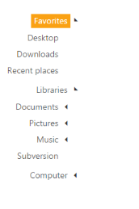

# RTL

TreeView supports right-to-left layout and the node text is displayed in the RTL languages. Arabic and Hebrew are languages written from right to left. When you desire to change the display of TreeView as right to left direction, you can do so by using the EnableRTL property. To enable or disable this option, set the appropriate value for the EnableRTL property. When EnableRTL is enabled, the appearance of the TreeView is displayed in the right to left direction. You can display the TreeView as right to left direction by using this feature.

The following steps explain enabling the EnableRTL property for TreeView.

1. In the View page, add TreeView helper to configure TreeView.



\\ To configure TreeView in the CSHTML page

@Html.EJ().TreeView("treeview").Items(items =>

    {

        items.Add().Text("Favorites").Expanded(true).Children(child =>

                   {

                       child.Add().Text("Desktop");

                       child.Add().Text("Downloads");

                       child.Add().Text("Recent places");

                   });

        items.Add().Text("Libraries").Expanded(true).Children(child =>

        {

            child.Add().Text("Documents").Children(child1 =>

                {

                    child1.Add().Text("My Documents");

                    child1.Add().Text("Public Documents");

                });

            child.Add().Text("Pictures").Children(child1 =>

            {

                child1.Add().Text("My Pictures");

                child1.Add().Text("Public Pictures");

            });

            child.Add().Text("Music").Children(child1 =>

            {

                child1.Add().Text("My Music");

                child1.Add().Text("Public Music");

            });

            child.Add().Text("Subversion");

        });

        items.Add().Text("Computer").Children(child =>

        {

            child.Add().Text("Folder(C)");

            child.Add().Text("Folder(D)");

            child.Add().Text("Folder(E)");

        });

}).EnableRTL(true)



The output for TreeView when EnableRTL is set to “True” is as follows.

_Figure 54: TreeView with EnableRTL_

