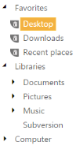

# Specifying Tree nodes using Helper element

Sometimes we may not need a DataSource for rendering TreeView. We can simply make use of the TreeView helper to render the TreeView. You can customize the TreeView appearance, and give it a new look or style. Using the Items property, we can achieve this.

In the following code example, you can delete the child node by clicking the Delete icon. This is achieved by the RemoveNode method in TreeView and you can change the position of the image where you want to place it.

The following steps explain configuring the template option for TreeView.

1. In the View page, add TreeView helper to configure TreeView. ‘HtmlAttributes’ property is used to add HTML attributes like, id, class etc.. to the components. We need to use IDictionary<string, object> to specify the HTML attributes. Please check the below code.

<table>
<tr>
<td>
[View]\\ To configure TreeView in the CSHTML page@{IDictionary<string, object> htmlAttribute = new Dictionary<string, object>();  htmlAttribute.Add("class", "cont-del");  }@Html.EJ().TreeView("treeview").Items(items =>                {                    items.Add().Text("Favorites").Expanded(true).Children(child =>                    {                        child.Add().Text("Desktop").HtmlAttributes(htmlAttribute);                        child.Add().Text("Downloads").HtmlAttributes(htmlAttribute);                        child.Add().Text("Recent places").HtmlAttributes(htmlAttribute);                    });                    items.Add().Text("Libraries").Expanded(true).Children(child =>                   {                       child.Add().Text("Documents").Children(child1 =>                            {                                child1.Add().Text("My Documents").HtmlAttributes(htmlAttribute);                                child1.Add().Text("Public Documents").HtmlAttributes(htmlAttribute);                            });                       child.Add().Text("Pictures").Children(child1 =>                        {                            child1.Add().Text("My Pictures").HtmlAttributes(htmlAttribute);                            child1.Add().Text("Public Pictures").HtmlAttributes(htmlAttribute);                        });                       child.Add().Text("Music").Children(child1 =>                       {                           child1.Add().Text("My Music").HtmlAttributes(htmlAttribute);                           child1.Add().Text("Public Music").HtmlAttributes(htmlAttribute);                       });                       child.Add().Text("Subversion");                   });                    items.Add().Text("Computer").Children(child =>                    {                        child.Add().Text("Folder(C)").HtmlAttributes(htmlAttribute);                        child.Add().Text("Folder(D)").HtmlAttributes(htmlAttribute);                        child.Add().Text("Folder(E)").HtmlAttributes(htmlAttribute);                    });                })</td></tr>
<tr>
<td>
[JavaScript]</td></tr>
</table>

2. Adding the style for TreeView control as follows.





The TreeView control template displays the following output.

