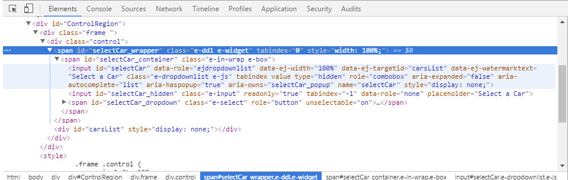
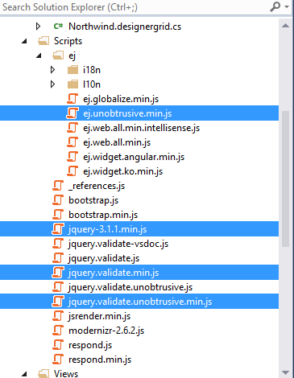
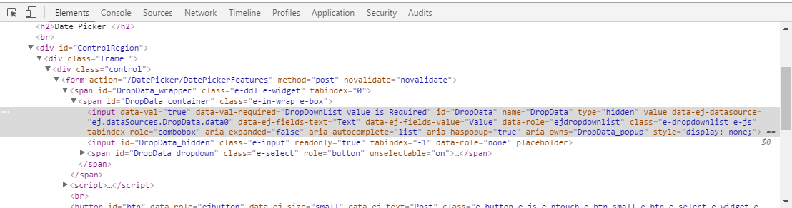

# Unobtrusive

Many uncertainties and difficulties are involved in a usual **JavaScript programming** environment, like some of the browsers may ignore the JavaScript codes under the scripts section completely or partially due to its complexity, and so on. To overcome all such inconveniences, the [Unobtrusive JavaScript](http://www.w3.org/wiki/The_principles_of_unobtrusive_JavaScript) support has been introduced to make it easier for the users to create all our Syncfusion components with basic level HTML tag-like structure.

One of the main goal of the unobtrusive support is to achieve the clear separation of both the HTML content and behavior, so as to enhance the page loading time and to make the code updation easier. The **Essential JavaScript** have separate integration library to achieve the **Unobtrusive JS** support. To make use of Unobtrusive support with our Essential JavaScript components, it is necessary to refer to the **ej.unobtrusive.min.js** file in your application.

The **ej.unobtrusive.min.js** file can be accessed from the following location, that can then be copied and referred in your application.

<table>
<tr>
<td>
<b>(installed location)</b>\Syncfusion\Essential Studio\{{ site.releaseversion }}\JavaScript\assets\scripts\common
</td>
</tr>
<tr>
<td>
<b>For example,</b> If you have installed the Essential Studio package within <b>C:\Program Files (x86)</b>, navigate to the following location.
 
<b>C:\Program Files (x86)</b>\Syncfusion\Essential Studio\{{ site.releaseversion }}\JavaScript\assets\scripts\common
</td>
</tr>
</table>

When you enable the **unobtrusive** in your application, refer to the **ej.unobtrusive.min.js** file in the application.

You have to set the value of **UnobtrusiveJavaScriptEnabled** to **true** in Root directory web.config file as shown in the following code example.



    <appSettings>
        <add key="ClientValidationEnabled" value="true" />
        <add key="UnobtrusiveJavaScriptEnabled" value="true" />
    </appSettings>



After setting the value as true, refer to the unobtrusive script file in the _Layout page as shown in the following code example.



    



N> The ej.unobtrusive.min.js script should be referred next to the ej.web.all.min.js file reference, since it is dependent on it.

By default, it is necessary to add Script Manager code in the _Layout.cshtml file present within the ~/Views/Shared folder of your application.



    <body>
        @Html.EJ().ScriptManager()
        @RenderSection("scripts", required: false)
    </body>



N>The main reason for referring the Script manager in _Layout file is that, it can be referred as common by all the View files present within your application. 
If unobtrusive is set to true in the application, the script manager can be excluded, as the control is initialized by using HTML5 attributes.

A simple example by using the DropDownList control is as follows:

Render the DropDownList control as follows in your view page and enable the unobtrusive mode in your application.



    @Html.EJ().DropDownList("selectCar").TargetID("carsList").Width("100%").WatermarkText("Select a Car")
    

        <ul>
            <li>Audi A4</li>
            <li>Audi A5</li>
            <li>Audi A6</li>
            <li>Audi A7</li>
            <li>Audi A8</li>
        </ul>
    



When the above code is executed on the browser, the DropDownList control will be rendered with the following equivalent HTML DOM attributes created for it.

## Enabling Client Side Validation

Refer to the required jQuery validation scripts to perform Client-side Validation before postback, when the form is submitted. This can be enabled or disabled by ClientValidationEnabled key in app settings of web.config file.

In this section, how to perform Client-Side Validation for DropDownList control with DataAnnotations attribute is explained.

Define the view model for DropDownList control as follows.



    using System.ComponentModel.DataAnnotations; 
    namespace Dropdown
    {
        public class DropValue
        {
            [Required(ErrorMessage = "DropDownList value is Required")]
            public List<DropDownValue> DropData { get; set; }

        }
        public class DropDownValue
        {
            public string Text { get; set; }
            public string Value { get; set; }
        }
    }



Four sets of files are needed to implement the Unobtrusive.

•	The jQuery library
•	The jQuery Validate plugin
•	The Unobtrusive extensions to Validate
•	Ej unobtrusive library 

Refer the above mentioned necessary scripts files in your layout.cshtml page.



    
    
    
    
    



After that you need to create the controller’s action methods. These render views on the UI and bind a model with the view. So let us create a controller as follows:



    using Syncfusion.JavaScript.Models; 
    namespace Dropdown
    {
        public partial class DropdownlistController: Controller
        {
            public ActionResult DropdownlistFeatures() 
            { 
                BindingData(); 
                return View(); 
            } 
            public void BindingData() 
            { 
                List<DropDownValue> data = new List<DropDownValue>() { }; 
                data.Add(new DropDownValue() { Value = "item1", Text = "List Item 1" });
                data.Add(new DropDownValue() { Value = "item2", Text = "List Item 2" }); 
                data.Add(new DropDownValue() { Value = "item3", Text = "List Item 3" }); 
                data.Add(new DropDownValue() { Value = "item4", Text = "List Item 4" }); 
                data.Add(new DropDownValue() { Value = "item5", Text = "List Item 5" });
                DropDownListProperties obj = new DropDownListProperties(); 
                obj.DataSource = data;
                DropDownListFields fields = new DropDownListFields();
                fields.Text = "Text";
                fields.Value = "Value"; 
                obj.DropDownListFields = fields; ViewData["properties"] = obj; 
            } 
            [HttpPost]
            public ActionResult DropdownlistFeatures(DropDownListModel model) 
            { 
                BindingData(); 
                return View(model); 
            }
        }
    }



The view is created as in the following code snippet:



    @using (Html.BeginForm())
    {
        @Html.ValidationSummary(true)

        @Html.EJ().DropDownListFor(Model => Model.DropData, (Syncfusion.JavaScript.Models.DropDownListProperties)ViewData["properties"])
         
        @Html.EJ().Button("btn").Size(ButtonSize.Small).Text("Post").Type(ButtonType.Submit)
    }



When the above code is executed on the browser, the DropDownList control will be rendered with the following equivalent HTML DOM attributes created for it.

Now, some interesting new attributes are there to look at:
•	data-val specifies that the DropDownList needs validation.
•	data-val-required is the error message to be displayed, if a value is not provided.

This is part of the magic of Unobtrusive: it uses HTML5-compatible "data-" attributes to store all the information it needs to perform validation. This is why you don't need to use any other code besides attributes to enable client-side validation with this library.
