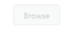

# Enable or Disable the UploadBox 

The Enabled property is Boolean type, which allow us to set the enable or disable the UploadBox. By default value of Enabled property is true.

The following steps explain the configuration of Enabled property in UploadBox. 

1. In the VIEW page, add below script to configure the UploadBox element.

   ~~~ html
     // In the CSHTML page, add the UploadBox element.

	 @Html.EJ().Uploadbox("uploadbox").SaveUrl("Uploadbox/Save").RemoveUrl("Uploadbox/Remove").Enabled(false)

   ~~~
   {:.prettyprint }

2. The following screenshot displays the output. 

