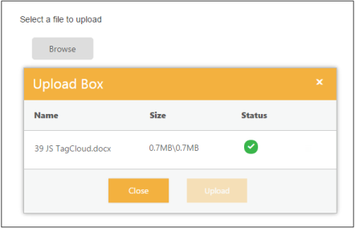
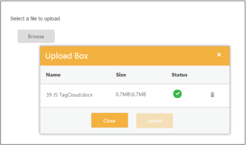
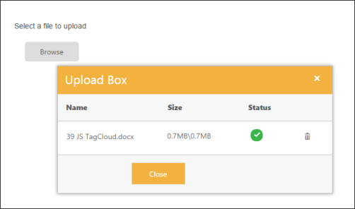

# File Actions

## Save File Action 

To save the uploaded file in MVC, create an ActionResult and trigger the same in SaveUrl property.  In ActionResult, save and specify the target location as App_Data folder for the uploaded files. The data type is string.

The following steps explain the configuration of SaveUrl property in the UploadBox. 

1. In the VIEW page, add the below script to configure the UploadBox element.

   ~~~ cshtml

		// In the CSHTML page, add the UploadBox element.
		@Html.EJ().Uploadbox("uploadbox")
		.SaveUrl("Uploadbox/Save")
		.RemoveUrl("Uploadbox/Remove")
		
   ~~~
   

   ~~~ csharp
		// Configure the ActionResult to save the file in App_Data location. In the following code example, the uploaded files is saved in App_Data folder.
		public ActionResult Save(IEnumerable<HttpPostedFileBase> uploadbox)
		{
			foreach (var file in uploadbox)
			{           
				var fileName = Path.GetFileName(file.FileName);
				var destinationPath = Path.Combine(Server.MapPath("~/App_Data"), fileName);
				file.SaveAs(destinationPath); 
			}       
		return Content("");
	}

   ~~~
   

2. The following screenshot displays the output. 

## Remove File Action 

To remove the uploaded file in MVC, create ActionResult and trigger the same in RemoveUrl property.  This action removes the uploaded file from where it is saved. This is achieved by clicking remove button on upload dialog. The data type is string.

The following steps explain the configuration of RemoveUrl property in UploadBox. 




// In the CSHTML page, add the UploadBox element.
@Html.EJ().Uploadbox("uploadbox")
.SaveUrl("Uploadbox/Save")
.RemoveUrl("Uploadbox/Remove")


 
// Configure the action to remove the file in target location. From that location, the file is searched and removed from the App_Data folder. 
	public ActionResult Remove(string[] fileNames) 
	{            
		foreach (var fullName in fileNames)
		{  
			var fileName = Path.GetFileName(fullName); 
			var physicalPath = Path.Combine(Server.MapPath("~/App_Data"), fileName);
			if (System.IO.File.Exists(physicalPath))
			{  
				System.IO.File.Delete(physicalPath);
            }
        }
		return Content("");
    }


  

The following screenshot displays the output. 

## AutoUpload

The UploadBox widget provides support to upload the file automatically once file is selected by using Browse button, that is, without clicking upload button. To achieve this, set the AutoUpload property to ‘true’. The data type is Boolean. By default, the value is set to ‘false’, so Upload button is clicked to upload the files. 

The following steps explain the configuration of AutoUpload property in UploadBox

1. In the VIEW page, add the below script to configure the UploadBox element.

   ~~~ cshtml

	// In the CSHTML page, add the UploadBox element.

	@Html.EJ().Uploadbox("uploadbox").SaveUrl("Uploadbox/Save").RemoveUrl("Uploadbox/Remove").AutoUpload(true)

   ~~~
   

2. For MVC, configure SaveActionResult and RemoveActionResult files as mentioned in Save file action and Remove file action respectively.

The following screenshot displays the output.

