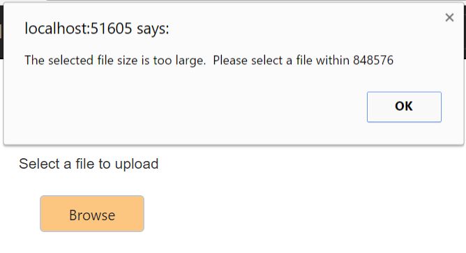

# File Size 

## Maximum File Size for UploadBox

In the UploadBox control, you can browse files with the size going up to gigabytes. You can restrict the files from being browsed using the FileSize property. When you do not use this property, it takes a default size, 31457280B, that is, 31MB. When this size exceeds, we cannot browse the file. 

1. Add the following code example to the corresponding View page to render the UploadBox control with the customized file size.



 
    @Html.EJ().Uploadbox("UploadBox")
	.SaveUrl("Uploadbox/Save")
	.RemoveUrl("UploadBox/Remove")
	.FileSize(848576)
	.ClientSideEvents(e => e.Error("fileuploaderror"))



To know about file action, we need to refer link:

<http://docs.syncfusion.com/aspnetmvc/uploadbox/file-size>

The following screenshot displays UploadBox control with customized file size.

When you want to browse the file within the fileSize, you can browse and upload the files.

When you try to browse the file with exceeded FileSize, we cannot browse and upload the files.

