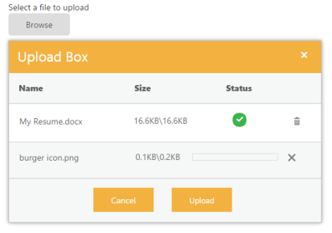

# Getting Started

This section explains briefly about how to create an UploadBox in ASP.NET MVC application .

## Create your first UploadBox in MVC

ASP.NET MVC UploadBox provides support to upload the files or photos within your webpage. From the following guidelines, you can learn how to upload the file that is used in a Resume Upload scenario. This helps you to restrict some file extensions, while uploading the resume in the server by using UploadBox control. The following screenshot demonstrates the functionality of UploadBox with file extension.

In the above screenshot, you can upload a resume. It allows .png and .docx file extension. This enables you to avoid unsupported resume formats to be uploaded in the server.

### Create UploadBox widgets

ASP.NET MVC UploadBox widget has built-in features like Upload multiple files, Delete files, check the status of the file, whether it shows complete or failed, and retry uploading the files.  You can easily create the UploadBox widget by using the following steps.

1. You can create an MVC project and add necessary assemblies, styles, and scripts with the help of the given [MVC-Getting Started](http://docs.syncfusion.com/aspnetmvc/uploadbox/getting-started) Documentation.
2. Add the following code example to the corresponding view page to render the UploadBox.
   
   ~~~ cshtml

	@Html.EJ().Uploadbox("UploadDefault").SaveUrl(@Url.Action("Save")).RemoveUrl(@Url.Action("Remove"))

   ~~~
   

3. Add the following script in your controller page.

   ~~~ csharp
   
	public ActionResult SaveDefault(IEnumerable<HttpPostedFileBase> UploadDefault)

	{

		foreach (var file in UploadDefault)

		{

			var fileName = Path.GetFileName(file.FileName);

			var destinationPath = Path.Combine(Server.MapPath("~/App_Data"), fileName);

		}

		return Content("");

	} 

   ~~~
   

4. Add the following Remove ActionResult in your controller page.

   ~~~ csharp

	public ActionResult RemoveDefault(string[] fileNames)

	{

		foreach (var fullName in fileNames)

		{

			var fileName = Path.GetFileName(fullName);

			var physicalPath = Path.Combine(Server.MapPath("~/App_Data"), fileName);

			if (System.IO.File.Exists(physicalPath))

			{

				System.IO.File.Delete(physicalPath);

			}

		}

		return Content("");

	}
	
   ~~~
   

5. Execute the code to render the following output.

   

6. After file upload, the files are saved in a path. Give the path in local host as follows. Add the following code in the script.

   ~~~ js

	

	

   ~~~
   

7. Execute the project to render the following output for the given steps. The file is being uploaded.

UploadBox after uploading
{:.caption}

### Upload Multiple Files

To upload multiple files in UploadBox control, click the Browse button to select files. The selected files appear in the UploadBox control and you can upload all the files by using MultipleFilesSelection property.

The following screenshot displays an UploadBox control with multiple files selected.



@Html.EJ().Uploadbox("UploadDefault").SaveUrl(@Url.Action("Save")).RemoveUrl(@Url.Action("Remove")).MultipleFilesSelection(true)



