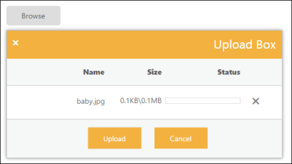

## RTL Support 

The EnableRTL property is Boolean type, which allow us to change of left-to-right alignment of the UploadBox widget to right-to-left (RTL). That is, it sets the UploadBox to right-to-left actions. Default value of EnableRTL property is false. 

The following steps explain the configuration of EnableRTL property in UploadBox. 

In the VIEW page, add the below script to configure the UploadBox element.

[CSHTML]

// In the CSHTML page, add the UploadBox element.

@Html.EJ().Uploadbox("uploadbox").SaveUrl("Uploadbox/Save").RemoveUrl("Uploadbox/Remove").EnableRTL(true)

The following screenshot displays the output.

{  | markdownify }
{:.image }

